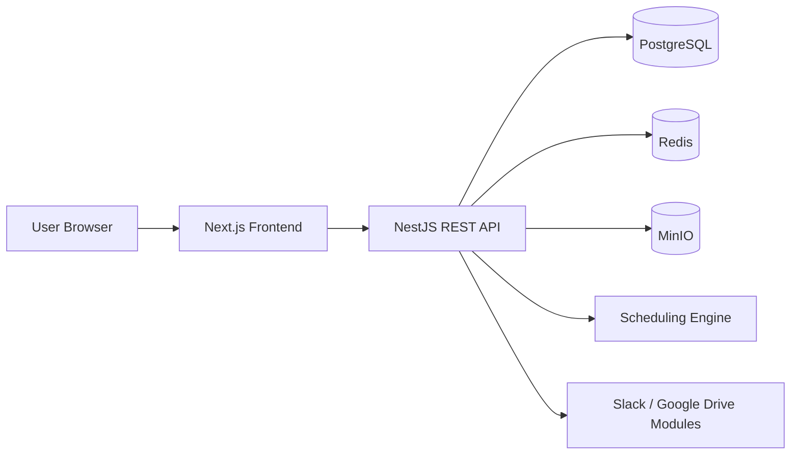
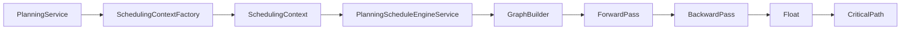
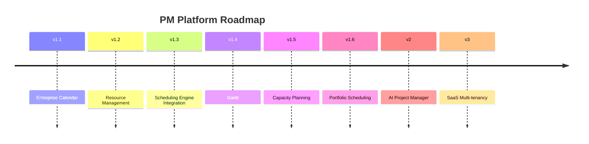

# PM Platform Master Guide

This is the authoritative guide for PM Platform contributors, reviewers, and AI coding assistants. Read this first when joining the project or starting a new feature.

## 1. Product Vision

PM Platform is an enterprise project management platform for managing project delivery from execution detail to executive visibility.

The platform supports:

- Multi-project management.
- Project workspace and governance roles.
- Task management, WBS, milestones, and dependencies.
- Planning workspace, schedule snapshots, baselines, float, and critical path.
- RAID management.
- Portfolio and executive dashboards.
- Notifications.
- Slack and Google Drive integration boundaries.
- Enterprise Calendar administration.
- Docker-based deployment with PostgreSQL, Redis, and MinIO.

The long-term direction is an enterprise-grade planning platform that can support resource management, calendar-aware planning, Gantt, capacity planning, portfolio scheduling, AI assistance, and eventual SaaS multi-tenancy.

## 2. Current Architecture At A Glance



Core stack:

| Layer | Technology |
| --- | --- |
| Frontend | Next.js, React, TypeScript, Tailwind CSS, Vitest |
| Backend | NestJS, TypeScript, TypeORM, Jest |
| Database | PostgreSQL |
| Infra services | Redis, MinIO |
| Deployment | Docker Compose |

Canonical references:

- [Architecture Index](architecture/README.md)
- [System Architecture](architecture/01-SYSTEM-ARCHITECTURE.md)
- [Domain Model](architecture/02-DOMAIN-MODEL.md)
- [Backend Architecture](architecture/03-BACKEND-ARCHITECTURE.md)
- [Frontend Architecture](architecture/04-FRONTEND-ARCHITECTURE.md)
- [Scheduling Architecture](architecture/05-SCHEDULING-ARCHITECTURE.md)
- [Database Architecture](architecture/06-DATABASE-ARCHITECTURE.md)
- [Security Architecture](architecture/07-SECURITY-ARCHITECTURE.md)

## 3. Architectural Principles

| Principle | Meaning |
| --- | --- |
| Scheduling isolation | Scheduling Engine owns CPM, float, scheduling, dependencies, and critical path. |
| Planning consumes scheduling | Planning prepares context and consumes deterministic scheduling output. |
| Calendars do not schedule | Calendars own working hours, holidays, and exception days only. |
| Resources do not schedule directly | Resources own future capacity, availability, skills, and cost. |
| API first | Frontend consumes backend REST APIs through the shared API client. |
| Feature ownership | Backend modules and frontend features own their business behavior. |
| Thin controllers | Controllers route requests and delegate; services own business rules. |
| DTO boundary | Public API boundaries should use DTOs and avoid leaking persistence details. |
| Additive database changes | Schema changes must preserve existing data and behavior. |
| Tests are part of design | Features are not complete until relevant tests and builds pass. |

### Non-Negotiable Scheduling Boundary



Rules:

- No SchedulingContext database table.
- No public SchedulingContext API.
- Scheduling Engine must not import Calendar entities.
- Scheduling Engine must not access persistence.
- Calendar services must never mutate schedules.

See [ADR-003 Scheduling Isolation](architecture/adr/ADR-003-scheduling-isolation.md).

## 4. Repository Structure

```text
backend/
  src/common/          Shared authz, base entities, scheduling adapters, serialization
  src/database/        Baseline schema, migrations, TypeORM config
  src/modules/         NestJS feature modules

frontend/
  app/                 Next.js routes
  components/          Shared and domain UI components
  features/            Feature APIs, hooks, types, constants, business UI
  hooks/               Shared hooks
  lib/api/             Shared API client
  lib/config/          Runtime config
  tests/               Vitest tests

docs/
  PM_PLATFORM_MASTER_GUIDE.md
  BUILD_PLAYBOOK.md
  architecture/
  planning/v1.1/
  roadmap/
  releases/
  testing/
```

## 5. Backend Contribution Rules

Backend features follow NestJS module structure:

```text
backend/src/modules/<feature>/
  dto/
  entities/
  tests/
  <feature>.controller.ts
  <feature>.module.ts
  <feature>.service.ts
```

Rules:

- Use controllers for routes, guards, params, bodies, and Swagger decorators.
- Use services for business rules, validation, mapping, and repository orchestration.
- Use TypeORM repositories through dependency injection.
- Use DTOs with class-validator for request payloads.
- Use response DTOs where a public API boundary exists.
- Use Nest exceptions for platform error style: 400, 403, 404, 409, 422.
- Keep existing APIs backward compatible.

References:

- [Backend Architecture](architecture/03-BACKEND-ARCHITECTURE.md)
- [API Design ADR](architecture/adr/ADR-004-api-design.md)
- [Coding Standards](architecture/09-CODING-STANDARDS.md)

## 6. Frontend Contribution Rules

Frontend pages should be thin. Business logic belongs in `frontend/features`.

Recommended feature shape:

```text
frontend/features/<feature>/
  api/
  components/
  hooks/
  constants.ts
  index.ts
  types.ts
```

Rules:

- Use `frontend/lib/api/client.ts`; do not create duplicate fetch helpers.
- Use React hooks and feature hooks for state.
- Do not introduce Redux, Zustand, MobX, Material UI, Ant Design, Chakra, or Bootstrap without an ADR.
- Reuse shared layout, modal, form, table, and badge patterns.
- Match existing Tailwind styling.
- Keep route pages in `frontend/app` focused on composition.

References:

- [Frontend Architecture](architecture/04-FRONTEND-ARCHITECTURE.md)
- [Frontend Architecture ADR](architecture/adr/ADR-005-frontend-architecture.md)

## 7. Development Workflow

Every substantial feature must follow:

1. Requirements Review.
2. Repository Investigation.
3. Architecture Gap Analysis.
4. Architecture Design Document.
5. Codex Prompt.
6. Implementation.
7. Architecture Review.
8. Code Review.
9. Testing.
10. Docker Verification.
11. Ubuntu Verification.
12. Single Feature Commit.

Do not skip investigation. The repository is the source of truth.

References:

- [Build Playbook](BUILD_PLAYBOOK.md)
- [Development Workflow](architecture/08-DEVELOPMENT-WORKFLOW.md)

## 8. Testing Strategy

| Scope | Required Verification |
| --- | --- |
| Backend feature | `cd backend && npm test && npm run build` |
| Frontend feature | `cd frontend && npm test && npm run build` |
| Scheduling feature | Scheduling unit tests plus Planning regression tests |
| Database feature | Migration tests, backend tests, Docker database verification |
| Docker/deployment feature | `docker compose build`, `docker compose up -d`, service health checks |

Testing conventions:

- Backend uses Jest under `backend/src/**/*.spec.ts`.
- Frontend uses Vitest and Testing Library under `frontend/tests`.
- Mock APIs in frontend tests.
- Cover permissions, validation, isolation, and regressions for domain changes.

## 9. Build And Deployment

### Local Build

```bash
cd backend
npm install
npm test
npm run build

cd ../frontend
npm install
npm test
npm run build
```

### Docker

Root `docker-compose.yml` starts:

- PostgreSQL 17
- Redis 7
- MinIO
- Backend
- Frontend

Typical verification:

```bash
docker compose build
docker compose up -d
docker compose ps
docker compose exec backend wget -qO- http://127.0.0.1:3000/health
docker compose exec frontend wget -qO- http://127.0.0.1:3000/api/health
```

### Ubuntu Deployment

Ubuntu deployment follows the same Compose model:

1. Install Docker Engine and Compose plugin.
2. Clone the repository.
3. Configure environment variables.
4. Build images.
5. Start services.
6. Verify Postgres, Redis, MinIO, backend, and frontend health.
7. Review logs before changing configuration.

## 10. Database Strategy

Database conventions:

- PostgreSQL is the source of persistence.
- `backend/src/database/schema/001_initial_schema.sql` initializes baseline schema.
- `backend/src/database/migrations` contains additive migrations.
- Most domain tables use audit and soft-delete columns.
- Partial indexes commonly filter on `deleted_at IS NULL`.
- Baseline snapshots are immutable by database triggers.

Do not make destructive schema changes without explicit approval.

Reference: [Database Architecture](architecture/06-DATABASE-ARCHITECTURE.md).

## 11. Security Strategy

Current security model:

- JWT authentication.
- Role/permission based authorization.
- `JwtAuthGuard` and `PermissionsGuard`.
- Project visibility through global permissions, governance roles, membership, and selected task-assignment expansion.
- Frontend navigation filtered by permissions returned from `/auth/me`.

Important note: the current platform is project-visibility based, not full SaaS tenant-isolated. SaaS multi-tenancy is a future roadmap item.

Reference: [Security Architecture](architecture/07-SECURITY-ARCHITECTURE.md).

## 12. Epic Roadmap



### Completed / Current

- Core Platform.
- Planning.
- Portfolio.
- RAID.
- Executive Dashboard.
- Enterprise Calendar Epic 1.1.

### Future

- v1.2 Resource Management.
- v1.3 Calendar/resource Scheduling Engine Integration.
- v1.4 Gantt.
- v1.5 Capacity Planning.
- v1.6 Portfolio Scheduling.
- v2 AI Project Manager.
- v3 SaaS Multi-tenancy.

Reference: [Roadmap](architecture/10-ROADMAP.md).

## 13. Key ADRs

| ADR | Decision |
| --- | --- |
| [ADR-001 Feature Architecture](architecture/adr/ADR-001-feature-architecture.md) | Use feature-owned backend modules and frontend feature folders. |
| [ADR-002 Calendar Architecture](architecture/adr/ADR-002-calendar-architecture.md) | Calendar is administrative data and does not schedule. |
| [ADR-003 Scheduling Isolation](architecture/adr/ADR-003-scheduling-isolation.md) | Scheduling Engine remains isolated from persistence and calendar entities. |
| [ADR-004 API Design](architecture/adr/ADR-004-api-design.md) | REST APIs use thin controllers, DTOs, services, repositories, and platform exceptions. |
| [ADR-005 Frontend Architecture](architecture/adr/ADR-005-frontend-architecture.md) | Frontend follows route composition plus feature-owned APIs, hooks, and components. |

## 14. AI Development Guidelines

AI coding assistants must follow the same architecture workflow as humans.

Before coding:

- Read the prompt and in-scope/out-of-scope rules.
- Inspect the repository.
- Identify protected files and modules.
- Confirm whether the task is code, docs, review, or investigation.
- Use existing patterns over new abstractions.

While coding:

- Keep changes scoped.
- Do not modify Scheduling Engine unless explicitly approved.
- Do not modify backend APIs when the prompt says backend is complete.
- Do not modify application code during docs-only tasks.
- Use `apply_patch` for file edits.
- Preserve user changes in the worktree.

Before final response:

- Run relevant tests/builds when code changed.
- Report files added and modified.
- Report assumptions and verification.
- Mention anything not run.
- Do not create commits unless explicitly requested.

## 15. Common Mistakes To Avoid

- Treating roadmap items as implemented architecture.
- Adding scheduling behavior to Calendar or Resource services.
- Creating public APIs for internal adapters.
- Creating database tables for `SchedulingContext`.
- Returning persistence entities from new public API boundaries.
- Adding a frontend state library for local feature state.
- Duplicating API fetch helpers.
- Making destructive migrations.
- Updating unrelated modules during a feature.

## 16. Release Strategy

A release is ready when:

- Feature scope matches the approved requirements.
- Architecture review confirms protected boundaries.
- Backend tests and build pass when backend changed.
- Frontend tests and build pass when frontend changed.
- Docker build and Compose health checks pass for deployable changes.
- Ubuntu deployment path remains compatible.
- Documentation and release notes are updated.
- The work is committed as a single coherent feature commit.

## 17. First Links For New Contributors

Read in this order:

1. This Master Guide.
2. [Build Playbook](BUILD_PLAYBOOK.md).
3. [Architecture Index](architecture/README.md).
4. [Scheduling Architecture](architecture/05-SCHEDULING-ARCHITECTURE.md).
5. [Development Workflow](architecture/08-DEVELOPMENT-WORKFLOW.md).
6. [Coding Standards](architecture/09-CODING-STANDARDS.md).
7. Current feature PRD/TDD or prompt.

