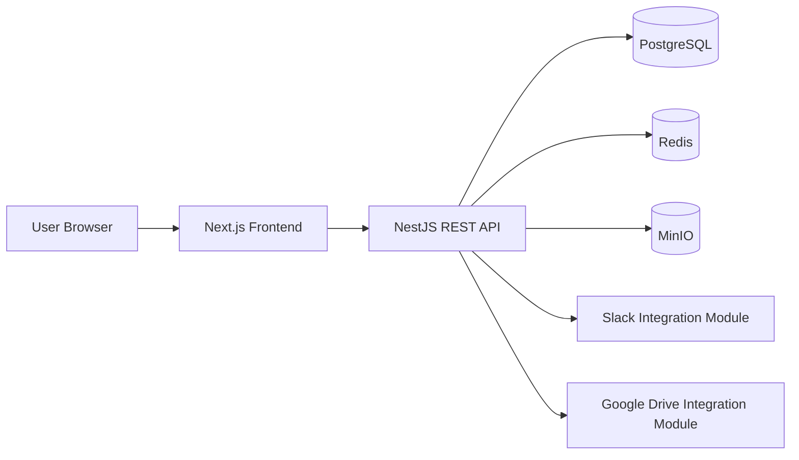
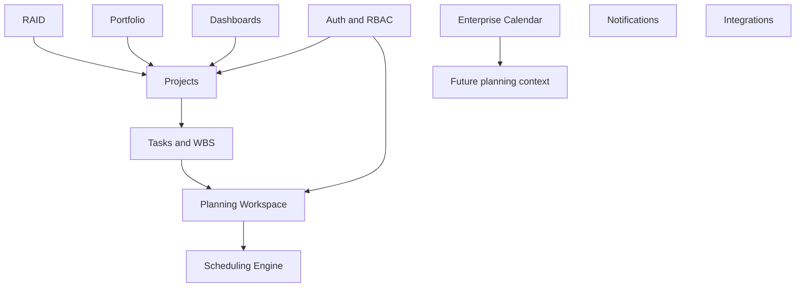
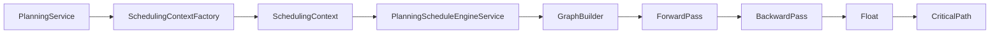

# System Architecture

## Overview

PM Platform is a Docker-deployed web application with a Next.js frontend, NestJS backend, PostgreSQL database, Redis service, and MinIO object storage service.

## Runtime Services

| Service | Current Role |
| --- | --- |
| Frontend | Next.js app routes, feature UIs, shared API client, Tailwind UI. |
| Backend | NestJS REST API, domain services, RBAC, persistence, health checks. |
| PostgreSQL | Primary relational store. |
| Redis | Infrastructure service wired in Docker and health checks. |
| MinIO | Object storage service wired in Docker for future/file workflows. |

## Bounded Contexts

## API Shape

The backend exposes REST controllers per feature module. Controllers are guarded by JWT authentication and permission guards where required. Swagger decorators are used in backend controllers.

Representative route groups:

- `/auth`
- `/users`
- `/projects`
- `/tasks`
- `/planning`
- `/raid`
- `/portfolio`
- `/dashboard`
- `/calendar`
- `/notifications`
- `/health`

## Scheduling Path

## AI Integration Points

There is no autonomous AI project manager implementation in the current codebase. The documented future direction is that AI should consume planning data and recommendations rather than replace deterministic scheduling logic.

Potential future integration points:

- Planning workspace summaries.
- RAID summaries.
- Portfolio status narratives.
- Resource overload explanations.
- Schedule quality review.

AI must not become scheduling authority.

