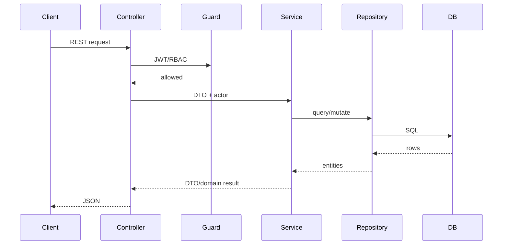

# Backend Architecture

## Stack

- NestJS
- TypeScript
- TypeORM
- PostgreSQL
- Passport JWT
- Swagger decorators
- Jest

## Module Pattern

Backend features live under `backend/src/modules/<feature>`.

Common structure:

```text
feature/
  dto/
  entities/
  tests/
  feature.controller.ts
  feature.module.ts
  feature.service.ts
```

Some shared infrastructure lives under `backend/src/common`, including authz, base entities, scheduling adapters, enums, and serialization.

## Request Flow



## Controllers

Controllers should:

- Define routes.
- Apply guards and permission decorators.
- Accept DTOs and params.
- Pass authenticated actor context to services.
- Return service results.

Controllers should not contain business rules, scheduling rules, or persistence logic.

## Services

Services own business behavior:

- Authorization checks that require domain state.
- Validation beyond DTO syntax.
- Repository orchestration.
- Mapping to response DTOs when a feature has DTO boundaries.
- Transaction decisions when needed.

## Repositories

TypeORM repositories are injected through `@InjectRepository`. Services should use repositories instead of direct database clients unless there is an explicit reason.

## DTOs and Validation

Incoming payloads use DTO classes and class-validator decorators. Existing controllers also use Swagger decorators for API documentation.

DTO rules:

- Use request DTOs for create/update.
- Use response DTOs for public API boundaries where defined.
- Never expose sensitive fields such as password hashes.
- Keep DTO compatibility when evolving APIs.

## Base Entities

Common entity bases:

| Base | Fields |
| --- | --- |
| BaseEntity | `id`, `created_at`, `updated_at`, `deleted_at` |
| AuditableEntity | Base fields plus `created_by_id`, `updated_by_id`, `deleted_by_id` |
| ProjectScopedEntity | Project-scoped base pattern |

## Dependency Rules

- Feature modules may import common infrastructure.
- Planning may call Scheduling Engine services.
- Scheduling Engine must not import Calendar entities or persistence.
- Calendar services must not mutate schedules.
- Frontend-specific concerns must not leak into backend services.

## Testing

Backend tests are Jest specs under `backend/src`. Current patterns include service unit tests, controller/guard tests, and integration-style module tests with mocked repositories.

# Backend Architecture

## Purpose

Define the backend architecture for the NestJS API, including module boundaries, service responsibilities, validation, authorization, persistence, and testing expectations.

## Scope

This document covers backend structure under `backend/`, including controllers, services, entities, DTOs, guards, database access, and module-level testing.

## Audience

Backend engineers, architects, QA engineers, DevOps owners, and reviewers.

## Overview

The backend is a NestJS application using TypeScript, TypeORM, PostgreSQL, DTO validation, JWT authentication, and permission guards. Business behavior should live in services, controllers should remain thin, and persistence should be accessed through repositories or dedicated query abstractions.

## Contents

### Backend Module View

```text
backend/src/
|-- app.module.ts
|-- common/
|   |-- authz/
|   |-- entities/
|   `-- enums/
|-- config/
|-- database/
|-- modules/
|   |-- auth/
|   |-- dashboard/
|   |-- notifications/
|   |-- planning/
|   |-- portfolio/
|   |-- projects/
|   |-- raid/
|   |-- tasks/
|   `-- users/
`-- main.ts
```

### Request Flow

```text
Controller
  -> Guard
  -> DTO Validation
  -> Service
  -> Repository
  -> PostgreSQL
```

### Module Responsibilities

| Module | Responsibility |
| --- | --- |
| `auth` | Authentication, JWT payload handling, and auth guards. |
| `projects` | Project CRUD, project members, baselines, and project workspace APIs. |
| `tasks` | Task lifecycle, hierarchy, status, planned fields, and dependencies. |
| `planning` | Planning workspace snapshots, schedule rows, dependency management, critical path, and resource allocations. |
| `raid` | RAID entities, comments, history, and project-scoped register operations. |
| `portfolio` | Portfolio summaries and executive-level project signals. |
| `notifications` | User notifications and read state. |
| `users` | Users, roles, permissions, and role-permission mapping. |

### API Consistency

- Use project-scoped routes for project-owned resources.
- Validate all UUID params and DTO fields.
- Return consistent `NotFoundException`, `BadRequestException`, `ConflictException`, and `ForbiddenException` responses.
- Keep route naming predictable across modules.

### Persistence

- TypeORM entities map to PostgreSQL tables.
- Schema changes should be represented in SQL migrations.
- Use soft-delete fields consistently where supported by the entity model.
- Add indexes for project-scoped lookups and relationship traversal.

### Transaction Boundaries

Transactions are required when one user action changes multiple tables or must preserve schedule consistency. Planning snapshot creation, dependency edits plus recalculation, baseline capture, and resource capacity updates should be transactional.

### Backend Quality Gates

- Unit tests for service-level business rules.
- Integration tests for controller/API behavior.
- E2E tests for authorization, project scoping, and cross-module workflows.
- Migration verification for schema drift.

## Related Documents

- [System Architecture](system-architecture.md)
- [Planning Engine Roadmap](planning-engine-roadmap.md)
- [Testing Strategy](../development/testing.md)
- [Coding Standards](../development/coding-standards.md)

## Revision History

| Date | Version | Author | Notes |
| --- | --- | --- | --- |
| 2026-06-25 | 0.1 | Codex | Created backend architecture framework. |
