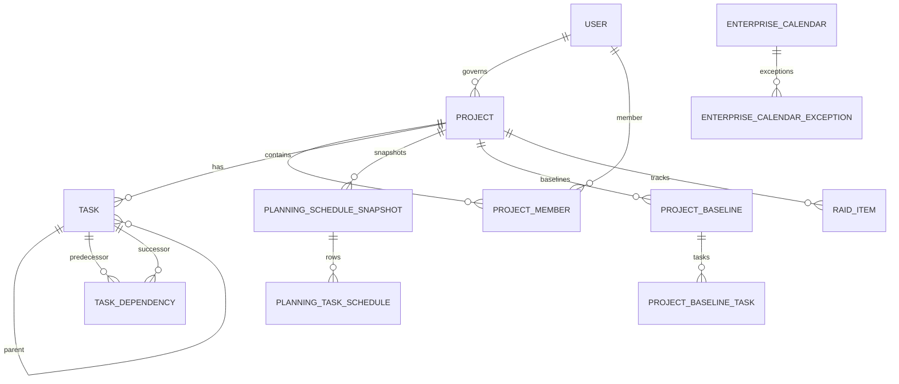

# Domain Model

This document describes the current implementation plus roadmap items that are explicitly identified as future work.

## Aggregate Summary

| Domain | Current Aggregate/Entities | Responsibility |
| --- | --- | --- |
| Users/Auth | User, Role, Permission, RolePermission | Identity, RBAC, session permissions. |
| Projects | Project, ProjectMember | Project metadata, governance roles, membership visibility. |
| Tasks | Task, TaskDependency | WBS, task execution, milestones, dependencies. |
| Planning | PlanningScheduleSnapshot, PlanningTaskSchedule, ProjectBaseline, ResourceAllocation, ResourceCapacity, ResourceWorkloadSnapshot, PortfolioDependency | Planning workspace read models, snapshots, resource planning foundations, portfolio dependencies. |
| Scheduling | SchedulingContext, Scheduling Engine services | Deterministic CPM, float, critical path. |
| Calendars | EnterpriseCalendar, EnterpriseCalendarException | Enterprise working days, hours, holidays, exception days. |
| RAID | Risk, Issue, Assumption, Dependency, RaidComment, RaidHistoryEntry | Delivery risk and governance tracking. |
| Portfolio | PortfolioSummary DTO/service | Cross-project summary view. |
| Notifications | Notification | User notifications. |
| Integrations | SlackIntegration, GoogleDriveIntegration stubs | Integration module boundaries. |

## Relationships

## Projects

Projects own delivery metadata such as name, status, start date, target end date, owner, business owner, executive sponsor, and delivery lead. Project visibility is enforced through global permissions, governance roles, project membership, and task assignment expansion.

## Tasks

Tasks belong to projects and may form a parent-child hierarchy. `task_kind` identifies standard tasks, summary tasks, and milestones. A milestone remains a Task rather than a separate aggregate or table. Milestones have zero duration, matching planned and actual date pairs, validated categories, normalized completion/reopening behavior, and the same audit and dependency identity as other Tasks. Task dependencies are separate edges with FS, SS, FF, and SF dependency types.

## Planning

Planning stores snapshots and task schedule rows. The Planning Workspace reads project, schedule, dependencies, resource allocations, and critical path data. Baselines are immutable snapshots of project task state.

Planning remains scheduling authority for milestone forecast and critical-path outputs. The milestone projection combines Task, latest Planning schedule snapshot, current baseline, owner, and schedule analysis without persisting a duplicate read model.

## Calendars

Enterprise calendars store administrative calendar metadata:

- Name, description, timezone.
- Default working days.
- Working day start/end.
- Hours per day.
- Status.
- Exceptions for holidays, non-working days, and working overrides.

There is no SchedulingContext table and no public SchedulingContext API.

## Resources

Resource planning tables exist for capacities, allocations, and workload snapshots. The approved roadmap expands this into resource profiles, resource calendars, utilization, overload detection, and capacity planning.

## Portfolio

Portfolio currently summarizes project health and delivery signals. Future roadmap items add portfolio schedule and resource pressure summaries without turning portfolio into cross-project scheduling authority.

## Notifications

Notifications are user-scoped records with title, body, type, and `read_at`.
