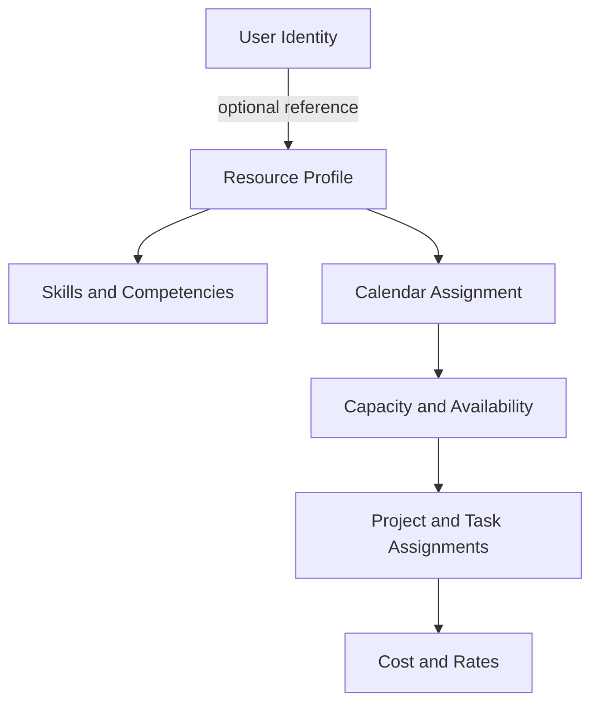
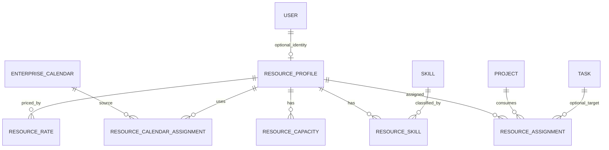
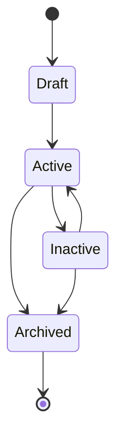
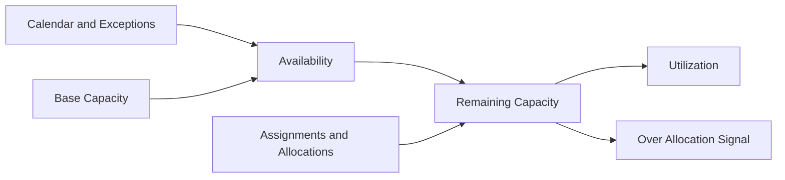

# Resource Architecture

## Status

Architecture baseline for Epic 1.2. Not yet implemented as a standalone Resource module.

## Current Repository State

The current codebase has resource-related planning foundations:

- `ResourceCapacity`
- `ResourceAllocation`
- `ResourceWorkloadSnapshot`
- `ResourceAllocationUnit` with `user` and `team`
- Project-scoped planning endpoints for capacities, allocations, and heat map rows

The current codebase does not yet have a standalone Resource aggregate, Resource Profile module, resource skills, resource calendars, or resource cost model.

## Architectural Goal

Create a Resource bounded context that can model human and non-human resources while preserving Planning and Scheduling boundaries.

Recommended conceptual model:



## Bounded Contexts

| Context | Owns |
| --- | --- |
| Users/Auth | Identity, login, RBAC, user status. |
| Resource | Resource profile, type, status, skills, capacity, availability, assignments, cost. |
| Calendar | Working hours, holidays, exception days, calendar definitions. |
| Planning | Planning workspace, schedule snapshots, assignments consumption. |
| Scheduling Engine | Scheduling, critical path, float, working day calculations. |
| Portfolio | Aggregated project/resource pressure signals. |

## Resource Aggregate

Resource is not User. A resource may reference a user where appropriate.

Proposed aggregate responsibilities:

- Resource identity and lifecycle.
- Resource type.
- Optional user reference.
- Display profile.
- Status.
- Team/organization metadata.
- Skills and competencies.
- Calendar assignment.
- Capacity and availability summary.
- Assignment summary.
- Cost/rate metadata.

## Resource Types

| Type | Description |
| --- | --- |
| Human | Employee or internal person linked to a User where appropriate. |
| Contractor | External human resource that may or may not have a login. |
| Team | A named capacity pool or delivery group. |
| Equipment | Tool, machine, or shared physical asset. |
| Facility | Room, lab, warehouse, or physical location. |
| Vehicle | Vehicle or transport resource. |
| Generic Resource | Placeholder or demand bucket for planning. |

This architecture is preferable because it avoids conflating identity with planning capacity and supports non-human resources from the start.

## Relationships



## Lifecycle



Lifecycle rules:

- Draft resources are not assignable.
- Active resources are assignable.
- Inactive resources are visible but not new assignment candidates.
- Archived resources are retained for history.

## Capacity Model

Definitions:

| Concept | Definition |
| --- | --- |
| Daily Capacity | Available working minutes/hours for a resource on a date. |
| Weekly Capacity | Sum of daily capacity in a week. |
| Monthly Capacity | Sum of daily capacity in a month. |
| Availability | Capacity adjusted by calendar, exceptions, status, and absence/unavailability. |
| Allocation | Planned demand assigned to a resource for a date range. |
| Remaining Capacity | Availability minus allocated demand. |
| Utilization | Allocated demand divided by availability. |
| Over Allocation | Allocation exceeds availability. |



## Calendar Assignment

Precedence:

```text
User Calendar
  -> Team Calendar
    -> Project Calendar
      -> Organization Default Calendar
```

Effective calendar resolution should prefer the most specific applicable calendar. Calendar assignment is administrative in Epic 1.2; schedule calculation integration is future work.

## Assignments

Assignments connect resource demand to:

- Project.
- Optional planning task.
- Date range.
- Allocation percent or planned effort.
- Assignment status.

Assignments must respect project visibility and resource permissions.

## Cost

Cost/rate metadata is future-facing and should be protected:

- Standard cost rate.
- Bill rate if ever needed.
- Currency.
- Effective date range.
- Visibility restrictions.

Cost is not payroll or invoicing.

## Scheduling Boundary

Resource Management may consume schedule output. It must not directly mutate schedule dates.

Scheduling Engine owns:

- Scheduling.
- Critical Path.
- Float.
- Working day calculations.

Planning consumes Scheduling. Resource Management provides context and analysis inputs.

## Implementation Implications

Recommended sequence:

1. Resource Domain.
2. Resource Profiles.
3. Skills and Competencies.
4. Calendar Assignment.
5. Capacity Management.
6. Project/Task Assignment.
7. Cost and Rates.
8. Resource Dashboard.

