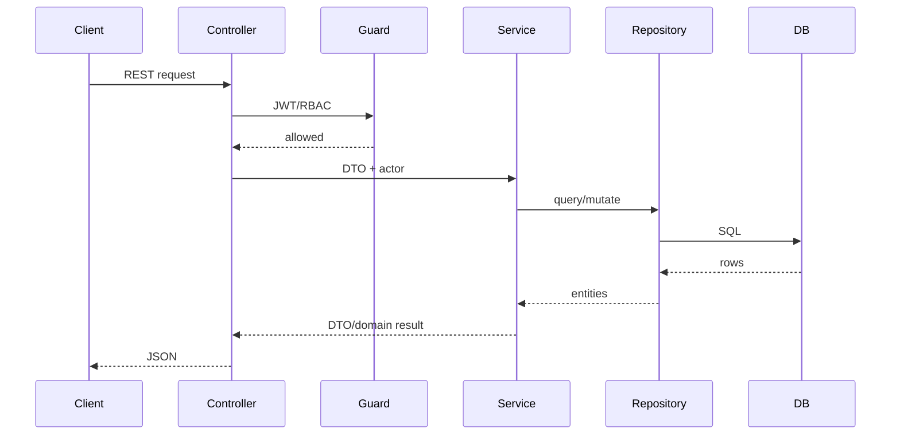

# Backend Architecture

## Stack

- NestJS
- TypeScript
- TypeORM
- PostgreSQL
- Passport JWT
- Swagger decorators
- Jest

## Module Pattern

Backend features live under `backend/src/modules/<feature>`.

Common structure:

```text
feature/
  dto/
  entities/
  tests/
  feature.controller.ts
  feature.module.ts
  feature.service.ts
```

Some shared infrastructure lives under `backend/src/common`, including authz, base entities, scheduling adapters, enums, and serialization.

## Request Flow



## Controllers

Controllers should:

- Define routes.
- Apply guards and permission decorators.
- Accept DTOs and params.
- Pass authenticated actor context to services.
- Return service results.

Controllers should not contain business rules, scheduling rules, or persistence logic.

## Services

Services own business behavior:

- Authorization checks that require domain state.
- Validation beyond DTO syntax.
- Repository orchestration.
- Mapping to response DTOs when a feature has DTO boundaries.
- Transaction decisions when needed.

## Repositories

TypeORM repositories are injected through `@InjectRepository`. Services should use repositories instead of direct database clients unless there is an explicit reason.

## DTOs and Validation

Incoming payloads use DTO classes and class-validator decorators. Existing controllers also use Swagger decorators for API documentation.

DTO rules:

- Use request DTOs for create/update.
- Use response DTOs for public API boundaries where defined.
- Never expose sensitive fields such as password hashes.
- Keep DTO compatibility when evolving APIs.

## Base Entities

Common entity bases:

| Base | Fields |
| --- | --- |
| BaseEntity | `id`, `created_at`, `updated_at`, `deleted_at` |
| AuditableEntity | Base fields plus `created_by_id`, `updated_by_id`, `deleted_by_id` |
| ProjectScopedEntity | Project-scoped base pattern |

## Dependency Rules

- Feature modules may import common infrastructure.
- Planning may call Scheduling Engine services.
- Scheduling Engine must not import Calendar entities or persistence.
- Calendar services must not mutate schedules.
- Frontend-specific concerns must not leak into backend services.

## Testing

Backend tests are Jest specs under `backend/src`. Current patterns include service unit tests, controller/guard tests, and integration-style module tests with mocked repositories.

