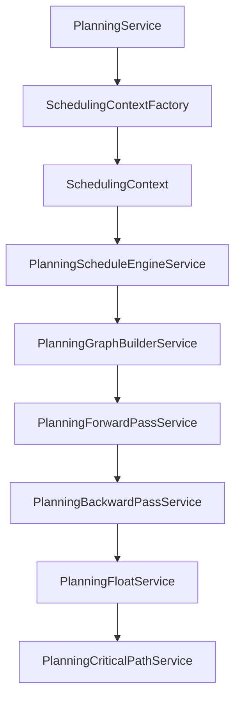

# Scheduling Architecture

This is the most important boundary in PM Platform.

## Ownership

| Domain | Owns | Does Not Own |
| --- | --- | --- |
| Scheduling Engine | CPM, graph validation, forward pass, backward pass, float, critical path | Persistence, calendars, resources, API controllers |
| Planning | Snapshot orchestration, workspace read models, calls into scheduling | Calendar CRUD, resource calendars |
| Calendars | Working days, working hours, holidays, exception days | Schedule calculation or mutation |
| Resources | Future capacity, availability, skills, cost | CPM or automatic date movement |
| Tasks | Milestone lifecycle, category, actual state, audit, persistence | CPM, forecast calculation, snapshot orchestration |

## Current Scheduling Flow

## SchedulingContext

`SchedulingContext` is an internal adapter type in `backend/src/common/scheduling`.

Rules:

- No SchedulingContext database table.
- No public SchedulingContext API.
- It is built from Planning-owned task and dependency data.
- It is immutable via frozen arrays in the factory.

## Scheduling Engine Services

| Service | Responsibility |
| --- | --- |
| PlanningGraphBuilderService | Build and validate graph nodes and dependency edges. |
| PlanningForwardPassService | Calculate early starts and finishes. |
| PlanningBackwardPassService | Calculate late starts and finishes. |
| PlanningFloatService | Calculate total and free float. |
| PlanningCriticalPathService | Identify critical tasks. |
| PlanningScheduleEngineService | Orchestrate graph, passes, float, and critical path. |

## Milestone Boundary

Milestones are zero-duration Task nodes. Enterprise milestone lifecycle and REST work does not change `SchedulingContext`, graph construction, forward pass, backward pass, float, or critical-path algorithms. Planning consumes engine output and rebuilds snapshots; the milestone projection reads forecast and criticality from those outputs. TasksService owns lifecycle mutation and never becomes a second scheduling authority.

## Calendar Boundary

Enterprise Calendar currently manages administrative data. It must not call scheduling engine services or mutate planning schedules.

Future calendar-aware scheduling must enter through Planning and an approved SchedulingContext extension. Calendar entities should not be imported by the Scheduling Engine.

## Resource Boundary

Resource capacity and allocations exist as planning foundations. Future overload detection and capacity views may consume schedule output, but automatic leveling and date movement are roadmap items and must be separately designed.

## Prohibited Couplings

- Scheduling Engine importing TypeORM repositories.
- Scheduling Engine importing Calendar entities.
- Calendar services updating PlanningTaskSchedule rows.
- Resource services directly changing early/late dates.
- Frontend triggering schedule mutation from calendar administration screens.
