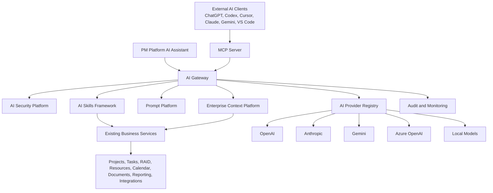
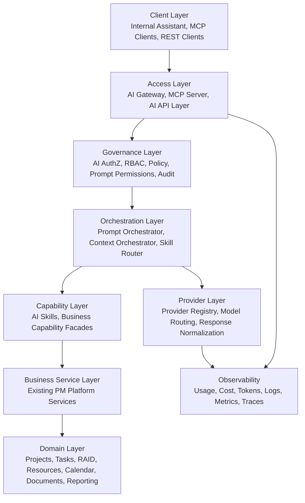
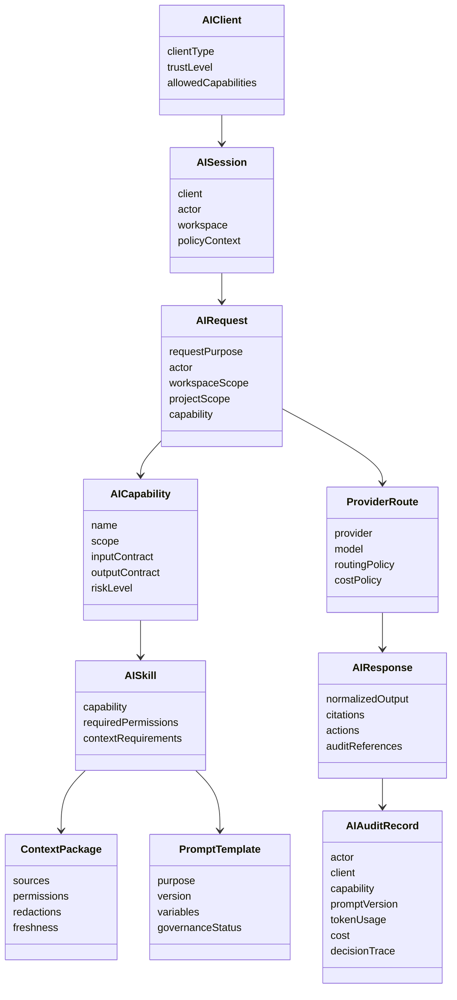
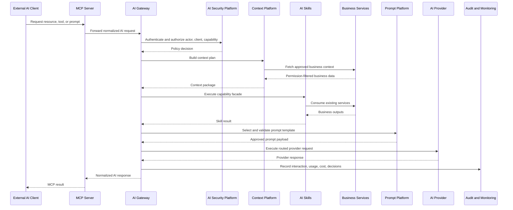
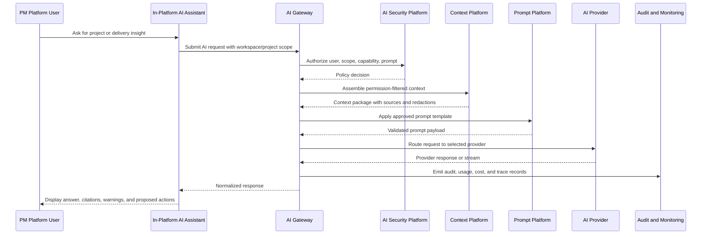
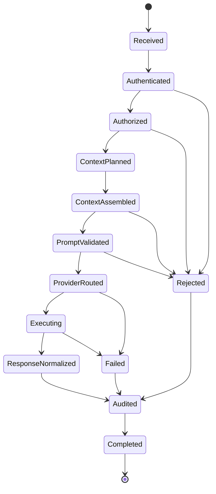

# AI Platform Architecture Design Package

**Release:** v1.3  
**Initiative:** AI Platform Foundation  
**Stage:** Architecture and Design  
**Status:** Draft for Architecture Review  
**Governing Document:** [AI Platform Master Guide](AI_PLATFORM_MASTER_GUIDE.md)  
**Implementation Status:** Not approved for implementation

---

## 1. Executive Summary

PM Platform v1.3 introduces the AI Platform as a shared enterprise capability, not as a chatbot feature. The AI Platform provides secure, governed, provider-agnostic access to PM Platform business capabilities for internal product experiences and external AI clients such as ChatGPT, Codex, Cursor, Claude, Gemini, VS Code AI Extensions, and future MCP-compatible systems.

The architecture is designed around a single principle: AI clients consume business services, never persistence entities or repositories. The in-platform AI Assistant and external AI systems use the same governed AI APIs, authorization policies, audit model, prompt platform, context platform, and skills framework.

This package defines architecture only. It does not authorize implementation code, controllers, services, DTOs, entities, migrations, frontend screens, provider implementations, MCP implementation, or database schema changes.

## 2. Scope

### In Scope

- Overall AI Platform architecture.
- Layered architecture.
- Component model and responsibility boundaries.
- AI Gateway architecture.
- MCP Server architecture.
- AI Provider Registry architecture.
- AI Skills Framework architecture.
- Prompt Platform architecture.
- Enterprise Context Platform architecture.
- AI Security Platform architecture.
- API strategy for REST, MCP resources, MCP tools, MCP prompts, and future event APIs.
- Request flow diagrams.
- Request lifecycle model.
- Internal Assistant and external client flows.
- Governance, audit, monitoring, and extension models.
- Recommended ADRs.
- Recommended folder and package structures as architecture guidance.
- Recommended implementation phases as stage-gated sequencing, not implementation tasks.

### Out of Scope

- Production code.
- Controllers, services, DTOs, entities, repositories, database schema, migrations, and APIs.
- Frontend implementation.
- MCP protocol implementation.
- Provider adapter implementation.
- Prompt content library implementation.
- Embedding generation, vector storage, RAG execution, and autonomous workflow execution.
- Implementation task breakdown before architecture approval.

## 3. Architecture Goals

The AI Platform must:

- Reuse existing business services without duplicating business logic.
- Expose business capabilities rather than database entities.
- Enforce RBAC, workspace isolation, project isolation, and tenant isolation for every request.
- Provide a common platform surface for internal and external AI clients.
- Remain provider agnostic across OpenAI, Anthropic, Gemini, Azure OpenAI, local models, and future providers.
- Support REST APIs, MCP resources, MCP tools, MCP prompts, and future event APIs.
- Maintain enterprise auditability, observability, cost tracking, token accounting, rate limiting, and governance.
- Support incremental rollout through the existing architecture-first, stage-gated delivery model.

## 4. Architecture Principles

1. AI is a platform capability, not a workspace feature.
2. AI clients call governed business capabilities, not repositories or database entities.
3. Internal and external AI clients use the same platform APIs.
4. AI Skills orchestrate approved business services and never duplicate domain rules.
5. Context assembly is permission-filtered before prompt assembly.
6. Provider selection is a runtime routing decision, not a domain dependency.
7. Prompt templates are versioned, governed, and auditable.
8. AI responses are normalized before returning to clients.
9. Every AI interaction is auditable, observable, and attributable to a user, client, workspace, project, and capability.
10. Sensitive data exposure is denied by default and enabled only through explicit policy.

## 5. Overall AI Platform Architecture

The AI Platform is composed of seven primary platform components:

1. **AI Gateway**: Request entry, orchestration, authorization, routing, streaming, token accounting, cost tracking, retries, and response normalization.
2. **MCP Server**: MCP resources, tools, prompts, capability discovery, session management, AI authentication, and AI authorization.
3. **AI Provider Registry**: Provider catalog, model capabilities, routing metadata, health, limits, and failover policy.
4. **AI Skills Framework**: Business-capability facade for project analysis, risk assessment, sprint health, timeline analysis, delivery health, RAID insights, executive summaries, resource forecasting, and document intelligence.
5. **Prompt Platform**: Prompt templates, versions, variables, context contracts, validation, governance, and evaluation readiness.
6. **Enterprise Context Platform**: Secure context assembly across projects, tasks, milestones, resources, RAIDs, documents, calendar, reporting, integrations, permissions, and organization hierarchy.
7. **AI Security Platform**: Authentication, authorization, RBAC, workspace isolation, project isolation, prompt permissions, PII masking, audit logging, usage monitoring, and cost monitoring.



## 6. Layered Architecture



### Dependency Direction

- Client surfaces depend on platform AI contracts.
- AI Skills depend on existing business service interfaces.
- Business services do not depend on AI components.
- Provider adapters do not depend on business domains.
- Prompt templates do not own authorization or business rules.
- Context providers query business capabilities through approved application services.

## 7. Component Responsibilities

| Component | Primary Responsibilities | Must Not Own |
| --- | --- | --- |
| AI Gateway | Request orchestration, auth entry, routing, context assembly coordination, prompt orchestration, streaming, retry, response normalization, cost and token accounting | Domain business rules, persistence entities, provider-specific business logic |
| MCP Server | MCP protocol surface, capability discovery, MCP resources, tools, prompts, sessions, external AI auth | Business service implementation, direct database access |
| AI Provider Registry | Provider catalog, model capabilities, routing rules, limits, health, failover, provider selection metadata | Prompt construction, domain authorization, business logic |
| AI Skills Framework | Business capability exposure, skill contracts, skill-level validation, orchestration of existing services | Duplicate domain rules, persistence, provider-specific model calls |
| Prompt Platform | Template management, versioning, variable contracts, policy gates, validation, evaluation readiness | Business data fetching, RBAC decisions |
| Enterprise Context Platform | Permission-aware context assembly, context contracts, relevance policy, redaction hooks | Prompt ownership, provider selection, direct repository access |
| AI Security Platform | Authentication, authorization, RBAC, isolation, prompt permissions, PII masking, audit policy | Business capability execution |
| Audit and Monitoring | Interaction audit, usage logs, cost metrics, token metrics, traces, operational dashboards | Request approval decisions |

## 8. Domain Model

This is a conceptual AI domain model for architecture review. It is not a database design.



### Core Concepts

| Concept | Description |
| --- | --- |
| AI Client | Internal Assistant, external MCP client, REST client, or future event client. |
| AI Session | Authenticated, policy-scoped interaction context. |
| AI Request | A user- or agent-initiated request for a business capability. |
| AI Capability | Governed business capability exposed to AI clients. |
| AI Skill | Capability adapter that orchestrates existing PM Platform services. |
| Context Package | Permission-filtered, redacted, source-attributed business context. |
| Prompt Template | Governed prompt contract with variables and versioning. |
| Provider Route | Selected provider, model, fallback policy, and cost constraints. |
| AI Response | Normalized result with citations, actions, warnings, and audit references. |
| AI Audit Record | Complete audit trail for compliance, governance, and operations. |

## 9. AI Gateway Design

The AI Gateway is the central control plane for AI interactions. It receives requests from the in-platform Assistant, MCP Server, REST clients, and future event-driven surfaces.

### Responsibilities

- Authenticate AI requests through the platform security model.
- Resolve actor, client, workspace, project, tenant, and capability scope.
- Authorize requested capabilities before context assembly.
- Coordinate context assembly through the Enterprise Context Platform.
- Coordinate prompt selection and prompt validation through the Prompt Platform.
- Route requests to the selected AI provider through the AI Provider Registry.
- Normalize provider responses into PM Platform AI responses.
- Enforce token, rate, usage, cost, and streaming policies.
- Handle retries and provider failover where policy allows.
- Emit audit, metric, trace, and usage events.

### Gateway Stages

1. **Ingress**: Accept request from internal Assistant, MCP Server, REST API, or future event API.
2. **Identity Resolution**: Resolve user, client, workspace, project, tenant, role, and session.
3. **Capability Authorization**: Confirm the requested AI capability is allowed for the actor and client.
4. **Context Plan**: Determine approved context providers and source boundaries.
5. **Context Assembly**: Fetch and filter context through business services.
6. **Prompt Orchestration**: Select template, validate variables, apply governance, and attach context.
7. **Provider Routing**: Select provider and model according to routing, cost, capability, and residency policy.
8. **Execution**: Execute provider call or stream through approved provider abstraction.
9. **Response Normalization**: Normalize output, citations, warnings, action proposals, and errors.
10. **Audit and Monitoring**: Record request, policy decisions, usage, costs, and outcome.

### Gateway Non-Responsibilities

- It does not implement project, task, RAID, resource, calendar, document, reporting, or integration business rules.
- It does not access repositories directly.
- It does not own provider SDK details beyond the provider abstraction boundary.
- It does not bypass RBAC to improve answer quality.

## 10. MCP Server Design

The MCP Server exposes PM Platform business capabilities to compatible AI clients through MCP resources, tools, and prompts.

### Responsibilities

- Authenticate external AI clients and bind sessions to PM Platform actors.
- Discover available capabilities for the authenticated actor.
- Expose MCP Resources for read-oriented business context.
- Expose MCP Tools for governed business capability execution.
- Expose MCP Prompts for approved prompt entrypoints.
- Maintain MCP session state and request correlation.
- Delegate authorization, context assembly, prompt orchestration, and provider routing to the AI Gateway where appropriate.

### MCP Resource Strategy

MCP Resources expose permission-filtered business views, not database tables. Examples:

| Resource | Purpose |
| --- | --- |
| Workspace Portfolio Summary | Authorized portfolio overview for a workspace. |
| Project Delivery Context | Project-level health, timeline, RAID, milestones, resources, and documents summary. |
| RAID Register Context | Authorized RAID insights and risk posture. |
| Resource Capacity Context | Resource availability and capacity view. |
| Document Knowledge Context | AI-visible, permission-filtered document metadata and approved extracted context when available. |

### MCP Tool Strategy

MCP Tools expose governed business capabilities. Examples:

| Tool | Business Capability |
| --- | --- |
| Analyze Project Delivery | Uses project, task, milestone, RAID, resource, and reporting services. |
| Assess RAID Exposure | Uses RAID and project services. |
| Generate Executive Summary | Uses portfolio, reporting, project, RAID, and resource services. |
| Analyze Timeline Health | Uses planning and scheduling services. |
| Forecast Resource Pressure | Uses resource and planning services. |

Tools must return normalized, source-attributed outputs and must not perform unauthorized mutations. Mutating AI tools require a later explicit approval architecture.

### MCP Prompt Strategy

MCP Prompts are approved entrypoints for common AI workflows, such as executive summary generation, delivery review preparation, risk review, sprint health review, and planning checkpoint analysis.

## 11. AI Provider Registry Design

The AI Provider Registry enables provider interchangeability and policy-based routing.

### Provider Registry Responsibilities

- Maintain provider definitions and model capability metadata.
- Support OpenAI, Anthropic, Gemini, Azure OpenAI, local models, and future providers.
- Track model capabilities such as context size, streaming, tool calling, structured output, multimodal support, latency class, cost class, and data residency posture.
- Define routing policies by capability, workspace, tenant, risk level, data sensitivity, and cost budget.
- Support health checks, circuit breaking, failover policy, and graceful degradation.
- Provide provider response normalization contracts.

### Routing Inputs

- Capability requested.
- Actor and workspace policy.
- Data classification and residency constraints.
- Required model features.
- Prompt and context size.
- Cost budget.
- Latency target.
- Provider health.
- Evaluation or governance requirements.

### Provider Boundary

Providers receive only the approved prompt payload and context package. They do not receive repository access, raw database credentials, platform secrets, or unrestricted business-service access.

## 12. AI Skills Framework

AI Skills expose PM Platform business capabilities to AI clients through governed contracts.

### Skill Principles

- Skills are capability facades, not domain services.
- Skills call existing business services and compose their outputs.
- Skills declare required permissions, context requirements, input contracts, output contracts, risk level, and audit classification.
- Skills return structured, source-attributed results suitable for response normalization.
- Skills remain provider-neutral.

### Initial Skill Families

| Skill Family | Example Capabilities | Existing Service Inputs |
| --- | --- | --- |
| Project Analysis | Project health, progress, blocked work, delivery confidence | Projects, Tasks, Planning, Reporting |
| Risk Assessment | Risk trends, impact, overdue mitigations, escalation candidates | RAID, Projects, Audit |
| Sprint Health | Sprint status, throughput, blockers, team load | Tasks, Resources, Calendar |
| Timeline Analysis | Critical path explanation, milestone risk, dependency pressure | Planning, Scheduling, Tasks |
| Delivery Health | Cross-domain delivery summary and confidence | Projects, Tasks, RAID, Resources, Reporting |
| RAID Insights | Risk exposure, aging issues, decision log gaps | RAID, Projects |
| Executive Summary | Portfolio or project executive readout | Portfolio, Reporting, Projects, RAID |
| Resource Forecast | Capacity pressure, allocation risk, availability gaps | Resources, Planning, Calendar |
| Document Intelligence | Document summaries and knowledge signals where AI-visible | Documents, Enterprise Search |

### Skill Contract Model

Each skill should define:

- Capability name and description.
- Scope: tenant, workspace, project, portfolio, user, or document.
- Inputs and validation rules.
- Required permissions and policy gates.
- Context providers required.
- Business services consumed.
- Output shape and citation requirements.
- Audit classification.
- Evaluation hooks.
- Mutability classification: read-only, proposes action, or executes approved action.

## 13. Prompt Platform

The Prompt Platform governs all prompt templates used by internal and external AI workflows.

### Responsibilities

- Store prompt templates conceptually as governed platform assets.
- Version prompts and support rollback.
- Define variables and context contracts.
- Validate required context before execution.
- Enforce prompt permissions by capability, workspace, client, and actor.
- Maintain evaluation readiness metadata.
- Support prompt lifecycle states: draft, review, approved, deprecated, retired.
- Support prompt ownership, review history, and audit references.

### Prompt Template Model

Prompt templates should include:

- Purpose and supported capability.
- Version identifier.
- System, developer, and user-instruction segments where supported by provider policy.
- Required variables.
- Required context providers.
- Output contract.
- Safety and compliance constraints.
- Evaluation scenarios.
- Approval status.
- Deprecation policy.

### Prompt Governance

Prompt changes must follow architecture and governance review before production use. High-risk prompts that can influence executive reporting, external communication, or workflow automation require stricter approval and evaluation evidence.

## 14. Enterprise Context Platform

The Enterprise Context Platform assembles AI-ready context from existing PM Platform business services.

### Context Sources

- Projects.
- Tasks.
- Milestones.
- Resources.
- RAIDs.
- Documents.
- Calendar.
- Reporting.
- Integrations.
- Permissions.
- Organization hierarchy.

### Context Assembly Rules

1. Resolve actor, tenant, workspace, project, and client scope first.
2. Authorize each requested context source before reading.
3. Fetch context through existing business services.
4. Apply RBAC, workspace isolation, project isolation, and tenant isolation.
5. Apply document AI visibility rules before document context is included.
6. Apply PII masking and sensitivity policy.
7. Attach source references and freshness metadata.
8. Produce a bounded context package with explicit omissions and redactions.

### Context Package Outputs

The context package should include:

- Business facts.
- Source references.
- Permission decisions.
- Redaction markers.
- Freshness timestamps.
- Confidence or completeness indicators.
- Context size estimates.
- Excluded source reasons where safe to disclose.

## 15. AI Security Architecture

The AI Security Platform extends existing PM Platform identity, RBAC, workspace isolation, project isolation, audit, and governance principles.

### Security Controls

| Control | Requirement |
| --- | --- |
| Authentication | All AI clients must authenticate through approved platform mechanisms. |
| Authorization | Every request, capability, context source, prompt, and proposed action requires authorization. |
| RBAC | Existing permission model remains authoritative. |
| Workspace Isolation | Context and capability execution cannot cross workspace boundaries without explicit authorization. |
| Project Isolation | Project-level AI context must honor project membership and visibility. |
| Tenant Isolation | Provider calls and audit records must preserve tenant isolation. |
| Prompt Permissions | Prompts require capability and actor authorization. |
| PII Masking | Sensitive fields are masked or excluded according to policy. |
| Audit Logging | Every AI interaction records identity, client, prompt, context, provider, usage, cost, and outcome metadata. |
| Usage Monitoring | Token, rate, model, provider, capability, workspace, and tenant usage are tracked. |
| Cost Monitoring | Cost estimates and actual usage are recorded and reportable. |

### Security Non-Negotiables

- No unauthenticated AI access.
- No direct repository or database exposure.
- No provider receives more context than the request is authorized to use.
- No AI-visible documents by default unless document policy allows it.
- No cross-workspace context leakage.
- No prompt or context bypass for internal Assistant requests.
- No hidden mutations through AI tools.

## 16. API Strategy

PM Platform exposes AI capabilities through business-oriented APIs.

### API Surfaces

| Surface | Purpose |
| --- | --- |
| REST AI APIs | Internal Assistant and platform-managed clients. |
| MCP Resources | Read-oriented, permission-filtered business context for MCP clients. |
| MCP Tools | Governed business capability execution for MCP clients. |
| MCP Prompts | Approved AI workflow entrypoints. |
| Future Event APIs | Event-driven AI automation and monitoring workflows. |

### API Rules

- APIs expose capabilities, not entities.
- APIs do not expose repositories.
- APIs do not expose persistence models.
- APIs use existing business services.
- APIs enforce RBAC and audit policy.
- APIs return source-attributed, normalized results.
- APIs maintain stable contracts across provider changes.

### Example Capability-Oriented API Categories

- Project delivery intelligence.
- Portfolio executive intelligence.
- RAID intelligence.
- Timeline intelligence.
- Resource forecasting.
- Document intelligence.
- Workflow recommendations.
- Search and knowledge discovery.

## 17. Request Flow Diagrams

### External Client Flow



### Internal Assistant Flow



## 18. AI Request Lifecycle



### Lifecycle Controls

| Stage | Required Control |
| --- | --- |
| Received | Client and request correlation. |
| Authenticated | Actor and client identity validation. |
| Authorized | Capability, scope, prompt, and context authorization. |
| Context Planned | Approved source selection and size bounds. |
| Context Assembled | RBAC filtering, redaction, source attribution. |
| Prompt Validated | Template version, variables, governance status. |
| Provider Routed | Provider capability, cost, residency, health. |
| Executing | Timeout, retry, streaming, circuit breaker policy. |
| Response Normalized | Output contract, citations, warnings, action proposals. |
| Audited | Full trace, usage, token, cost, policy, and outcome records. |

## 19. Governance Model

### Governance Domains

- Capability governance.
- Prompt governance.
- Provider governance.
- Context governance.
- Cost governance.
- Security governance.
- Evaluation governance.
- Change governance.

### Governance Roles

| Role | Responsibility |
| --- | --- |
| Product Architecture | Owns AI Platform architecture and master guide alignment. |
| Security Architecture | Reviews identity, authorization, isolation, and data exposure. |
| Product Owner | Approves business capability scope and user outcomes. |
| Engineering Lead | Confirms implementation feasibility after architecture approval. |
| Data Owner | Approves sensitive data usage, document visibility, and retention boundaries. |
| Operations Owner | Owns monitoring, cost controls, incident response, and provider availability policy. |

### Governance Gates

1. Architecture review.
2. ADR approval where required.
3. Product design review.
4. Engineering design review.
5. Security review.
6. Prompt and evaluation review.
7. Implementation approval.
8. Operational readiness review.

## 20. Audit Model

Every AI interaction should produce an audit record sufficient for enterprise compliance and incident investigation.

### Audit Dimensions

- Request id and session id.
- Actor id and role context.
- Client id and client type.
- Workspace, project, tenant, and capability scope.
- Requested capability.
- Prompt template and version.
- Context sources requested and context sources included.
- Redactions and denied sources.
- Provider and model selected.
- Token usage and cost estimate.
- Streaming status.
- Response classification.
- Proposed actions.
- Errors, retries, and fallback decisions.
- Policy decisions and decision references.
- Timestamps and correlation ids.

### Audit Boundaries

Audit logs should store enough metadata to explain decisions and usage while avoiding unnecessary retention of sensitive prompt or response content. Retention and redaction policy require separate security approval.

## 21. Monitoring Model

### Operational Metrics

- Request volume by client, workspace, tenant, capability, and provider.
- Latency by gateway stage, provider, model, and skill.
- Error rate by stage and provider.
- Retry and failover counts.
- Streaming duration and interruption rate.
- Context assembly size and latency.
- Prompt validation failures.
- Authorization denials.

### Usage and Cost Metrics

- Token usage by provider, model, workspace, tenant, project, actor, and capability.
- Cost by provider, model, workspace, tenant, project, actor, and capability.
- Budget threshold warnings.
- Rate-limit events.
- High-cost prompt or context patterns.

### Governance Metrics

- Prompt version usage.
- Capability usage by risk level.
- Denied data source attempts.
- PII masking events.
- Document AI visibility usage.
- Evaluation pass or failure summary when evaluation infrastructure exists.

## 22. Extension Model

The AI Platform is extensible through governed extension points.

| Extension Point | Purpose | Required Governance |
| --- | --- | --- |
| New AI Skill | Expose a new business capability | Capability review, permission review, output contract review |
| New Context Provider | Add context from an existing domain service | Data owner review, RBAC review, freshness and redaction review |
| New Prompt Template | Add or update an AI workflow | Prompt review, evaluation readiness, approval status |
| New Provider | Add provider or model | Security review, data residency review, cost review, operations review |
| New MCP Resource | Expose read-oriented business context | MCP contract review, permission review |
| New MCP Tool | Expose governed AI capability | Tool risk review, mutation classification, audit review |
| New Event API | Enable event-driven AI workflows | Event governance, replay, idempotency, audit review |

## 23. Recommended ADRs

The following ADRs are recommended before implementation begins. These are architecture decisions, not implementation tasks.

| ADR | Decision Scope |
| --- | --- |
| ADR-017 AI Platform Boundary | Establish AI Platform as a shared platform bounded context and prohibit direct repository/entity exposure. |
| ADR-018 AI Gateway and Request Lifecycle | Approve gateway responsibilities, lifecycle stages, policy gates, and response normalization. |
| ADR-019 Enterprise MCP Server Strategy | Approve MCP resources, tools, prompts, session model, and external AI client boundary. |
| ADR-020 AI Provider Registry and Provider Agnosticism | Approve provider abstraction, routing inputs, model capability metadata, and failover principles. |
| ADR-021 AI Skills Framework | Approve skill contracts, business-service reuse rule, mutability classification, and audit requirements. |
| ADR-022 Prompt Platform Governance | Approve prompt versioning, lifecycle, review, variable contracts, and evaluation readiness. |
| ADR-023 Enterprise Context and Retrieval Boundary | Approve context assembly rules, RBAC filtering, document AI visibility, redaction, and source attribution. |
| ADR-024 AI Security, Audit, Usage, and Cost Controls | Approve audit dimensions, usage accounting, cost tracking, monitoring, and retention principles. |

## 24. Recommended Folder Structure

This folder structure is conceptual architecture guidance for later engineering design. It does not authorize file creation or implementation.

```text
backend/src/modules/ai/
  gateway/
  mcp/
  providers/
  skills/
  prompts/
  context/
  security/
  audit/
  monitoring/
  contracts/

frontend/features/ai/
  assistant/
  governance/
  usage/
  shared/

docs/architecture/08-ai/
  AI_PLATFORM_MASTER_GUIDE.md
  AI_PLATFORM_ARCHITECTURE_DESIGN_PACKAGE.md
  AI_GATEWAY.md
  MCP_SERVER.md
  AI_SKILLS_FRAMEWORK.md
  PROMPT_PLATFORM.md
  ENTERPRISE_CONTEXT_PLATFORM.md
  AI_SECURITY_AUDIT_MONITORING.md

docs/adr/
  ADR-017-ai-platform-boundary.md
  ADR-018-ai-gateway-request-lifecycle.md
  ADR-019-enterprise-mcp-server.md
  ADR-020-ai-provider-registry.md
  ADR-021-ai-skills-framework.md
  ADR-022-prompt-platform-governance.md
  ADR-023-enterprise-context-retrieval-boundary.md
  ADR-024-ai-security-audit-usage-cost.md
```

## 25. Recommended Package Structure

This package structure is conceptual and subject to engineering design review.

| Package | Purpose |
| --- | --- |
| `ai-gateway` | Request ingress, orchestration, streaming, retries, response normalization. |
| `ai-mcp` | MCP resources, tools, prompts, sessions, external client boundary. |
| `ai-provider-registry` | Provider definitions, model capabilities, routing, health, failover. |
| `ai-skills` | Business capability facades using existing services. |
| `ai-prompts` | Prompt templates, versions, validation, governance metadata. |
| `ai-context` | Context provider contracts, context assembly, redaction, source attribution. |
| `ai-security` | AI-specific authorization, prompt permissions, isolation policy, PII masking. |
| `ai-audit` | Interaction audit and compliance records. |
| `ai-monitoring` | Usage, cost, token, latency, and operational metrics. |
| `ai-contracts` | Shared request, response, capability, and context contracts. |

## 26. Recommended Implementation Phases

These phases describe stage-gated sequencing only. They are not implementation tasks and should not begin until architecture approval.

### Phase 1: Architecture Approval

- Review this design package against the AI Platform Master Guide.
- Approve or revise recommended ADR list.
- Confirm non-goals and implementation constraints.
- Confirm target client and capability scope.

### Phase 2: ADR and Product Design

- Draft and approve required ADRs.
- Define initial AI capability catalog.
- Define internal Assistant product experience boundaries.
- Define external AI client access expectations.

### Phase 3: Engineering Design

- Convert approved architecture into technical design.
- Define contracts, module boundaries, authorization integration, audit integration, and observability approach.
- Define testing strategy and quality gates.
- Confirm no duplicated business logic.

### Phase 4: AI Gateway Foundation

- Establish approved AI request lifecycle.
- Establish authorization, context, prompt, provider, audit, and monitoring integration points.
- Keep initial capabilities read-oriented unless later ADRs approve mutations.

### Phase 5: MCP Server Foundation

- Establish MCP resource, tool, prompt, session, and capability discovery model.
- Route all MCP business requests through the same governance path as internal Assistant requests.

### Phase 6: Provider Registry Foundation

- Establish provider abstraction and routing policy.
- Support initial provider set according to approved security and operations constraints.

### Phase 7: Skills, Prompt, and Context Foundation

- Introduce initial read-oriented skills.
- Introduce governed prompt templates.
- Introduce permission-aware context providers using existing business services.

### Phase 8: Governance, Audit, Monitoring, and Evaluation Readiness

- Operationalize audit, usage, token, cost, monitoring, and governance reporting.
- Prepare evaluation harness and prompt quality review model.

### Phase 9: Internal Assistant and External Client Expansion

- Expand internal Assistant workflows.
- Expand MCP resources, tools, and prompts.
- Add higher-risk capabilities only after explicit governance and mutation-control approval.

## 27. Architecture Risks and Mitigations

| Risk | Mitigation |
| --- | --- |
| AI duplicates business logic | Skills may only orchestrate existing business services. Architecture and code review must enforce this boundary. |
| Unauthorized context leakage | Context is assembled only after authorization and filtered per source. |
| Provider lock-in | Provider Registry abstracts providers and normalizes responses. |
| Prompt drift | Prompt Platform requires versioning, lifecycle states, and governance approval. |
| Cost overruns | Token accounting, cost tracking, rate limiting, and budget policy are gateway responsibilities. |
| Audit gaps | Audit is part of the lifecycle and records decisions, usage, provider, prompt, context, and outcome metadata. |
| Unsafe external AI access | MCP Server authenticates clients and delegates authorization to AI Security Platform and AI Gateway. |
| Document data exposure | Document context requires document permission and AI visibility policy. |
| Hidden mutations | Mutating AI tools are out of scope until separately approved. |

## 28. Review Checklist

- The design aligns with the AI Platform Master Guide.
- The design treats AI as a platform capability.
- The internal Assistant and external clients share the same platform boundary.
- Business services remain authoritative.
- No direct repository or persistence entity exposure is introduced.
- RBAC, workspace isolation, project isolation, and tenant isolation are enforced.
- Context assembly is permission-aware and source-attributed.
- Provider routing is provider-agnostic.
- Prompt templates are governed and versioned.
- Audit, usage, token, cost, and monitoring models are defined.
- Recommended ADRs are identified before implementation.
- Recommended phases preserve the architecture-first methodology.

## 29. Architecture Review Outcome

This document is ready for architecture review. Implementation must not begin until the architecture package and required ADRs are reviewed and approved through the PM Platform stage-gated methodology.
