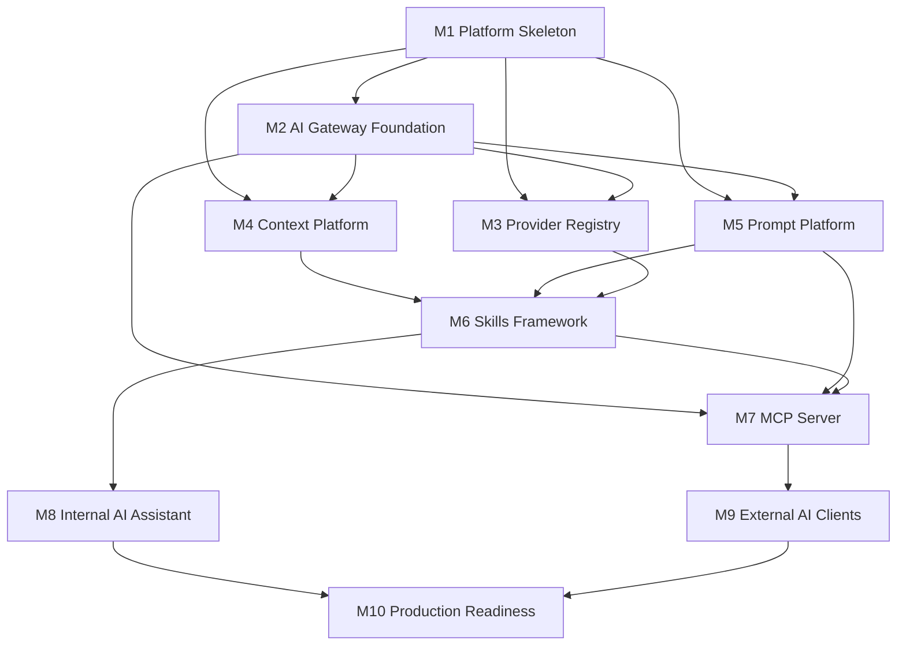

# AI Platform Implementation Planning Package

**Release:** v1.3  
**Initiative:** AI Platform Foundation  
**Stage:** Implementation Planning Package  
**Status:** Architecture Complete  
**Implementation Status:** Planning only. No implementation code authorized.

---

## 1. Purpose

This Implementation Planning Package translates the approved AI Platform
architecture, ADRs, and Technical Design Package into an engineering roadmap
for PM Platform v1.3.

This document is intended to become the implementation backlog for multiple
developers working in parallel while preserving the approved architecture. It
does not create NestJS modules, controllers, services, DTOs, entities,
repositories, tests, frontend code, MCP implementation, provider
implementation, or business logic.

## 2. Authoritative Inputs

- [AI Platform Master Guide](AI_PLATFORM_MASTER_GUIDE.md)
- [AI Platform Architecture Design Package](AI_PLATFORM_ARCHITECTURE_DESIGN_PACKAGE.md)
- [AI Platform Technical Design Package](AI_PLATFORM_TECHNICAL_DESIGN_PACKAGE.md)
- [AI Platform ADR Package](adr/README.md)

## 3. Overall Implementation Strategy

### Implementation Philosophy

The AI Platform should be implemented as a governed platform foundation before
user-facing AI experiences expand. The implementation sequence prioritizes
contracts, module boundaries, security integration, auditability, provider
neutrality, and testability before high-value skills or external client
availability.

The platform must remain architecture-first:

- Implement contracts and skeletons before capability logic.
- Use existing business services for domain behavior.
- Keep AI Skills thin and capability-oriented.
- Keep provider concerns behind the Provider Registry.
- Keep MCP as an interoperability boundary, not a business execution layer.
- Treat security, audit, telemetry, usage, cost, and token accounting as
  mandatory from the first usable increment.

### Incremental Delivery

Delivery should progress through ten milestones. Each milestone must produce a
reviewable, testable increment with feature flags and documentation updates.

The recommended order is:

1. M1 Platform Skeleton.
2. M2 AI Gateway Foundation.
3. M3 Provider Registry.
4. M4 Context Platform.
5. M5 Prompt Platform.
6. M6 Skills Framework.
7. M7 MCP Server.
8. M8 Internal AI Assistant.
9. M9 External AI Clients.
10. M10 Production Readiness.

### Backward Compatibility

- Existing PM Platform APIs, dashboards, planning, RAID, resources, documents,
  calendar, reporting, and integrations must continue to work unchanged.
- AI implementation must be additive.
- Existing business services remain authoritative.
- Existing RBAC and audit behavior must not regress.
- Feature flags must allow AI Platform components to be disabled without
  breaking non-AI platform workflows.

### Feature Flags

Feature flags should gate:

- AI Platform root enablement.
- AI Gateway.
- Provider Registry.
- Individual providers.
- Context Platform.
- Prompt Platform.
- Skills Framework.
- Individual skills.
- MCP Server.
- Internal Assistant.
- External AI clients.
- Streaming.
- Context caching.
- Summarization.

Feature flags must not bypass authorization, audit, workspace isolation,
project isolation, tenant isolation, or prompt governance.

### Rollout Strategy

Rollout should start with non-user-facing platform foundations, then move to
developer preview, internal beta, customer beta, and general availability.

Recommended rollout posture:

- Start with disabled-by-default AI infrastructure.
- Enable provider mocks before real provider routes.
- Enable read-only, non-mutating capabilities first.
- Limit early skills to low-risk project and delivery summaries.
- Enable MCP only after gateway, security, audit, and provider contracts are
  stable.
- Delay mutating AI tools until a future human-approval ADR is approved.

## 4. Engineering Milestones

| Milestone | Objective | Primary Output |
| --- | --- | --- |
| M1 Platform Skeleton | Establish AI package boundaries, contracts, feature flags, and architecture guardrails. | Empty platform structure and shared contracts. |
| M2 AI Gateway Foundation | Establish request lifecycle orchestration and response normalization. | Gateway foundation with audit and telemetry hooks. |
| M3 Provider Registry | Establish provider abstraction, health, routing, fallback, and provider mock support. | Provider-neutral execution path. |
| M4 Context Platform | Establish permission-aware context providers, aggregation, caching policy, summarization hooks, and token budgeting. | Secure context package pipeline. |
| M5 Prompt Platform | Establish prompt templates, variables, validation, lifecycle governance, and response parsing. | Governed prompt execution pipeline. |
| M6 Skills Framework | Establish skill registration, discovery, execution lifecycle, versioning, and permission checks. | Business-capability skill foundation. |
| M7 MCP Server | Establish MCP lifecycle, sessions, registries, authentication, authorization, and gateway delegation. | External AI interoperability foundation. |
| M8 Internal AI Assistant | Connect in-platform Assistant to the same AI Gateway and initial read-only skills. | Internal assistant preview. |
| M9 External AI Clients | Enable governed external client access through MCP and compatibility validation. | External AI developer preview. |
| M10 Production Readiness | Harden security, performance, observability, documentation, deployment, and release controls. | Production-ready AI Platform v1.3. |

## 5. Epic Breakdown

### M1 Platform Skeleton

| Epic | Objective | Business Value | Dependencies | Risk | Complexity | Acceptance Criteria |
| --- | --- | --- | --- | --- | --- | --- |
| AI-M1-E1 Platform Boundary | Establish AI package boundaries and allowed dependencies. | Prevents architectural drift before teams work in parallel. | Approved TDP. | Medium | M | Boundaries match TDP; forbidden dependency rules documented and reviewable. |
| AI-M1-E2 Shared Contracts | Define shared request, response, error, scope, lifecycle, and capability contracts. | Enables parallel implementation across gateway, MCP, providers, skills, prompts, context, and monitoring. | AI-M1-E1. | Medium | M | Contracts cover all TDP public interface concepts without business logic. |
| AI-M1-E3 Feature Flag Baseline | Define AI feature flag plan and rollout defaults. | Allows safe disabled-by-default delivery. | AI-M1-E1. | Low | S | Flags cover gateway, providers, context, prompts, skills, MCP, assistant, external clients, streaming, caching, and summarization. |

### M2 AI Gateway Foundation

| Epic | Objective | Business Value | Dependencies | Risk | Complexity | Acceptance Criteria |
| --- | --- | --- | --- | --- | --- | --- |
| AI-M2-E1 Gateway Lifecycle | Implement lifecycle states and orchestration shell. | Creates common path for all AI requests. | M1. | High | L | Request lifecycle follows TDP from incoming request through response delivery. |
| AI-M2-E2 Gateway Security Integration | Integrate authentication and authorization provider contracts. | Ensures AI requests are secure by default. | M1, AI-M2-E1. | High | M | Capability, prompt, context, and provider route authorization hooks exist. |
| AI-M2-E3 Gateway Audit and Telemetry Hooks | Establish audit and telemetry emissions. | Provides accountability from first usable increment. | M1, AI-M2-E1. | Medium | M | Audit and telemetry hooks exist at all lifecycle transitions. |

### M3 Provider Registry

| Epic | Objective | Business Value | Dependencies | Risk | Complexity | Acceptance Criteria |
| --- | --- | --- | --- | --- | --- | --- |
| AI-M3-E1 Provider Registry Core | Establish provider registration and capability metadata. | Enables provider-agnostic routing. | M1, M2. | Medium | M | Providers expose metadata, capabilities, model support, and lifecycle state. |
| AI-M3-E2 Provider Mock Adapter | Establish provider mock for validation and local development. | Enables deterministic tests without vendor dependency. | AI-M3-E1. | Low | M | Mock supports non-streaming, streaming, errors, token usage, and cost metadata. |
| AI-M3-E3 Routing, Health, and Fallback | Establish health checks, route selection, timeout, and fallback policy. | Improves resilience and enterprise readiness. | AI-M3-E1. | High | L | Routing respects policy, health, capability, cost, timeout, and fallback constraints. |

### M4 Context Platform

| Epic | Objective | Business Value | Dependencies | Risk | Complexity | Acceptance Criteria |
| --- | --- | --- | --- | --- | --- | --- |
| AI-M4-E1 Context Provider Framework | Establish context provider contracts and registry. | Enables secure context assembly across domains. | M1, M2. | High | M | Providers declare scope, permissions, freshness, token estimate, and source attribution. |
| AI-M4-E2 Context Aggregation Pipeline | Establish aggregation, permission filtering, masking, attribution, and warnings. | Prevents unauthorized context leakage. | AI-M4-E1, M2. | High | L | Context package records included, omitted, redacted, denied, and stale sources. |
| AI-M4-E3 Token, Cache, and Summarization Policy | Establish token budgeting, cache rules, and summarization hooks. | Controls cost and scale. | AI-M4-E2, M3. | Medium | M | Oversized context is trimmed, summarized, or rejected safely by policy. |

### M5 Prompt Platform

| Epic | Objective | Business Value | Dependencies | Risk | Complexity | Acceptance Criteria |
| --- | --- | --- | --- | --- | --- | --- |
| AI-M5-E1 Prompt Template Registry | Establish prompt metadata, lifecycle, version, variables, and output contracts. | Creates governed prompt assets. | M1, M2. | Medium | M | Approved lifecycle states and version policy are enforced. |
| AI-M5-E2 Prompt Validation and Injection | Establish variable injection, context binding, prompt permissions, and token validation. | Reduces prompt drift and sensitive data exposure. | AI-M5-E1, M4. | High | M | Missing variables, unauthorized prompts, and invalid token budgets fail safely. |
| AI-M5-E3 Response Parsing Contracts | Establish output parsing, warnings, citations, and parse failure behavior. | Makes AI output predictable for clients. | AI-M5-E2, M3. | Medium | M | Parsed responses align to normalized AI response contracts. |

### M6 Skills Framework

| Epic | Objective | Business Value | Dependencies | Risk | Complexity | Acceptance Criteria |
| --- | --- | --- | --- | --- | --- | --- |
| AI-M6-E1 Skill Registry and Discovery | Establish skill metadata, lifecycle, versioning, and permission-aware discovery. | Enables business capability catalog. | M1, M2. | Medium | M | Discovery returns only authorized compatible skills. |
| AI-M6-E2 Skill Execution Lifecycle | Establish validation, dependency resolution, context use, execution, errors, audit, and telemetry. | Enables reusable business-capability execution. | AI-M6-E1, M4, M5. | High | L | Skills call existing business services and never providers or repositories. |
| AI-M6-E3 Initial Read-Only Skill Set | Plan and implement low-risk read-only skills. | Delivers early business value without mutation risk. | AI-M6-E2. | Medium | L | Initial skills are read-only, source-attributed, authorized, audited, and feature-flagged. |

### M7 MCP Server

| Epic | Objective | Business Value | Dependencies | Risk | Complexity | Acceptance Criteria |
| --- | --- | --- | --- | --- | --- | --- |
| AI-M7-E1 MCP Server and Session Lifecycle | Establish server startup, transport abstraction, sessions, expiration, and shutdown. | Enables external AI interoperability foundation. | M1, M2. | High | L | Sessions bind client, actor, tenant, workspace, trust level, and discovery snapshot. |
| AI-M7-E2 MCP Registries | Establish tool, resource, and prompt registries. | Provides discoverable external AI capabilities. | AI-M7-E1, M5, M6. | Medium | M | Registries are permission-filtered and map to gateway requests only. |
| AI-M7-E3 MCP Compatibility Validation | Validate MCP request, response, streaming, error, and auth behavior. | Enables safe external client onboarding. | AI-M7-E2. | Medium | M | Compatibility suite covers resources, tools, prompts, auth, denials, errors, and streaming where enabled. |

### M8 Internal AI Assistant

| Epic | Objective | Business Value | Dependencies | Risk | Complexity | Acceptance Criteria |
| --- | --- | --- | --- | --- | --- | --- |
| AI-M8-E1 Assistant Gateway Integration | Connect internal Assistant to AI Gateway. | Gives users governed in-platform AI access. | M2-M6. | Medium | M | Assistant uses same gateway path as external clients. |
| AI-M8-E2 Assistant UX Safety and Citations | Show citations, warnings, denials, and proposed next steps safely. | Builds trust and avoids opaque AI responses. | AI-M8-E1, M4, M5. | Medium | M | Responses display source attribution and safe errors without leaking policy internals. |
| AI-M8-E3 Internal Preview Rollout | Enable limited internal users and collect feedback. | Validates platform value before external exposure. | AI-M8-E1, AI-M8-E2, M10 partial gates. | Medium | S | Feature flags, telemetry, audit, and rollback paths are operational. |

### M9 External AI Clients

| Epic | Objective | Business Value | Dependencies | Risk | Complexity | Acceptance Criteria |
| --- | --- | --- | --- | --- | --- | --- |
| AI-M9-E1 External Client Policy | Define allowed clients, trust levels, auth requirements, and scopes. | Enables secure enterprise AI client access. | M7, M10 security gates. | High | M | Client access is governed, auditable, revocable, and scope-bound. |
| AI-M9-E2 External Developer Preview | Enable selected MCP-compatible clients. | Proves PM Platform interoperability with enterprise AI workflows. | AI-M9-E1, M7. | High | M | Selected clients can discover and invoke authorized resources, tools, and prompts. |
| AI-M9-E3 External Client Documentation | Publish setup, auth, capability, troubleshooting, and safety guidance. | Reduces support burden and onboarding risk. | AI-M9-E2. | Low | S | Docs cover ChatGPT/Codex/Cursor/Claude/Gemini/VS Code class clients without provider lock-in. |

### M10 Production Readiness

| Epic | Objective | Business Value | Dependencies | Risk | Complexity | Acceptance Criteria |
| --- | --- | --- | --- | --- | --- | --- |
| AI-M10-E1 Security Hardening | Complete security, RBAC, isolation, PII masking, secret, and policy reviews. | Protects enterprise data and compliance posture. | M2-M9. | High | L | Security review passes with no critical or high unresolved findings. |
| AI-M10-E2 Performance and Scale Readiness | Validate gateway, context, provider, MCP, streaming, and telemetry scale. | Ensures production reliability. | M2-M9. | High | L | Performance targets are met under approved load profiles. |
| AI-M10-E3 Operational Readiness | Complete monitoring, alerts, runbooks, release plan, rollback, and support docs. | Enables safe production operations. | M2-M9. | Medium | M | Operations can detect, diagnose, disable, and recover AI Platform components. |

## 6. Feature and Task Breakdown

### M1 Platform Skeleton

#### AI-M1-E1 Platform Boundary

| Feature ID | Description | Dependencies | Definition of Done | Validation |
| --- | --- | --- | --- | --- |
| AI-M1-F1 | Establish AI package boundary plan. | TDP. | Package map and allowed imports are documented in implementation notes. | Architecture review. |
| AI-M1-F2 | Add dependency guardrails to engineering checklist. | AI-M1-F1. | Forbidden dependencies are visible in review checklist. | Documentation review. |

| Task ID | Description | Size | Dependencies | Deliverables |
| --- | --- | --- | --- | --- |
| AI-M1-T1 | Confirm TDP module map against current repo conventions. | S | None | Module boundary note. |
| AI-M1-T2 | Define dependency guardrail checklist. | S | AI-M1-T1 | Review checklist update. |
| AI-M1-T3 | Identify shared contract ownership. | S | AI-M1-T1 | Ownership note. |

#### AI-M1-E2 Shared Contracts

| Feature ID | Description | Dependencies | Definition of Done | Validation |
| --- | --- | --- | --- | --- |
| AI-M1-F3 | Define shared contract backlog. | AI-M1-E1. | Contract list covers request, response, scope, capability, lifecycle, error, audit, telemetry, and usage. | Architecture compliance review. |
| AI-M1-F4 | Define lifecycle state backlog. | AI-M1-F3. | Lifecycle states match TDP request lifecycle. | TDP traceability check. |

| Task ID | Description | Size | Dependencies | Deliverables |
| --- | --- | --- | --- | --- |
| AI-M1-T4 | Draft shared contract inventory. | M | AI-M1-T1 | Contract inventory. |
| AI-M1-T5 | Map contracts to owning modules. | S | AI-M1-T4 | Ownership matrix. |
| AI-M1-T6 | Review contracts for business logic leakage. | S | AI-M1-T5 | Review notes. |

#### AI-M1-E3 Feature Flag Baseline

| Feature ID | Description | Dependencies | Definition of Done | Validation |
| --- | --- | --- | --- | --- |
| AI-M1-F5 | Define AI feature flag catalog. | AI-M1-E1. | Flag list covers all major AI components and experimental capabilities. | Rollout review. |
| AI-M1-F6 | Define disabled-by-default policy. | AI-M1-F5. | Production defaults prevent accidental enablement. | Security review. |

| Task ID | Description | Size | Dependencies | Deliverables |
| --- | --- | --- | --- | --- |
| AI-M1-T7 | Draft flag catalog. | S | AI-M1-T1 | Flag catalog. |
| AI-M1-T8 | Define environment rollout defaults. | S | AI-M1-T7 | Rollout default note. |
| AI-M1-T9 | Confirm flags cannot bypass security/audit. | S | AI-M1-T8 | Security checklist item. |

### M2 AI Gateway Foundation

| Feature ID | Description | Dependencies | Definition of Done | Validation |
| --- | --- | --- | --- | --- |
| AI-M2-F1 | Gateway request ingress and lifecycle shell. | M1. | Lifecycle accepts direct and MCP-originated AI request contracts. | Unit and contract tests. |
| AI-M2-F2 | Gateway authorization hook integration. | AI-M2-F1. | Capability, context, prompt, and provider route authorization hooks are invoked in order. | Security tests. |
| AI-M2-F3 | Gateway response normalization. | AI-M2-F1, M3, M5. | Provider, prompt, skill, and error outputs normalize to AI Response. | Contract tests. |
| AI-M2-F4 | Gateway audit and telemetry events. | AI-M2-F1. | All lifecycle transitions emit audit and telemetry records. | Integration tests. |

| Task ID | Description | Size | Dependencies | Deliverables |
| --- | --- | --- | --- | --- |
| AI-M2-T1 | Translate lifecycle states into engineering backlog. | S | M1 | Lifecycle implementation notes. |
| AI-M2-T2 | Define gateway request validation scenarios. | M | AI-M2-T1 | Validation scenario list. |
| AI-M2-T3 | Define authorization hook call order. | S | AI-M2-T1 | Security sequence note. |
| AI-M2-T4 | Define response normalization scenarios. | M | AI-M2-T1 | Contract scenario list. |
| AI-M2-T5 | Define audit and telemetry event catalog. | M | AI-M2-T1 | Event catalog. |

### M3 Provider Registry

| Feature ID | Description | Dependencies | Definition of Done | Validation |
| --- | --- | --- | --- | --- |
| AI-M3-F1 | Provider registration and capability metadata. | M1, M2. | Providers declare models, capabilities, lifecycle, cost, limits, and residency metadata. | Contract tests. |
| AI-M3-F2 | Provider mock adapter. | AI-M3-F1. | Mock produces deterministic success, failure, timeout, streaming, usage, and cost outputs. | Provider mock tests. |
| AI-M3-F3 | Provider routing. | AI-M3-F1, M2. | Route selection respects capability, health, policy, cost, timeout, and residency constraints. | Integration tests. |
| AI-M3-F4 | Provider health, retry, fallback, circuit breaker policy. | AI-M3-F3. | Provider degradation is observable and routed according to policy. | Performance and resilience tests. |

| Task ID | Description | Size | Dependencies | Deliverables |
| --- | --- | --- | --- | --- |
| AI-M3-T1 | Define provider metadata scenarios. | S | M1 | Provider metadata checklist. |
| AI-M3-T2 | Define provider mock behavior matrix. | M | AI-M3-T1 | Mock behavior matrix. |
| AI-M3-T3 | Define route selection rules. | M | AI-M3-T1 | Routing rules. |
| AI-M3-T4 | Define health and circuit breaker thresholds. | M | AI-M3-T3 | Resilience policy note. |
| AI-M3-T5 | Define fallback audit scenarios. | S | AI-M3-T3 | Fallback audit checklist. |

### M4 Context Platform

| Feature ID | Description | Dependencies | Definition of Done | Validation |
| --- | --- | --- | --- | --- |
| AI-M4-F1 | Context provider registry. | M1, M2. | Providers declare scope, permissions, freshness, token estimate, and source attribution. | Contract tests. |
| AI-M4-F2 | Context aggregation pipeline. | AI-M4-F1. | Aggregation orders context by requiredness, relevance, freshness, and sensitivity. | Integration tests. |
| AI-M4-F3 | Permission filtering and masking. | AI-M4-F1, M2. | Context is filtered before prompt resolution and provider invocation. | Security tests. |
| AI-M4-F4 | Cache, summarization, and token budgeting. | AI-M4-F2, M3. | Oversized context is safely trimmed, summarized, or rejected. | Performance and token tests. |

| Task ID | Description | Size | Dependencies | Deliverables |
| --- | --- | --- | --- | --- |
| AI-M4-T1 | Define context provider types for initial skills. | M | M1 | Context provider inventory. |
| AI-M4-T2 | Define permission filtering scenarios. | M | AI-M4-T1 | Security scenario matrix. |
| AI-M4-T3 | Define context package shape and source attribution. | M | AI-M4-T1 | Context package contract note. |
| AI-M4-T4 | Define cache policy by sensitivity. | M | AI-M4-T2 | Cache policy note. |
| AI-M4-T5 | Define token budgeting rules. | M | AI-M4-T3 | Token budgeting checklist. |

### M5 Prompt Platform

| Feature ID | Description | Dependencies | Definition of Done | Validation |
| --- | --- | --- | --- | --- |
| AI-M5-F1 | Prompt registry and lifecycle. | M1, M2. | Prompts have metadata, versions, lifecycle states, variables, context requirements, and output contracts. | Contract tests. |
| AI-M5-F2 | Prompt validation and variable injection. | AI-M5-F1, M4. | Missing variables, unauthorized prompts, and invalid lifecycle states fail safely. | Unit and security tests. |
| AI-M5-F3 | Prompt response parsing. | AI-M5-F2, M3. | Provider outputs parse into normalized response fields, warnings, and citations. | Contract tests. |
| AI-M5-F4 | Prompt governance and evaluation readiness. | AI-M5-F1. | Production prompts require approved lifecycle and evaluation metadata. | Governance review. |

| Task ID | Description | Size | Dependencies | Deliverables |
| --- | --- | --- | --- | --- |
| AI-M5-T1 | Define prompt metadata requirements. | S | M1 | Prompt metadata checklist. |
| AI-M5-T2 | Define prompt lifecycle transition rules. | S | AI-M5-T1 | Lifecycle note. |
| AI-M5-T3 | Define variable injection scenarios. | M | AI-M5-T1, M4 | Variable scenario matrix. |
| AI-M5-T4 | Define response parsing contracts. | M | AI-M5-T3 | Response parsing checklist. |
| AI-M5-T5 | Define evaluation readiness evidence. | S | AI-M5-T2 | Evaluation checklist. |

### M6 Skills Framework

| Feature ID | Description | Dependencies | Definition of Done | Validation |
| --- | --- | --- | --- | --- |
| AI-M6-F1 | Skill registry and lifecycle. | M1, M2. | Skills declare version, owner, permissions, context requirements, risk, supported clients, and lifecycle. | Contract tests. |
| AI-M6-F2 | Skill discovery. | AI-M6-F1. | Discovery is permission-filtered and lifecycle-aware. | Security tests. |
| AI-M6-F3 | Skill execution lifecycle. | AI-M6-F1, M4, M5. | Execution validates input, checks permissions, uses context, calls existing services, and emits audit/telemetry. | Integration tests. |
| AI-M6-F4 | Initial read-only skill set. | AI-M6-F3. | Initial skills are non-mutating, source-attributed, audited, and feature-flagged. | End-to-end preview tests. |

| Task ID | Description | Size | Dependencies | Deliverables |
| --- | --- | --- | --- | --- |
| AI-M6-T1 | Define initial skill candidates. | S | M4, M5 | Skill candidate list. |
| AI-M6-T2 | Define skill metadata and versioning rules. | M | AI-M6-T1 | Skill metadata checklist. |
| AI-M6-T3 | Define dependency declaration rules. | S | AI-M6-T2 | Dependency rule note. |
| AI-M6-T4 | Define skill execution failure scenarios. | M | AI-M6-T2 | Error scenario matrix. |
| AI-M6-T5 | Define read-only skill acceptance tests. | M | AI-M6-T4 | Test scenario list. |

### M7 MCP Server

| Feature ID | Description | Dependencies | Definition of Done | Validation |
| --- | --- | --- | --- | --- |
| AI-M7-F1 | MCP server lifecycle and transport abstraction. | M1, M2. | Server startup, shutdown, transport, cancellation, and streaming semantics are defined. | MCP compatibility tests. |
| AI-M7-F2 | MCP session lifecycle. | AI-M7-F1. | Sessions bind client, actor, tenant, workspace, trust level, and discovery snapshot. | Security tests. |
| AI-M7-F3 | MCP tool, resource, and prompt registries. | AI-M7-F2, M5, M6. | Registries are permission-filtered and gateway-delegated. | Contract tests. |
| AI-M7-F4 | MCP interoperability validation. | AI-M7-F3. | Compatible clients can discover and call authorized resources, tools, and prompts. | MCP compatibility tests. |

| Task ID | Description | Size | Dependencies | Deliverables |
| --- | --- | --- | --- | --- |
| AI-M7-T1 | Define MCP transport and session assumptions. | M | M2 | MCP lifecycle note. |
| AI-M7-T2 | Define MCP auth and trust levels. | M | AI-M7-T1 | Auth policy note. |
| AI-M7-T3 | Define MCP registry mappings. | M | AI-M7-T2, M5, M6 | Registry mapping matrix. |
| AI-M7-T4 | Define MCP compatibility suite. | M | AI-M7-T3 | Compatibility test plan. |

### M8 Internal AI Assistant

| Feature ID | Description | Dependencies | Definition of Done | Validation |
| --- | --- | --- | --- | --- |
| AI-M8-F1 | Internal Assistant gateway client. | M2-M6. | Assistant requests use the same AI Gateway path as external clients. | Integration tests. |
| AI-M8-F2 | Assistant response presentation. | AI-M8-F1. | Responses show citations, warnings, safe denials, and no hidden mutations. | UX and security review. |
| AI-M8-F3 | Internal preview rollout. | AI-M8-F1, AI-M8-F2. | Limited users can access flagged read-only capabilities with audit and telemetry. | Internal UAT. |

| Task ID | Description | Size | Dependencies | Deliverables |
| --- | --- | --- | --- | --- |
| AI-M8-T1 | Define Assistant capability scope. | S | M6 | Assistant preview scope. |
| AI-M8-T2 | Define Assistant UX safety states. | M | AI-M8-T1 | UX state checklist. |
| AI-M8-T3 | Define internal preview rollout criteria. | S | AI-M8-T2 | Preview rollout plan. |

### M9 External AI Clients

| Feature ID | Description | Dependencies | Definition of Done | Validation |
| --- | --- | --- | --- | --- |
| AI-M9-F1 | External AI client policy. | M7, M10 partial. | Client trust levels, scopes, authentication, revocation, and audit requirements are defined. | Security review. |
| AI-M9-F2 | External MCP developer preview. | AI-M9-F1, M7. | Selected clients can discover and invoke authorized MCP capabilities. | MCP compatibility tests. |
| AI-M9-F3 | External onboarding docs. | AI-M9-F2. | Docs explain setup, auth, tools, resources, prompts, errors, and support. | Documentation review. |

| Task ID | Description | Size | Dependencies | Deliverables |
| --- | --- | --- | --- | --- |
| AI-M9-T1 | Define external client allowlist and trust levels. | M | M7 | Client policy note. |
| AI-M9-T2 | Define external client preview scope. | S | AI-M9-T1 | Preview scope. |
| AI-M9-T3 | Define client onboarding checklist. | S | AI-M9-T2 | Onboarding checklist. |

### M10 Production Readiness

| Feature ID | Description | Dependencies | Definition of Done | Validation |
| --- | --- | --- | --- | --- |
| AI-M10-F1 | Security hardening. | M2-M9. | No critical or high security findings remain unresolved. | Security review and security tests. |
| AI-M10-F2 | Performance and scale validation. | M2-M9. | Gateway, context, provider, MCP, streaming, and telemetry targets are met. | Performance tests. |
| AI-M10-F3 | Operational readiness. | M2-M9. | Monitoring, alerts, runbooks, rollback, and support paths are complete. | Ops readiness review. |
| AI-M10-F4 | Release readiness. | M2-M9. | Alpha, developer preview, beta, and GA criteria are satisfied. | Release checklist. |

| Task ID | Description | Size | Dependencies | Deliverables |
| --- | --- | --- | --- | --- |
| AI-M10-T1 | Define production security checklist. | M | M8, M9 | Security checklist. |
| AI-M10-T2 | Define performance targets and load profiles. | M | M8, M9 | Performance plan. |
| AI-M10-T3 | Define runbooks and alert catalog. | M | M8, M9 | Ops runbook plan. |
| AI-M10-T4 | Define release acceptance checklist. | S | AI-M10-T1, AI-M10-T2, AI-M10-T3 | Release checklist. |

## 7. Dependency Graph

### Critical Path

M1 Platform Skeleton -> M2 Gateway Foundation -> M4 Context Platform -> M5
Prompt Platform -> M6 Skills Framework -> M8 Internal AI Assistant -> M10
Production Readiness.

M7 MCP Server and M9 External AI Clients form the external access critical
path and must not begin until gateway, security, prompt, and skill foundations
are stable.

### Parallel Work

- M3 Provider Registry can begin after M1 and run in parallel with M4 and M5.
- M4 Context Platform and M5 Prompt Platform can proceed in parallel after M2
  contracts stabilize.
- M10 documentation, operational readiness planning, and performance target
  design can begin during M6-M7 before implementation completion.

### Blocked Work

- M6 Skills Framework execution is blocked by M4 Context Platform and M5
  Prompt Platform.
- M7 MCP registries are blocked by M5 Prompt Platform and M6 Skills Framework.
- M8 Internal Assistant is blocked by M2-M6.
- M9 External AI Clients are blocked by M7 and security readiness.

### Independent Work

- Documentation drafts can proceed throughout.
- Test strategy and test data planning can start after M1.
- Security review scenarios can start after M2.
- Provider mock planning can start after M1.

## 8. Git Strategy

### Branch Strategy

- Base branch: `develop-v1.3`.
- Milestone branches: `feature/ai-m1-platform-skeleton`,
  `feature/ai-m2-gateway-foundation`, and equivalent milestone branches.
- Feature branches branch from the active milestone branch:
  `feature/ai-m2-f1-gateway-lifecycle`.
- Documentation-only planning changes may use
  `docs/ai-platform-implementation-planning`.

### Merge Policy

- Feature branches merge into milestone branches by pull request.
- Milestone branches merge into `develop-v1.3` only after milestone quality
  gates pass.
- Squash or merge commits should preserve feature IDs in commit messages.
- No direct commits to `develop-v1.3` except approved release or hotfix merges.

### Review Policy

- Every AI feature requires code review, architecture compliance review, and
  test evidence.
- Security-sensitive features require security review.
- Provider, MCP, prompt governance, and context features require contract
  review.
- Reviews must confirm no duplicated business logic and no direct repository
  access by AI Skills, MCP, Prompt Platform, or Provider Registry.

### Release Tagging

- Alpha: `v1.3.0-ai-alpha.N`.
- Developer Preview: `v1.3.0-ai-dev-preview.N`.
- Internal Beta: `v1.3.0-ai-internal-beta.N`.
- Customer Beta: `v1.3.0-ai-customer-beta.N`.
- GA: `v1.3.0`.

### Hotfix Policy

- Hotfixes branch from the active release tag or release branch.
- Hotfixes are limited to production defects, security issues, provider outage
  mitigations, or rollback support.
- Hotfixes must be back-merged into `develop-v1.3`.
- AI feature flags should be preferred over code rollback when disabling a
  faulty capability is sufficient.

## 9. Testing Strategy

| Test Type | Purpose | Required Coverage |
| --- | --- | --- |
| Unit Tests | Validate isolated contracts, lifecycle state handling, policy decisions, parsing, routing, and error mapping. | Gateway lifecycle, provider registry, prompt validation, context budgeting, skill validation, error model. |
| Integration Tests | Validate module interactions and existing business service integration. | Gateway-security-context-prompt-provider path; skill-context-business service path. |
| Contract Tests | Protect public interface contracts. | AI Gateway, Provider Adapter, Skill, Context Provider, Prompt Provider, MCP Tool, MCP Resource, Telemetry, Audit, Authorization. |
| MCP Compatibility Tests | Validate MCP interoperability. | Sessions, tools, resources, prompts, discovery, auth denials, errors, streaming where enabled. |
| Security Tests | Validate RBAC, workspace isolation, project isolation, tenant isolation, PII masking, prompt permissions, provider route authorization. | Positive and negative authorization paths, denied context, document AI visibility, external client trust levels. |
| Performance Tests | Validate scale and latency. | Gateway throughput, context assembly, prompt validation, provider timeout, streaming, telemetry overhead, token budgeting. |
| Provider Mock Tests | Validate deterministic provider behavior. | Success, error, timeout, retry, fallback, token usage, cost, streaming, malformed response. |
| Regression Tests | Protect existing PM Platform behavior. | Existing dashboard, projects, planning, RAID, resources, documents, calendar, reporting, auth, RBAC, audit. |

## 10. Quality Gates

Every feature must pass:

- Architecture compliance: dependencies match TDP; business logic is not
  duplicated; existing services remain authoritative.
- Code review: maintainability, clean architecture, naming, error handling,
  and test coverage are acceptable.
- Security review: RBAC, isolation, prompt permission, PII masking, secret
  handling, and audit requirements are satisfied.
- Performance review: no unbounded context growth, provider calls, streaming
  sessions, or telemetry cardinality.
- Documentation review: developer, operational, and user-facing docs are
  updated where relevant.
- Regression testing: existing PM Platform workflows continue to pass.
- Contract testing: changed interfaces remain compatible or are versioned.
- Feature flag review: capability is safely disabled by default until rollout.

## 11. Platform-Wide Definition of Done

An AI Platform implementation item is done only when:

- It aligns with the Master Guide, architecture package, TDP, and ADRs.
- It is behind the appropriate feature flag.
- It does not duplicate business logic.
- It does not bypass existing business services.
- It enforces authentication, authorization, RBAC, workspace isolation, project
  isolation, and tenant isolation.
- It emits required audit and telemetry.
- It handles errors through the standard AI error model.
- It has unit, integration, contract, security, and regression tests
  appropriate to risk.
- It documents configuration, behavior, failure modes, and operational
  considerations.
- It has rollback or disablement guidance.
- It has no unresolved critical or high security, architecture, or data
  exposure findings.

## 12. Release Strategy

### Alpha

Audience: engineering team.

Scope:

- Platform skeleton.
- Gateway lifecycle.
- Provider mock.
- Initial context, prompt, and skill contracts.

Exit criteria:

- Core contracts stabilize.
- Provider mock validates request path.
- Audit and telemetry hooks exist.

### Developer Preview

Audience: PM Platform developers and selected technical reviewers.

Scope:

- Provider registry.
- Context platform.
- Prompt platform.
- Skills framework.
- MCP foundation behind feature flag.

Exit criteria:

- Contract tests pass.
- MCP compatibility baseline exists.
- Read-only skill preview is available in controlled environments.

### Internal Beta

Audience: internal PM Platform users.

Scope:

- Internal Assistant preview.
- Initial read-only AI skills.
- Audit, usage, cost, latency, and token dashboards.

Exit criteria:

- Internal UAT passes.
- Security review passes.
- Performance targets are met for internal load.

### Customer Beta

Audience: selected customer or stakeholder pilot groups.

Scope:

- Controlled external MCP access.
- Selected read-only skills.
- Provider policies and cost controls.

Exit criteria:

- No critical or high unresolved security defects.
- Support and troubleshooting guides are validated.
- Rollback and disablement paths are tested.

### General Availability

Audience: approved production users.

Scope:

- Production AI Gateway.
- Governed Provider Registry.
- Context, Prompt, Skills, MCP, Internal Assistant, external client access
  according to approved flags.

Exit criteria:

- Production readiness review passes.
- Operational runbooks are complete.
- Release notes and documentation are complete.
- Monitoring, alerts, audit, usage, and cost reporting are operational.

## 13. Risk Register

| Risk ID | Category | Risk | Impact | Likelihood | Mitigation |
| --- | --- | --- | --- | --- | --- |
| AI-R1 | Technical | Gateway becomes too broad and absorbs business logic. | High | Medium | Enforce module boundaries, review Skills for service reuse, keep gateway orchestration-only. |
| AI-R2 | Technical | Context packages grow beyond token and latency budgets. | High | High | Token budgeting, summarization, optional context trimming, safe rejection policy. |
| AI-R3 | Architecture | AI modules depend on domain internals or repositories. | High | Medium | Dependency guardrails, architecture review, contract-only module imports. |
| AI-R4 | Security | Unauthorized context leaks to provider or external client. | Critical | Medium | Authorization before context assembly, per-source filtering, PII masking, audit of included/omitted sources. |
| AI-R5 | Security | Prompt or provider route bypasses policy. | High | Medium | Prompt permissions, provider route authorization, feature flags that cannot bypass security. |
| AI-R6 | Operational | Provider outage disrupts AI features. | Medium | High | Provider health checks, circuit breakers, fallback policy, feature-flag disablement. |
| AI-R7 | Operational | Audit or telemetry volume becomes expensive. | Medium | Medium | Cardinality controls, sampling where safe, metadata-first audit, cost monitoring. |
| AI-R8 | Vendor | Provider-specific features leak into platform contracts. | Medium | Medium | Provider capability mapping, response normalization, provider-neutral prompts and skills. |
| AI-R9 | Governance | Prompt or skill changes bypass approval. | High | Medium | Lifecycle states, governance checks, required review gates, audit. |
| AI-R10 | Performance | Streaming sessions consume unbounded resources. | Medium | Medium | Stream timeouts, cancellation, bounded session state, horizontal scaling plan. |
| AI-R11 | Compatibility | MCP protocol/client behavior differs across clients. | Medium | Medium | Compatibility suite, transport abstraction, versioned registry metadata. |
| AI-R12 | Release | Existing PM Platform workflows regress. | High | Low | Additive implementation, feature flags, regression tests across existing modules. |

## 14. Documentation Plan

| Document | Purpose | Target Milestone |
| --- | --- | --- |
| AI Platform Developer Guide | Explain module boundaries, contracts, feature flags, local development, and contribution rules. | M1-M2 |
| AI Gateway Developer Guide | Explain request lifecycle, lifecycle events, response normalization, errors, audit, and telemetry. | M2 |
| Provider Guide | Explain provider registration, capability mapping, health, timeout, fallback, cost, and mock adapters. | M3 |
| Context Provider Guide | Explain context provider contracts, permissions, masking, caching, summarization, token budgeting, and source attribution. | M4 |
| Prompt Authoring Guide | Explain prompt templates, variables, lifecycle, governance, validation, evaluation readiness, and response parsing. | M5 |
| Skill Development Guide | Explain skill registration, discovery, dependency rules, execution lifecycle, versioning, permissions, and audit. | M6 |
| MCP Integration Guide | Explain server lifecycle, sessions, tools, resources, prompts, auth, compatibility, and troubleshooting. | M7-M9 |
| Internal Assistant Guide | Explain supported internal capabilities, citations, warnings, safe denials, and limitations. | M8 |
| External AI Client Onboarding Guide | Explain setup and supported external AI client patterns without provider lock-in. | M9 |
| AI Deployment Guide | Explain Docker, production configuration, secrets, flags, scaling, health, and rollback. | M10 |
| AI Troubleshooting Guide | Explain common failures, provider outages, prompt errors, context denials, MCP issues, and telemetry signals. | M10 |
| AI Release Notes | Communicate staged rollout, flags, known limitations, and support expectations. | Each release stage |

## 15. Planning Completion Checklist

- Overall implementation strategy is defined.
- Engineering milestones M1-M10 are defined.
- Epics include objective, business value, dependencies, risk, complexity, and
  acceptance criteria.
- Features include ID, description, dependencies, Definition of Done, and
  validation.
- Tasks include ID, description, estimated size, dependencies, and
  deliverables.
- Dependency graph, critical path, parallel work, blocked work, and
  independent work are documented.
- Git strategy is defined.
- Testing strategy is defined.
- Quality gates are defined.
- Platform-wide Definition of Done is defined.
- Release strategy is defined.
- Risk register is defined.
- Documentation plan is defined.
- No implementation code, NestJS modules, controllers, services, DTOs,
  entities, repositories, tests, frontend code, MCP implementation, provider
  implementation, or business logic are authorized by this package.
