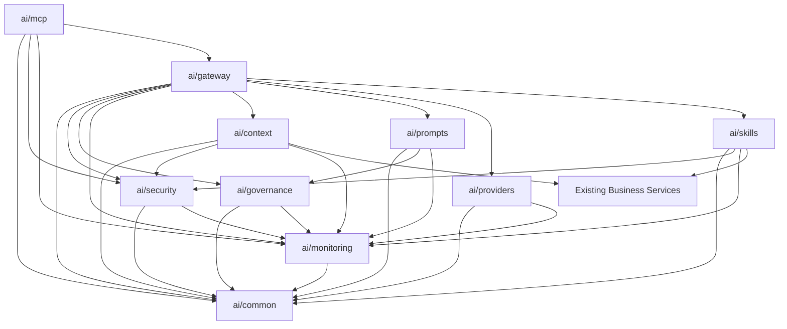
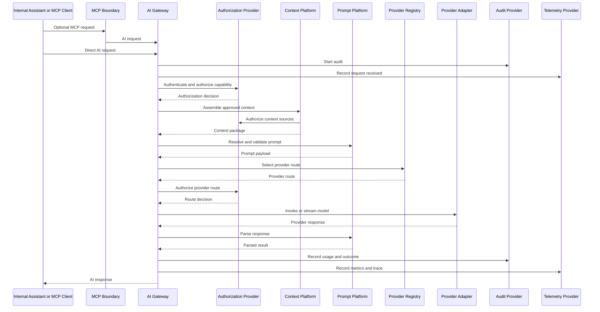

# AI Platform Technical Design Package

**Release:** v1.3  
**Initiative:** AI Platform Foundation  
**Stage:** Technical Design Package  
**Status:** Draft for Implementation Planning  
**Architecture Status:** Architecture and ADRs Approved  
**Implementation Status:** No production code authorized by this document

---

## 1. Purpose

This Technical Design Package translates the approved AI Platform architecture
and ADR package into an implementation-ready technical blueprint.

This document describes module structure, package dependencies, public
interfaces, lifecycle flows, extension boundaries, deployment concerns,
configuration, observability, and technical risks. It does not implement
business logic, source code, APIs, DTOs, entities, repositories, frontend,
backend services, MCP runtime behavior, provider adapters, or tests.

## 2. Authoritative Inputs

- [AI Platform Master Guide](AI_PLATFORM_MASTER_GUIDE.md)
- [AI Platform Architecture Design Package](AI_PLATFORM_ARCHITECTURE_DESIGN_PACKAGE.md)
- [AI Platform ADR Package](adr/README.md)

## 3. Design Principles

- AI is a shared platform capability.
- The AI Gateway is the request orchestration boundary.
- MCP is the external AI interoperability boundary.
- AI Skills expose business capabilities and reuse existing business services.
- Context assembly is permission-filtered before prompt resolution.
- Prompt templates are governed, versioned, and auditable.
- Provider routing is provider-agnostic and policy-driven.
- Security, audit, telemetry, usage, cost, latency, and token accounting are
  mandatory lifecycle concerns.
- No module may access repositories or persistence entities directly unless a
  later approved engineering design explicitly allows a narrow infrastructure
  concern. Business capability execution must flow through existing business
  services.

## 4. AI Module Structure

Recommended root module hierarchy:

```text
ai/
  gateway/
  mcp/
  providers/
  skills/
  prompts/
  context/
  security/
  governance/
  monitoring/
  common/
```

### Module Responsibilities

| Module | Responsibility | Non-Responsibilities |
| --- | --- | --- |
| `ai/gateway` | Request lifecycle orchestration, routing, streaming coordination, response processing, gateway-level errors, audit and telemetry emission. | Business rules, direct provider SDK calls, direct repository access. |
| `ai/mcp` | MCP server lifecycle, sessions, tool registry, resource registry, prompt registry, transport abstraction, external client boundary. | Provider selection, business execution, context filtering. |
| `ai/providers` | Provider registry, provider adapter contracts, capability discovery, provider health, timeout and fallback policy, response normalization inputs. | Prompt governance, business capability execution, RBAC ownership. |
| `ai/skills` | Skill registration, discovery, lifecycle, versioning, execution contracts, dependency declarations against approved business services. | Duplicated domain logic, direct database access, provider-specific logic. |
| `ai/prompts` | Prompt templates, prompt provider contracts, variable injection, validation, governance state, response parsing contracts. | Context fetching, authorization decisions, provider routing. |
| `ai/context` | Context provider contracts, aggregation, permission filtering, summarization, caching policy, token budgeting, future RAG boundary. | Domain rule ownership, prompt ownership, provider invocation. |
| `ai/security` | AI authentication integration, authorization provider contract, scope policy, prompt permissions, PII masking, policy enforcement hooks. | Domain-specific business decisions outside existing authorization model. |
| `ai/governance` | Governance policy catalog, capability lifecycle policy, prompt lifecycle policy, compliance metadata requirements, approval-state checks. | Runtime telemetry storage implementation, domain execution. |
| `ai/monitoring` | Telemetry provider, audit provider, usage accounting, token metrics, cost metrics, latency metrics, provider and skill metrics. | Business logic, provider routing decisions. |
| `ai/common` | Shared contracts, value specifications, error model, lifecycle enums, correlation model, constants, documentation-only interface definitions. | Runtime orchestration or business execution. |

### Internal Submodule Guidance

| Parent Module | Suggested Subareas | Purpose |
| --- | --- | --- |
| `gateway` | ingress, lifecycle, routing, streaming, response, errors | Keep request orchestration cohesive and testable. |
| `mcp` | server, sessions, tools, resources, prompts, transport, auth | Separate MCP protocol concerns from AI execution. |
| `providers` | registry, adapters, health, capabilities, fallback | Keep vendor-specific behavior behind adapter contracts. |
| `skills` | registry, discovery, executor, lifecycle, versions | Keep skill metadata separate from execution orchestration. |
| `prompts` | templates, variables, validation, governance, parsing | Keep prompt lifecycle and prompt execution contracts explicit. |
| `context` | providers, aggregation, permissions, cache, summarization, tokens, retrieval | Keep context preparation independent from prompts and providers. |
| `security` | authentication, authorization, policy, masking, isolation | Keep AI-specific security policy reusable across clients. |
| `governance` | approvals, compliance, capability policy, prompt policy | Keep review-state rules separate from runtime telemetry. |
| `monitoring` | telemetry, audit, usage, cost, latency, tokens | Keep observability concerns consistent across modules. |
| `common` | contracts, errors, identifiers, lifecycle states | Prevent shared definitions from depending on feature modules. |

## 5. Package Dependency Diagram



### Allowed Dependencies

| Package | May Depend On |
| --- | --- |
| `ai/common` | No AI package dependencies. |
| `ai/monitoring` | `ai/common`. |
| `ai/security` | `ai/common`, `ai/monitoring`, existing IAM/RBAC services. |
| `ai/governance` | `ai/common`, `ai/monitoring`. |
| `ai/providers` | `ai/common`, `ai/monitoring`. |
| `ai/prompts` | `ai/common`, `ai/governance`, `ai/monitoring`. |
| `ai/context` | `ai/common`, `ai/security`, `ai/monitoring`, existing business services. |
| `ai/skills` | `ai/common`, `ai/security`, `ai/monitoring`, existing business services. |
| `ai/gateway` | All AI platform modules through public interfaces only. |
| `ai/mcp` | `ai/common`, `ai/security`, `ai/monitoring`, `ai/gateway`. |

### Forbidden Dependencies

- `ai/common` must not depend on any other AI package.
- Provider adapters must not depend on Skills, Context, Prompts, MCP, or
  business services.
- Prompts must not depend on Providers, Skills, Context, MCP, or business
  services.
- Context providers must not depend on Providers or MCP.
- Skills must not depend on Providers or MCP.
- MCP must not bypass the AI Gateway to execute skills, prompts, context
  assembly, or provider calls.
- No AI package may depend on persistence repositories or database entities for
  business capability execution.
- Business domain modules must not depend on AI modules.

### Cycle Prevention Rules

- Shared contracts live in `ai/common`.
- Runtime orchestration flows toward the AI Gateway, not back from domain
  services.
- Registries expose read-only discovery interfaces to gateway and MCP.
- Provider, skill, context, prompt, audit, telemetry, and authorization
  providers communicate through contracts, not concrete module imports.
- Cross-module callbacks must emit events or telemetry through monitoring
  contracts rather than importing caller modules.

## 6. Public Interface Design

These are interface specifications only. They are not TypeScript declarations,
NestJS providers, DTOs, or implementation code.

### Shared Contract Concepts

| Contract | Required Fields |
| --- | --- |
| AI Request | request id, correlation id, actor, client, tenant, workspace, optional project, capability, input payload, requested response mode, metadata. |
| AI Response | request id, status, normalized content, structured output, citations, warnings, proposed actions, errors, audit reference, telemetry reference. |
| AI Scope | tenant id, workspace id, project ids, actor id, client id, role and permission context. |
| AI Capability | capability id, name, version, risk level, required permissions, supported clients, supported response modes. |
| AI Error | code, category, message, safe detail, retryable flag, provider reference where applicable, correlation id. |

### AI Gateway Interface

| Operation | Purpose | Inputs | Outputs |
| --- | --- | --- | --- |
| Accept Request | Start the AI lifecycle. | AI Request. | Gateway lifecycle handle or rejected AI Error. |
| Execute Request | Run a non-streaming AI request. | AI Request, scope, client metadata. | AI Response. |
| Stream Request | Run a streaming AI request where supported. | AI Request, stream policy, scope. | Stream events and terminal AI Response metadata. |
| Validate Capability | Confirm capability is known and allowed. | Capability id, actor, client, scope. | Authorization decision. |
| Normalize Response | Convert provider or skill output into platform response. | Provider result, skill result, prompt contract. | AI Response. |
| Emit Lifecycle Event | Report state transitions. | Request id, lifecycle state, timestamp, metadata. | Telemetry reference. |

### Provider Adapter Interface

| Operation | Purpose | Inputs | Outputs |
| --- | --- | --- | --- |
| Describe Provider | Return provider identity and metadata. | None. | Provider descriptor. |
| Discover Capabilities | Report model and provider capabilities. | Provider configuration scope. | Capability map. |
| Health Check | Validate provider readiness. | Health-check policy. | Health state. |
| Invoke Model | Execute non-streaming model request. | Provider request payload, timeout policy, routing context. | Provider response. |
| Stream Model | Execute streaming model request. | Provider request payload, stream policy. | Provider stream events. |
| Normalize Error | Convert provider failure into standard AI Error. | Provider exception or error response. | AI Error. |
| Estimate Cost | Estimate cost before or after invocation. | model, token estimate, request metadata. | Cost estimate. |

### Skill Interface

| Operation | Purpose | Inputs | Outputs |
| --- | --- | --- | --- |
| Describe Skill | Return skill metadata. | None. | Skill descriptor. |
| Validate Input | Validate capability input before execution. | Skill input, scope. | Validation result. |
| Authorize Skill | Declare or evaluate required permissions. | Actor, scope, skill input. | Authorization decision. |
| Resolve Dependencies | Identify required business services and context providers. | Skill descriptor. | Dependency list. |
| Execute Skill | Produce business capability output through existing services. | Skill input, context package, scope. | Skill result. |
| Report Version | Return version and compatibility metadata. | None. | Skill version descriptor. |

### Context Provider Interface

| Operation | Purpose | Inputs | Outputs |
| --- | --- | --- | --- |
| Describe Context | Return context type and supported scopes. | None. | Context descriptor. |
| Authorize Context | Confirm actor can access requested source. | Scope, context request. | Authorization decision. |
| Fetch Context | Retrieve business context through existing services. | Context request, scope, freshness policy. | Raw context fragment. |
| Filter Context | Apply permissions and sensitivity rules. | Raw fragment, scope, policy. | Filtered context fragment. |
| Summarize Context | Compress context where required. | Filtered fragment, token budget. | Context summary. |
| Attribute Sources | Attach source references and freshness metadata. | Context fragment. | Source-attributed fragment. |

### Prompt Provider Interface

| Operation | Purpose | Inputs | Outputs |
| --- | --- | --- | --- |
| Resolve Template | Select approved template for capability. | Capability id, version policy, actor, client. | Prompt template descriptor. |
| Validate Template | Confirm lifecycle state and governance status. | Prompt template, scope. | Validation result. |
| Inject Variables | Bind request input and context to variables. | Prompt template, variables, context package. | Prompt payload. |
| Validate Prompt | Confirm output contract, token budget, and safety constraints. | Prompt payload, provider route. | Validation result. |
| Parse Response | Convert provider response to prompt output contract. | Provider response, template output contract. | Parsed prompt result. |

### MCP Tool Interface

| Operation | Purpose | Inputs | Outputs |
| --- | --- | --- | --- |
| Describe Tool | Return MCP tool metadata. | Actor and client context. | Permission-filtered tool descriptor. |
| Validate Tool Input | Validate MCP tool arguments. | Tool request. | Validation result. |
| Map To AI Request | Convert MCP tool call into AI request. | Tool request, session context. | AI Request. |
| Return Tool Result | Convert AI response to MCP result. | AI Response. | MCP tool result. |

### MCP Resource Interface

| Operation | Purpose | Inputs | Outputs |
| --- | --- | --- | --- |
| Describe Resource | Return resource metadata. | Actor and client context. | Permission-filtered resource descriptor. |
| Resolve Resource | Convert resource request into context request or AI request. | Resource request, session context. | Context request or AI Request. |
| Return Resource | Convert context or AI response into MCP resource payload. | Context package or AI Response. | MCP resource result. |

### Telemetry Provider Interface

| Operation | Purpose | Inputs | Outputs |
| --- | --- | --- | --- |
| Record Event | Capture lifecycle event. | Event name, request id, dimensions, timestamp. | Telemetry reference. |
| Record Metric | Capture numeric metric. | Metric name, value, dimensions. | Telemetry reference. |
| Record Trace | Capture correlated timing data. | Trace span, parent id, timing, metadata. | Trace reference. |
| Record Error | Capture error metadata. | AI Error, request id, dimensions. | Telemetry reference. |

### Audit Provider Interface

| Operation | Purpose | Inputs | Outputs |
| --- | --- | --- | --- |
| Start Audit | Open audit record. | Request id, actor, client, scope, capability. | Audit reference. |
| Record Decision | Capture authorization, routing, prompt, or context decision. | Audit reference, decision type, result, safe metadata. | Updated audit reference. |
| Record Usage | Capture token, cost, latency, and provider usage. | Audit reference, usage record. | Updated audit reference. |
| Record Outcome | Capture final success, rejection, failure, or cancellation. | Audit reference, outcome metadata. | Final audit reference. |

### Authorization Provider Interface

| Operation | Purpose | Inputs | Outputs |
| --- | --- | --- | --- |
| Authenticate Client | Validate AI client and bind actor/session. | Client credentials or session token. | Authenticated client context. |
| Authorize Capability | Check actor can use capability. | Actor, client, scope, capability. | Authorization decision. |
| Authorize Context | Check actor can access context source. | Actor, scope, context descriptor. | Authorization decision. |
| Authorize Prompt | Check actor can use prompt template. | Actor, client, prompt descriptor, scope. | Authorization decision. |
| AuthorizeProviderRoute | Check provider route is allowed. | Actor, tenant, data classification, provider route. | Authorization decision. |
| Mask Sensitive Data | Apply PII and sensitivity policy. | Context fragment or prompt payload, policy. | Masked payload and masking metadata. |

## 7. Request Lifecycle



### Lifecycle Steps

1. **Incoming AI Request**: Request enters through internal Assistant, MCP, REST
   facade, or future event facade.
2. **Authentication**: Client and actor are resolved.
3. **Authorization**: Capability, scope, prompt eligibility, context sources,
   and provider route are checked.
4. **Audit Start**: Initial audit reference is created.
5. **Telemetry Start**: Request timing and correlation begin.
6. **Context Assembly**: Context plan is created, sources are authorized,
   fragments are fetched, filtered, redacted, summarized, and attributed.
7. **Prompt Resolution**: Approved prompt template is selected, variables are
   injected, output contract is validated, and token budget is checked.
8. **Provider Selection**: Provider Registry chooses a route based on
   capability, policy, health, cost, data sensitivity, and response mode.
9. **Model Invocation**: Provider adapter executes request or stream.
10. **Response Processing**: Provider response is normalized, parsed, checked
    against output contract, and enriched with citations and warnings.
11. **Audit Logging**: Decisions, context inclusion, provider route, usage,
    cost, and outcome are recorded.
12. **Telemetry**: Gateway, context, prompt, provider, skill, MCP, latency,
    token, and cost metrics are emitted.
13. **Response Delivery**: Normalized response or safe error is returned to the
    originating client.

## 8. Context Assembly Pipeline

### Pipeline Stages

```mermaid
flowchart LR
    Request[Context Request] --> Plan[Build Context Plan]
    Plan --> Authorize[Authorize Sources]
    Authorize --> Fetch[Fetch Through Business Services]
    Fetch --> Filter[Permission Filter]
    Filter --> Mask[PII and Sensitivity Masking]
    Mask --> Cache[Apply Cache Policy]
    Cache --> Summarize[Summarize and Compress]
    Summarize --> Budget[Token Budgeting]
    Budget --> Attribute[Source Attribution]
    Attribute --> Package[Context Package]
```



### Context Provider Interface Requirements

- Must declare supported context type and scope.
- Must declare required permissions.
- Must fetch through approved business services.
- Must support freshness metadata.
- Must support source attribution.
- Must support filtering and masking metadata.
- Must expose estimated token size.

### Aggregation Strategy

- Context aggregation is request-scoped.
- The gateway requests a context plan based on capability, prompt
  requirements, skill requirements, actor scope, client type, and token budget.
- Aggregation orders context by relevance, requiredness, freshness, and
  sensitivity.
- Required context failures may reject the request.
- Optional context failures may degrade the response with warnings and audit
  metadata.

### Permission Filtering

- Permission filtering occurs per source before aggregation output.
- Workspace, project, tenant, membership, document visibility, and role-based
  permission checks are enforced.
- Redacted or omitted context is recorded in audit metadata when safe.

### Caching Strategy

- Cache entries are scoped by tenant, workspace, project, actor, capability,
  context provider, and permission fingerprint.
- Sensitive context defaults to no-cache unless explicitly allowed by policy.
- Cache entries must include freshness timestamps and invalidation policy.
- Cache hits must still validate that actor scope and permissions are current.
- Cache policy must not allow cross-user, cross-project, cross-workspace, or
  cross-tenant reuse unless a later approved design explicitly permits it.

### Summarization Strategy

- Summaries are generated only after permission filtering and masking.
- Summaries must preserve source references.
- Summaries must include freshness and completeness indicators.
- Summaries must not promote low-confidence inferred facts into authoritative
  facts.
- Summarization failures degrade gracefully when raw filtered context can still
  satisfy the prompt budget.

### Token Budgeting

- Token budget is calculated from provider capability, prompt template,
  expected output size, context package, and client response mode.
- Required context receives priority.
- Optional context is trimmed by relevance and freshness.
- Oversized context triggers summarization, source trimming, or safe rejection.

### Future RAG Compatibility

- Context providers must be compatible with future retrieval sources.
- Future RAG must remain permission-filtered, document AI-visible,
  source-attributed, and auditable.
- Embeddings, vector stores, document chunking, and semantic search are future
  design concerns and are not authorized by this TDP.

## 9. Provider Integration Model

### Adapter Lifecycle

1. Provider adapter is registered with provider metadata.
2. Provider configuration is validated.
3. Capability discovery runs at startup or scheduled intervals.
4. Health checks update availability state.
5. Gateway requests provider route for each AI request.
6. Adapter invokes or streams model output.
7. Adapter normalizes provider errors and usage metadata.
8. Provider metrics update routing and monitoring signals.

### Capability Discovery

Provider capability metadata includes:

- Models.
- Context window.
- Streaming support.
- Structured output support.
- Tool-use support.
- Multimodal support.
- Latency class.
- Cost class.
- Data residency classification.
- Timeout limits.
- Rate limits.
- Provider health state.

### Health Monitoring

- Startup health checks confirm configuration readiness.
- Runtime health checks detect availability and degradation.
- Provider error rates and timeout rates feed circuit breaker policy.
- Health state must be observable by operations and gateway routing.

### Fallback Strategy

- Fallback is allowed only when policy permits alternate providers.
- Fallback must preserve data residency, sensitivity, tenant policy, and
  capability requirements.
- Fallback attempts are audited.
- Fallback must not silently change output contract.

### Timeout Handling

- Provider timeout policy is configured per provider, model, capability, and
  response mode.
- Gateway-level timeout must exceed or coordinate provider timeout.
- Streaming idle timeout is separate from full request timeout.
- Timeout errors are standardized and marked retryable only when safe.

### Streaming Support

- Streaming requires provider support, client support, and gateway policy.
- Stream events must carry correlation and lifecycle metadata.
- Partial stream failures must produce a terminal safe error and audit outcome.
- Sensitive data must be filtered before streaming begins.

### Provider Registration

Provider registration must declare:

- Provider id.
- Adapter version.
- Supported models.
- Capability metadata.
- Configuration requirements.
- Secret references.
- Health-check method.
- Cost model.
- Error mapping.
- Streaming support.

## 10. Skill Execution Model

### Registration

- Skills register through a skill registry.
- Registration includes capability id, version, lifecycle state, owner,
  required permissions, required context, input contract, output contract, risk
  level, and supported clients.
- Registration must be discoverable but permission-filtered.

### Discovery

- Discovery returns only skills available to the actor, client, tenant,
  workspace, and project scope.
- Discovery includes version compatibility and lifecycle state.
- Deprecated skills may be visible only for compatibility or migration
  scenarios.

### Dependency Injection

- Skills declare dependencies on approved business service interfaces and
  context providers.
- Skills do not depend on provider adapters, MCP modules, repositories, or
  persistence entities.
- Dependency resolution is validated during engineering implementation and
  startup readiness checks.

### Execution Lifecycle

1. Gateway selects skill based on capability.
2. Skill input is validated.
3. Skill permissions are checked.
4. Required context is assembled.
5. Skill consumes existing business services.
6. Skill returns structured business output.
7. Gateway passes skill output into prompt orchestration or response
   normalization.
8. Audit and telemetry record skill usage, latency, errors, and output
   classification.

### Error Handling

- Validation errors are safe client errors.
- Authorization errors are safe denials.
- Business service failures are standardized and audited.
- Optional dependency failures may degrade response with warnings.
- Required dependency failures reject execution.

### Versioning

- Skill versions must be backward-compatible within a major capability version.
- Breaking changes require a new skill version.
- Gateway and MCP discovery must expose compatible versions only.
- Deprecated versions require retirement policy.

### Permission Checks

- Skill-level permission checks occur before execution.
- Context-level permission checks still occur per context provider.
- Business services retain their own authorization enforcement.
- Proposed future mutating skills require separate approval architecture.

## 11. Prompt Execution Pipeline

### Prompt Templates

Prompt templates define purpose, capability, lifecycle state, version,
variables, required context, output contract, safety constraints, governance
status, and evaluation metadata.

### Variable Injection

- Variables may come from request input, actor scope, client metadata, context
  package, skill output, and runtime policy.
- Required variables must be present before execution.
- Variable injection must preserve source attribution where applicable.
- Sensitive values are masked according to security policy.

### Validation

- Prompt lifecycle state must allow execution.
- Prompt version must be compatible with requested capability.
- Required context and variables must be present.
- Output contract must be known.
- Token budget must be valid for selected provider route.
- Prompt permissions must be authorized.

### Governance

- Only approved prompts execute in production.
- Draft or review prompts require non-production governance policy.
- Deprecated prompts may execute only during approved transition windows.
- Prompt changes require evaluation readiness metadata.

### Execution

- Gateway sends provider-ready prompt payload to provider adapter.
- Prompt Platform does not call providers directly.
- Provider-specific formatting is constrained by provider capability metadata.

### Response Parsing

- Provider responses are parsed against prompt output contract.
- Parsed responses include content, structured fields, citations, warnings,
  proposed actions, and parse errors.
- Parse failures produce standardized safe errors or degraded responses when
  policy allows.

## 12. MCP Technical Design

### Server Lifecycle

- Initialize transport.
- Load MCP registry metadata.
- Validate security configuration.
- Load permission-filtered capability discovery.
- Start request handling.
- Emit health and telemetry state.
- Gracefully drain active sessions on shutdown.

### Session Lifecycle

1. Client connects through supported transport.
2. Client authentication is resolved.
3. Actor, tenant, workspace, and client trust level are bound.
4. Session policy is created.
5. Capability discovery is filtered.
6. Tool, resource, and prompt requests map to AI Gateway requests.
7. Session activity is audited and monitored.
8. Session expires, disconnects, or is revoked.

### Tool Registry

- Stores tool metadata and input specifications.
- Exposes only authorized tools.
- Maps tool calls to AI Gateway capability requests.
- Does not execute business logic directly.

### Resource Registry

- Stores resource metadata and scope requirements.
- Exposes permission-filtered resources.
- Maps resource access to context requests or gateway requests.
- Does not expose persistence entities.

### Prompt Registry

- Exposes approved MCP prompt entrypoints.
- Maps prompt requests to Prompt Platform templates through the gateway.
- Enforces prompt permissions through the security model.

### Transport Abstraction

- MCP transport details remain isolated behind a transport boundary.
- Request correlation, cancellation, streaming, and error semantics must be
  normalized before reaching the gateway.
- Transport-specific authentication details must not leak into AI Skills,
  Context, Prompts, or Providers.

### Authentication and Authorization

- MCP client authentication binds external client identity to PM Platform
  actor and scope.
- Authorization is delegated to AI Security and Gateway policies.
- MCP discovery is permission-aware.
- MCP cannot bypass prompt, context, provider, skill, audit, or telemetry
  controls.

## 13. Error Handling Strategy

### Standard Error Model

| Category | Description | Retryable |
| --- | --- | --- |
| Authentication | Client or actor identity cannot be established. | No |
| Authorization | Actor, client, scope, prompt, context, or provider route is denied. | No |
| Validation | Request, tool, prompt, variable, or skill input is invalid. | No |
| Context | Required context cannot be fetched, filtered, or summarized. | Depends on cause |
| Provider | Provider error, model error, rate limit, or unavailable service. | Depends on provider and policy |
| Timeout | Gateway, context, prompt, provider, stream, or skill timeout. | Depends on operation |
| Governance | Prompt, skill, provider, or capability lifecycle state disallows execution. | No |
| System | Unexpected platform failure. | Usually retryable after delay |

### Provider Failures

- Provider failures are normalized through provider error mapping.
- Provider error metadata must avoid leaking secrets or unsafe provider payload.
- Provider failures may trigger retry, fallback, graceful degradation, or safe
  failure according to policy.

### Timeout Policy

- Timeouts exist at gateway, context, skill, prompt, provider, and stream
  boundaries.
- Timeout outcomes are audited.
- Client-visible timeout messages must be safe and actionable.

### Retry Policy

- Retry only idempotent or safe read-oriented operations.
- Never retry if it risks duplicate mutations.
- Respect provider rate-limit guidance.
- Retry attempts are bounded and audited.

### Circuit Breaker Behavior

- Provider circuit breakers respond to error rate, timeout rate, and health
  signals.
- Open circuits remove provider routes from normal routing.
- Half-open probes are controlled by provider health policy.

### Graceful Degradation

- Optional context sources may be omitted with warnings.
- Optional provider features may degrade if output contract remains valid.
- Required capability, context, prompt, provider, or authorization failures
  must reject the request safely.

## 14. Observability Design

### Telemetry Dimensions

- Request id and correlation id.
- Actor id, client id, tenant id, workspace id, project id.
- Capability id and skill id.
- Prompt id and prompt version.
- Provider id and model id.
- Context provider ids.
- MCP session id where applicable.
- Response mode.
- Lifecycle state.

### Metrics by Area

| Area | Metrics |
| --- | --- |
| Gateway | request count, lifecycle duration, rejection count, error count, stream count, cancellation count. |
| Skills | execution count, latency, validation failures, authorization failures, dependency failures, version usage. |
| Providers | invocation count, latency, timeout count, rate-limit count, error count, fallback count, health state. |
| Prompts | template usage, version usage, validation failures, parse failures, token estimate accuracy. |
| MCP | session count, tool calls, resource requests, prompt requests, auth failures, disconnects. |
| Audit | audit start count, decision count, outcome count, audit failure count. |
| Cost | estimated cost, provider-reported cost when available, cost by tenant/workspace/project/capability. |
| Latency | gateway, context, prompt, skill, provider, MCP, total end-to-end latency. |
| Token Usage | prompt tokens, context tokens, completion tokens, total tokens, trimmed context tokens. |

### Audit Events

- Request received.
- Authentication decision.
- Authorization decision.
- Context source included, redacted, omitted, or denied.
- Prompt selected and versioned.
- Provider route selected.
- Model invocation started and completed.
- Skill executed.
- MCP tool, resource, or prompt invoked.
- Usage and cost recorded.
- Request completed, rejected, failed, cancelled, or timed out.

## 15. Configuration Model

### Environment Variables

Environment variables should provide deployment-time configuration only:

- AI platform enablement.
- Provider enablement.
- Provider endpoint references.
- Provider secret references.
- Default timeout values.
- Default rate-limit values.
- Audit and telemetry sinks.
- Cost tracking enablement.
- MCP enablement and transport settings.

Exact variable names are deferred to implementation design standards.

### Feature Flags

Feature flags should control:

- AI Gateway availability.
- MCP Server availability.
- Provider availability.
- Skill availability.
- Prompt availability.
- Streaming availability.
- Context caching.
- Summarization.
- Experimental capabilities.

Feature flags must not bypass authorization, audit, tenant isolation, or
workspace isolation.

### Provider Configuration

Provider configuration includes:

- Provider id.
- Enabled state.
- Endpoint.
- Secret reference.
- Supported models.
- Timeout policy.
- Rate-limit policy.
- Cost model.
- Data residency classification.
- Fallback eligibility.

### Secrets Management

- Provider secrets must be referenced, not stored in plain configuration.
- Secrets must not appear in telemetry, audit, logs, errors, prompts, or
  provider metadata returned to clients.
- Secret rotation must not require code changes.

### Runtime Configuration

Runtime configuration includes:

- Active provider routes.
- Prompt lifecycle states.
- Skill lifecycle states.
- Context cache policy.
- Tenant or workspace AI policy.
- Cost budgets and rate limits.
- MCP client trust policy.

Runtime configuration changes must be auditable.

## 16. Extension Model

### Adding a New AI Provider

Required steps for design and implementation planning:

- Define provider metadata.
- Define provider adapter contract compliance.
- Define capability mapping.
- Define model support.
- Define error mapping.
- Define cost model.
- Define health check.
- Define timeout and rate-limit policy.
- Define data residency classification.
- Register provider through Provider Registry.

Core gateway, skills, prompts, context, and MCP modules must not change for a
standard provider addition.

### Adding a New Skill

- Define capability id, version, risk level, lifecycle state, owner, input
  contract, output contract, required permissions, required context, and
  business service dependencies.
- Register skill in the Skill Registry.
- Ensure discovery is permission-filtered.
- Ensure audit and telemetry dimensions are declared.

Core gateway, provider, MCP, prompt, and context modules must not change for a
standard skill addition.

### Adding a New Prompt

- Define prompt template metadata.
- Define variables and required context.
- Define output contract.
- Define lifecycle state and governance approval.
- Define evaluation readiness metadata.
- Register prompt through Prompt Platform.

Core provider, skill, context, MCP, and gateway modules must not change for a
standard prompt addition.

### Adding a New MCP Tool

- Define tool metadata and input specification.
- Map tool to an AI capability.
- Declare required permissions and risk level.
- Register tool in MCP Tool Registry.
- Confirm gateway request mapping.

Tools must not execute business logic directly.

### Adding a New Context Provider

- Define context type and scope.
- Declare required permissions.
- Declare business service dependency.
- Define freshness, caching, masking, summarization, and source attribution
  behavior.
- Register provider in Context Platform.

Context providers must not call provider adapters or MCP modules.

## 17. Deployment Architecture

### Development

- AI modules may be disabled by default until implementation gates approve
  development.
- Local development should support provider stubs or disabled provider routes.
- Developer configuration should make missing secrets fail clearly and safely.

### Docker

- AI Platform runtime should fit within existing Docker deployment patterns.
- Provider credentials should be injected through secret references.
- MCP exposure should be explicitly enabled.
- Health endpoints must represent AI gateway, MCP, provider registry, and
  provider adapter readiness without exposing sensitive details.

### Production

- AI Gateway, MCP, provider registry, context, prompt, skill, security,
  governance, monitoring, and audit concerns must be observable.
- Production must support rate limits, cost limits, audit retention, and
  provider health monitoring.
- Provider access must respect tenant policy and secret management.

### Scaling

- Gateway and MCP request handling should be horizontally scalable.
- Context assembly and provider calls must avoid in-memory singleton state that
  cannot scale across instances.
- Provider health and circuit breaker state may require shared operational
  state or careful per-instance behavior.
- Audit and telemetry sinks must handle high-cardinality dimensions safely.

### Stateless Services

- Request orchestration should be stateless after each request completes.
- Long-running streams should use correlation ids and bounded session state.
- Session state must not be stored only in local process memory if production
  scale requires multi-instance routing.

### Session Management

- MCP sessions require explicit lifecycle policy.
- Session state includes client identity, actor binding, tenant, workspace,
  trust level, and capability discovery snapshot.
- Sessions must expire, revoke, and audit disconnects.
- Streaming sessions must handle cancellation and partial failure safely.

## 18. Technical Risks and Mitigations

| Risk Category | Risk | Mitigation |
| --- | --- | --- |
| Scalability | Context assembly becomes expensive across large portfolios. | Token budgeting, provider-scoped context plans, optional context trimming, cache policy, staged rollout. |
| Scalability | Gateway becomes a bottleneck. | Stateless design, horizontal scaling, clear lifecycle spans, provider timeout controls. |
| Security | AI context leaks across workspace, project, or tenant boundaries. | Authorization before context assembly, per-source filtering, audit of included and omitted sources. |
| Security | Provider receives sensitive data that should be masked. | PII masking, sensitivity policy, provider route authorization, deny-by-default document AI visibility. |
| Provider Dependency | Provider outage affects all AI features. | Provider Registry health checks, circuit breakers, policy-controlled fallback. |
| Provider Dependency | Provider-specific features leak into prompts or skills. | Capability mapping, adapter contracts, provider-neutral skill and prompt contracts. |
| Performance | Streaming or long model calls tie up request resources. | Streaming policy, idle timeout, cancellation, bounded request lifecycle. |
| Performance | Prompt validation and context summarization add latency. | Lifecycle metrics, optional summarization, cache policy, prompt pre-validation where safe. |
| Token Growth | Context packages exceed provider limits. | Token budget calculation, required/optional context priority, summarization, trimming, safe rejection. |
| Governance | Prompt or skill changes bypass approval. | Lifecycle states, governance checks, audit records, feature flags that cannot bypass security. |
| Governance | Audit records retain sensitive prompt or response content. | Metadata-first audit, redaction policy, retention design, compliance review. |
| Extension | Plugins bypass core platform controls. | Required registry integration, permission-aware discovery, compatibility versions, architecture review. |

## 19. Implementation Planning Readiness Checklist

- Module hierarchy is defined.
- Allowed and forbidden dependencies are defined.
- Public interface specifications are defined.
- Request lifecycle is defined end to end.
- Context assembly pipeline is defined.
- Provider integration model is defined.
- Skill execution model is defined.
- Prompt execution pipeline is defined.
- MCP technical design is defined.
- Error handling strategy is defined.
- Observability design is defined.
- Configuration model is defined.
- Extension model is defined.
- Deployment architecture is defined.
- Technical risks and mitigations are defined.
- No production code, business logic, APIs, DTOs, entities, repositories,
  NestJS code, React code, MCP implementation, provider implementation, or
  tests are authorized by this TDP.
