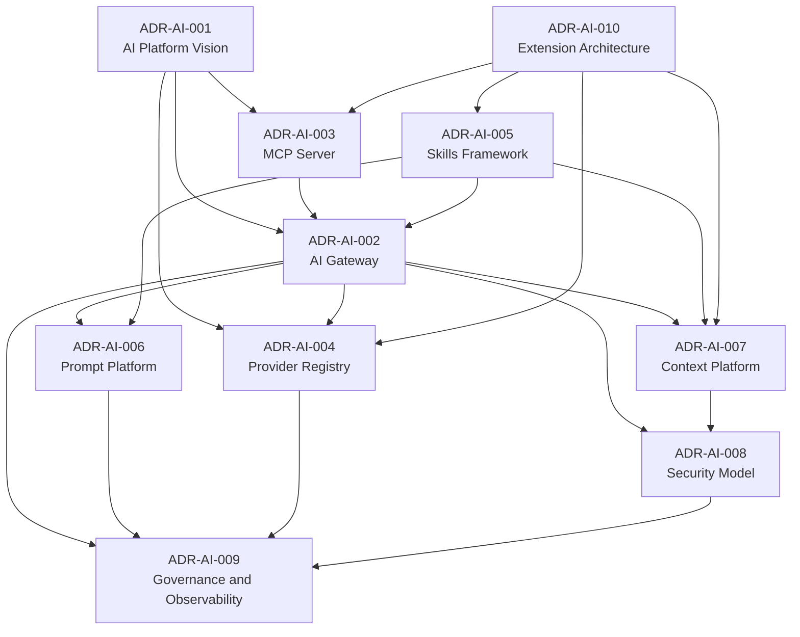

# AI Platform ADR Package

**Initiative:** AI Platform Foundation  
**Stage:** Architecture Decision Records  
**Status:** Accepted  
**Implementation Status:** No implementation authorized

This package formalizes the architectural decisions defined by:

- [AI Platform Master Guide](../AI_PLATFORM_MASTER_GUIDE.md)
- [AI Platform Architecture Design Package](../AI_PLATFORM_ARCHITECTURE_DESIGN_PACKAGE.md)
- [AI Platform](../AI_PLATFORM.md)

These ADRs are implementation-independent. They do not authorize source code,
APIs, DTOs, database schema, frontend work, backend implementation, MCP
implementation, provider adapters, or migrations.

## Suggested Reading Order

1. [ADR-AI-001 AI Platform Vision](ADR-AI-001-ai-platform-vision.md)
2. [ADR-AI-002 AI Gateway Architecture](ADR-AI-002-ai-gateway.md)
3. [ADR-AI-003 Model Context Protocol Server](ADR-AI-003-mcp-server.md)
4. [ADR-AI-004 AI Provider Registry](ADR-AI-004-provider-registry.md)
5. [ADR-AI-005 AI Skills Framework](ADR-AI-005-skills-framework.md)
6. [ADR-AI-006 Prompt Platform](ADR-AI-006-prompt-platform.md)
7. [ADR-AI-007 Enterprise Context Platform](ADR-AI-007-context-platform.md)
8. [ADR-AI-008 AI Security Model](ADR-AI-008-security.md)
9. [ADR-AI-009 AI Governance and Observability](ADR-AI-009-governance.md)
10. [ADR-AI-010 AI Extension Architecture](ADR-AI-010-extension-model.md)

## ADR Dependency Diagram

## Cross-ADR Themes

- AI is a platform capability, not a feature.
- AI clients consume business capabilities, not database entities.
- The in-platform AI Assistant and external AI clients share the same governed
  platform boundary.
- The AI Gateway is the primary orchestration and control point.
- MCP is the external interoperability boundary.
- Provider selection is policy-based and vendor-independent.
- AI Skills reuse existing business services and do not duplicate domain logic.
- Context assembly is permission-filtered before prompt construction.
- Security, audit, usage, cost, and observability are mandatory platform
  concerns.

## Recommended Future ADRs

| Future ADR | Purpose |
| --- | --- |
| AI Mutation and Human Approval Model | Define how AI may propose or execute changes, including confirmation, undo, and audit requirements. |
| AI Evaluation and Quality Gates | Define prompt, skill, provider, and response evaluation standards before production rollout. |
| AI Data Retention and Privacy Policy | Define retention rules for prompts, responses, context packages, traces, and provider payload metadata. |
| AI Document Retrieval and RAG Boundary | Define future semantic retrieval, embeddings, chunking, freshness, and document AI visibility enforcement. |
| AI Event Automation Architecture | Define future event-driven AI workflows, idempotency, replay, and operational safeguards. |
| AI Tenant Residency and Provider Policy | Define tenant-specific provider eligibility, data residency constraints, and local model routing. |
