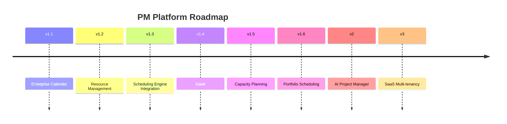

# Roadmap

This roadmap summarizes completed capabilities and approved future direction. It does not imply that future items are implemented.

## Completed / Current

| Area | Status |
| --- | --- |
| Core Platform | Implemented: auth, users, roles, permissions, project visibility. |
| Project Management | Implemented: projects, governance roles, members, project workspace. |
| Task Management | Implemented: tasks, WBS, milestones, dependencies, task operations. |
| Planning | Implemented: planning workspace, snapshots, baselines, scheduling engine. |
| RAID | Implemented: risks, assumptions, issues, dependencies, comments/history. |
| Portfolio | Implemented: portfolio summaries and executive dashboard signals. |
| Enterprise Calendar | Implemented in Epic 1.1: domain model, API, administration UI. |

## Epic Roadmap

## v1.1 Enterprise Calendar

Current implementation:

- Enterprise calendar persistence.
- Calendar exceptions.
- Calendar REST API.
- Calendar administration UI.

Deferred:

- Project calendars.
- Resource calendars.
- Effective calendar inheritance.
- Calendar-aware schedule calculation.

## v1.2 Resource Management

Planned:

- Resource profiles.
- Resource CRUD.
- Capacity and availability foundations.
- Initial resource management UI.

## v1.3 Scheduling Engine Integration

Planned:

- Approved integration of calendar/resource context into planning.
- SchedulingContext extension if needed.
- Regression protection for CPM behavior.

## v1.4 Gantt

Planned:

- Richer timeline/Gantt interaction.
- Planning visualization improvements.

## v1.5 Capacity Planning

Planned:

- Utilization summaries.
- Over-allocation indicators.
- Capacity vs demand views.

## v1.6 Portfolio Scheduling

Planned:

- Portfolio schedule health.
- Portfolio baseline variance.
- Portfolio resource pressure summaries.

## v2 AI Project Manager

Future:

- AI-assisted summaries, recommendations, and reviews.
- AI consumes deterministic planning outputs.
- AI does not replace Scheduling Engine authority.

## v3 SaaS Multi-tenancy

Future:

- Organization/tenant model.
- Tenant isolation.
- SaaS administration.
- Tenant-aware permissions and migrations.

