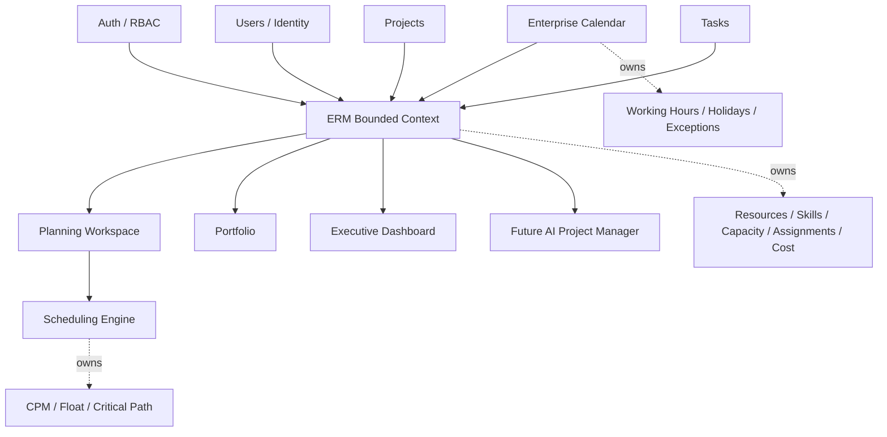
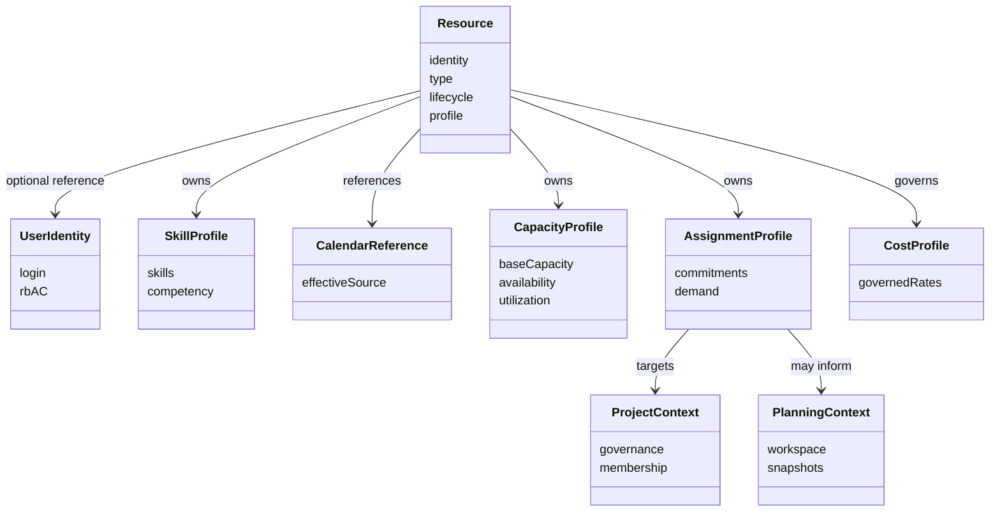
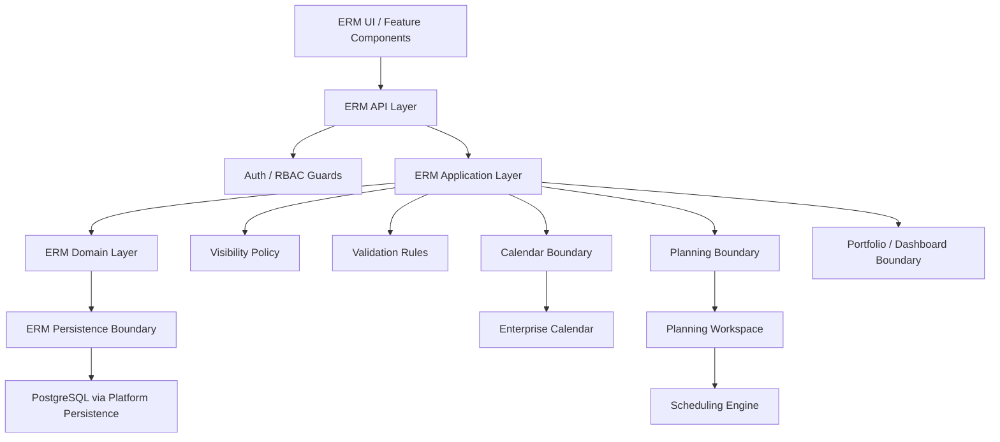
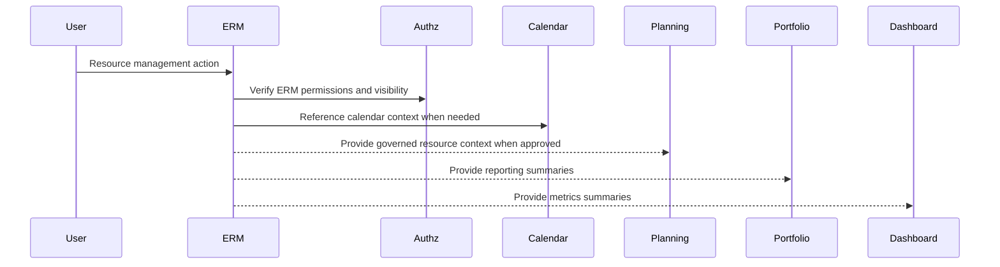
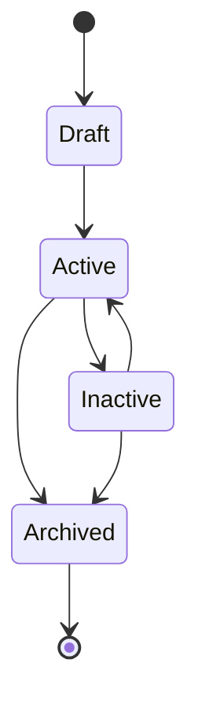
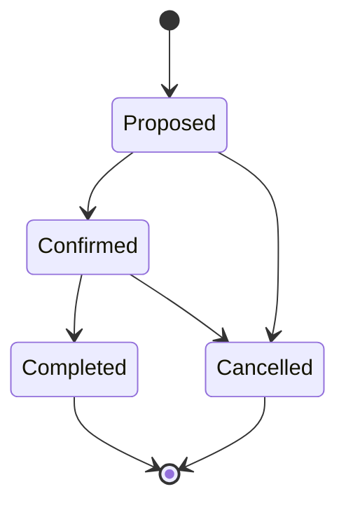
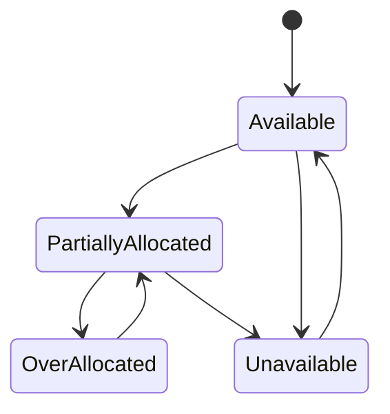
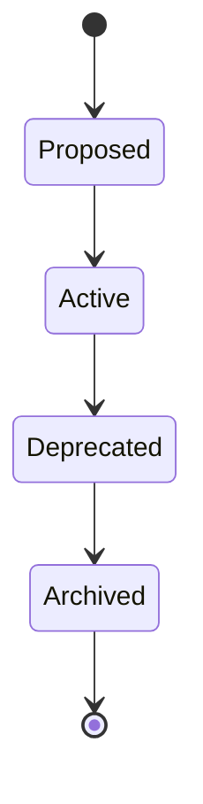

# ERM Architecture Design Document

## 1. Executive Summary

### Purpose

This Architecture Design Document defines how Enterprise Resource Management fits into the existing PM Platform architecture. It is the architectural blueprint for Epic 1.2 and the input to Stage 5 Technical Design Review.

### Scope

The ADD covers the ERM bounded context, conceptual domain model, logical components, integration boundaries, lifecycle design, security, API philosophy, persistence strategy, UI architecture, extensibility, backward compatibility, risks, and traceability.

### Goals

- Establish ERM as an independent bounded context.
- Preserve Scheduling Engine isolation.
- Preserve Enterprise Calendar ownership.
- Keep Resource independent from User identity.
- Support human and non-human resources.
- Support resource profiles, skills, calendar references, capacity, availability, assignments, cost governance, and resource dashboard concepts.
- Preserve backward compatibility with existing Planning resource foundations.

### Non-Goals

- No implementation code.
- No concrete database schema.
- No REST endpoint contracts.
- No DTO definitions.
- No migrations.
- No scheduling calculation changes.
- No automatic resource leveling.
- No SaaS tenant model.
- No AI implementation.

### Success Criteria

- ERM has a clear ownership boundary.
- Existing Planning, Calendar, Scheduling, Portfolio, Dashboard, Auth, and User responsibilities remain intact.
- Stage 5 can evaluate technical design without requiring more architectural clarification.
- Implementation planning can proceed without inventing new architecture.

## 2. Background

PM Platform is a Docker-deployed Next.js and NestJS platform with PostgreSQL persistence, Redis, MinIO, RBAC, project management, task management, Planning Workspace, Scheduling Engine, Enterprise Calendar, Portfolio, and Dashboards.

Relevant repository facts:

- Resource-related code currently exists in Planning as project-scoped capacity, allocation, and workload snapshot foundations.
- There is no standalone ERM module in the repository.
- Enterprise Calendar is implemented as an internal calendar domain plus public calendar API/UI.
- Scheduling Engine is production-stable and isolated through `SchedulingContext`.
- Portfolio and Dashboard are reporting consumers.

Relevant ADRs:

- ADR-001 Feature Architecture.
- ADR-002 Calendar Architecture.
- ADR-003 Scheduling Isolation.
- ADR-004 API Design.
- ADR-005 Frontend Architecture.
- ADR-006 Resource Domain.
- ADR-007 Capacity Model.
- ADR-008 Calendar Assignment.
- ADR-009 Resource Types.
- ADR-010 ERM Aggregate and Ownership Boundary.
- ADR-011 ERM Assignment Ownership.
- ADR-012 ERM Permissions and Visibility.
- ADR-013 ERM Planning Resource Transition.

ERM is required because the current platform can model users and project-scoped planning allocations, but cannot yet govern enterprise-wide resources, skills, availability, calendar association, cost visibility, or cross-project resource search.

## 3. Design Principles

| Principle | Application to ERM |
| --- | --- |
| Clean Architecture | ERM separates API, application, domain, and persistence responsibilities conceptually. |
| Domain-Driven Design | Resource is governed as a domain concept, not a user record or planning row. |
| Bounded Contexts | ERM owns resource governance while Calendar, Planning, Scheduling, Portfolio, Dashboard, Auth, Users, Projects, and Tasks retain their current responsibilities. |
| Dependency Inversion | ERM consumes shared platform services through stable boundaries and must not require those services to depend on ERM. |
| Separation of Concerns | Calendar defines calendar data; Scheduling calculates schedules; Planning orchestrates planning; ERM governs resources. |
| Scheduling Isolation | ERM must not import, mutate, or bypass Scheduling Engine internals. |
| Calendar Ownership | Calendar remains owner of working hours, holidays, exception days, and calendar definitions. |
| Resource Independence from Identity | User is identity; Resource is capacity/governance. A Resource may reference a User, but Resource is not User. |
| Extensibility | ERM supports humans, contractors, teams, equipment, facilities, vehicles, and generic resources without requiring separate bounded contexts for each type. |
| Backward Compatibility | Existing Planning resource foundations continue to operate until an approved transition path changes their relationship with ERM. |

## 4. ERM Bounded Context

### Responsibilities

ERM owns:

- Resource identity and lifecycle.
- Resource type governance.
- Resource profile semantics.
- Skills and competency governance.
- Resource calendar reference semantics.
- Resource capacity and availability governance.
- Resource assignment governance.
- Resource cost/rate governance.
- Resource visibility and permission policy.
- Resource search and reporting-ready summaries.

ERM does not own:

- User login or identity.
- Enterprise calendar definitions.
- Schedule calculations.
- Planning snapshots.
- Project governance.
- Task work-item semantics.
- Portfolio or Dashboard source data ownership.

### Public Responsibilities

- Provide resource management capabilities to authorized platform roles.
- Provide resource information to Planning, Portfolio, Dashboard, and future AI consumers through governed boundaries.
- Preserve visibility rules for sensitive data.

### Internal Responsibilities

- Enforce Resource lifecycle and type rules.
- Enforce assignment, capacity, availability, skills, and cost ownership boundaries.
- Coordinate with shared platform authz, audit, validation, persistence, and frontend conventions.

## 5. Conceptual Domain Model

### Resource

Resource is the central ERM aggregate. It represents governed planning capacity, not identity. A Resource can represent a human employee, contractor, team, equipment, facility, vehicle, or generic planning placeholder.

Conceptual Resource ownership:

- Resource identity.
- Type.
- Lifecycle state.
- Profile semantics.
- Optional User reference.
- Calendar reference.
- Skill profile.
- Capacity and availability posture.
- Assignment posture.
- Cost governance metadata.

### Skills

Skills describe capabilities associated with a Resource. Skills are owned by ERM because they support resource search, staffing, and competency reporting.

### Capacity

Capacity describes the planned available amount of resource capacity over time. ERM owns capacity governance. Capacity must not mutate schedule dates.

### Availability

Availability is the explainable view of capacity adjusted by lifecycle, calendar reference, exceptions, and committed demand. ERM owns availability governance; Calendar continues to own calendar definitions.

### Cost

Cost and rate information is sensitive ERM-governed metadata. Access must be governed by explicit visibility policy.

### Assignments

Assignments represent resource commitment or demand against project and planning contexts. ERM owns assignment governance. Projects, Tasks, Planning, and Scheduling retain their current ownership.

### Calendar Reference

A Resource may reference Calendar context. Calendar remains the source of calendar definitions. Resource calendar association is administrative and does not schedule work.

## 6. Component Architecture

Logical ERM components:

- API Layer: authenticated, authorized resource management boundary.
- Application Layer: orchestration, use-case coordination, visibility enforcement.
- Domain Layer: resource lifecycle, resource type, assignment, capacity, skills, calendar reference, and cost rules.
- Persistence Layer: ERM-owned durable state using platform persistence conventions.
- Shared Platform Services: Auth/RBAC, audit, validation, logging, serialization, and shared frontend/API conventions.

Component rules:

- ERM API does not contain domain rules.
- ERM Application coordinates domain operations and shared services.
- ERM Domain owns resource invariants.
- ERM Persistence stores ERM-owned state only.
- ERM does not directly call Scheduling Engine.

## 7. Integration Architecture

### Enterprise Calendar

Interaction model:

- ERM references calendar context for resource calendar association.
- Calendar remains owner of definitions, working hours, holidays, and exception days.
- ERM must not duplicate calendar definitions.

Dependency direction:

- ERM may depend on Calendar boundary for calendar references.
- Calendar must not depend on ERM for calendar definition ownership.

### Scheduling Engine

Integration principles:

- No direct ERM-to-Scheduling dependency in Epic 1.2.
- Scheduling remains behind Planning and `SchedulingContext`.
- Resource-aware scheduling is deferred to a future approved architecture.

Scheduling ownership:

- Scheduling owns CPM, graph validation, forward pass, backward pass, float, and critical path.
- ERM owns resource governance and must not mutate schedule dates.

### Planning Workspace

Resource consumption model:

- Planning remains owner of current Planning resource foundations.
- ERM becomes the governance source for enterprise resource concepts.
- The ADD boundary is coexistence: existing Planning behavior remains valid while future technical design defines consumption and transition details.

Assignment interaction:

- ERM owns assignment governance.
- Planning may consume ERM assignment context in future approved integration.
- Existing Planning allocations are not automatically reclassified as ERM-owned.

### Portfolio

Capacity and reporting interaction:

- Portfolio remains a reporting consumer.
- ERM can provide governed resource pressure, capacity, and assignment summaries for future portfolio reporting.
- Portfolio must not own ERM source data.

### Executive Dashboard

Metrics and reporting inputs:

- Dashboard remains a reporting consumer.
- ERM can provide governed utilization, availability, assignment, and overload signals.
- Sensitive cost/rate data requires explicit permission handling.

### Future AI Project Manager

Intended integration points:

- AI may consume deterministic ERM, Planning, Portfolio, and Dashboard outputs.
- AI must not become scheduling authority.
- AI must respect ERM visibility boundaries.

## 8. Lifecycle Design

### Resource Lifecycle

Lifecycle meaning:

- Draft: resource is being prepared and is not generally assignable.
- Active: resource is available for governed assignment and reporting.
- Inactive: resource is retained but not a new assignment candidate.
- Archived: resource is retained for history and excluded from active workflows.

### Assignment Lifecycle

Assignment lifecycle is administrative and must not mutate schedules.

### Availability Lifecycle

Availability is an explainable status derived from ERM capacity, assignment, lifecycle, and calendar reference context.

### Skills Lifecycle

Skill lifecycle supports controlled taxonomy evolution without uncontrolled reporting drift.

## 9. Permissions & Security

ERM security follows ADR-012.

Visibility model:

- Resource viewing.
- Resource administration.
- Assignment management.
- Capacity and availability visibility.
- Cost/rate visibility.
- Reporting visibility.

Permission boundaries:

- ERM must use existing Auth/RBAC infrastructure.
- ERM must not create a separate authentication system.
- Cost/rate data requires stricter visibility than ordinary resource profile data.
- Portfolio, Dashboard, and AI consumers must receive only data allowed by ERM visibility policy.

Administrative responsibilities:

- Resource Managers and PMO-style roles govern resource data.
- Project Managers may consume assignment and availability views within authorized scope.
- Executives consume governed summaries.

Audit expectations:

- ERM follows the platform audit model.
- Changes to resource lifecycle, assignment, capacity, calendar reference, skills, and cost governance should be auditable.

## 10. API Architecture

API philosophy:

- ERM APIs are resource-domain APIs, not User or Planning aliases.
- Public boundaries use request and response DTOs.
- Controllers remain thin.
- Application/domain services own rules and orchestration.
- Existing API compatibility is preserved.

Resource boundaries:

- Resource profile, skills, calendar reference, capacity, availability, assignment, and cost governance remain within ERM API boundaries.
- Scheduling behavior is not exposed through ERM APIs.

Validation strategy:

- Validate syntax at DTO boundary.
- Validate domain rules inside ERM application/domain layer.
- Preserve platform error semantics.

Pagination, filtering, sorting:

- Resource list, search, assignment, capacity, and availability views require predictable pagination and filtering behavior.
- Filtering and sorting should align with platform API conventions and indexed access expectations in later technical design.

Versioning:

- ERM begins within the existing API compatibility posture.
- Versioning is only introduced if compatibility requires it.

No endpoint contracts are defined in this ADD.

## 11. Persistence Strategy

Aggregate boundaries:

- ERM persistence owns ERM aggregate state.
- Planning persistence remains Planning-owned.
- Calendar persistence remains Calendar-owned.
- User persistence remains Identity-owned.

Persistence ownership:

- ERM must not persist SchedulingContext.
- ERM must not take ownership of existing Planning tables by assumption.
- ERM persistence follows platform TypeORM and migration conventions in technical design.

Auditing:

- ERM uses platform audit expectations for resource-governance changes.

Soft delete:

- ERM follows existing soft-delete philosophy where historical retention is needed.

Versioning:

- Optimistic locking is not a current platform standard.
- Concurrency/versioning decisions may be evaluated during technical design if ERM workflows require it.

Migration philosophy:

- Database evolution must be additive.
- No destructive migration is assumed by this ADD.
- Existing Planning resource foundations remain backward-compatible.

No tables, columns, indexes, or schema definitions are specified in this ADD.

## 12. UI Architecture

Navigation:

- ERM navigation follows existing permission-aware app shell conventions.
- Resource navigation visibility depends on ERM permissions.

CRUD consistency:

- ERM UI follows existing feature-folder architecture and Calendar CRUD patterns.
- Route pages remain thin.
- Feature components own resource-specific UI behavior.

Forms:

- Resource, skills, assignment, capacity, calendar reference, and cost forms follow existing modal/form conventions where appropriate.
- Client-side validation complements backend validation.

Tables:

- Resource lists use platform table patterns for scanability.
- Assignment, capacity, availability, and skill tables use consistent filtering and sorting patterns.

Detail views:

- Resource detail views should organize profile, assignments, capacity, availability, skills, calendar reference, and cost visibility according to permissions.

Search and filtering:

- Search by name, type, status, skill, team, and availability is a core requirement.
- Filters must be composable and permission-aware.

Bulk operations:

- Bulk import/export is a future-facing capability noted in Stage 1.
- Any bulk operation must preserve validation, audit, and permission boundaries.

## 13. Extensibility Strategy

Equipment:

- Supported through explicit resource types and future type-specific metadata.

Rooms/facilities:

- Supported through the Resource type model without requiring Calendar ownership changes.

Vendors:

- Procurement/vendor modeling is out of scope for Epic 1.2 but can be introduced later as a separate governance decision.

Contractors:

- Supported as Resources that may or may not reference User identity.

Capacity Planning:

- ERM capacity and availability create the foundation for future capacity planning and portfolio pressure views.

AI Project Manager:

- AI consumes governed summaries and deterministic outputs.
- AI does not schedule or bypass ERM visibility policy.

Resource Optimization:

- Optimization and automatic leveling are deferred.
- ERM provides governed inputs; it does not mutate schedules.

Skills taxonomy:

- Skills are ERM-owned and can evolve toward taxonomy, competency, and certification governance.

Certifications:

- Certifications can extend skills governance in future technical designs.

## 14. Backward Compatibility

ERM coexists with existing Planning and Calendar functionality.

Planning compatibility:

- Existing Planning resource capacity, allocation, and workload snapshot behavior remains Planning-owned.
- ERM does not retroactively redefine Planning resource foundations.
- Any transition must preserve current Planning APIs and scheduling behavior until explicitly changed by approved technical design.

Calendar compatibility:

- Enterprise Calendar continues to administer calendar definitions.
- Resource calendar reference does not duplicate Calendar definitions or mutate schedules.

Scheduling compatibility:

- Scheduling Engine remains untouched by ERM Epic 1.2.
- SchedulingContext remains internal.

API/UI compatibility:

- Existing user, project, task, planning, portfolio, dashboard, and calendar workflows remain backward-compatible.

## 15. Risks & Trade-offs

| Risk / Trade-off | Discussion |
| --- | --- |
| Planning and ERM resource overlap | Accepted as a transitional architectural reality. ADR-013 preserves Planning ownership until technical design defines boundaries. |
| No scheduling integration in Epic 1.2 | Preserves Scheduling stability but delays calendar/resource-aware scheduling benefits. |
| ERM-specific permissions add complexity | Required by ADR-012 because resource and cost data can be sensitive. |
| Resource independent from User | Adds domain modeling complexity but enables contractors, teams, equipment, facilities, vehicles, and generic resources. |
| Calendar reference without schedule mutation | Preserves Calendar/Scheduling boundaries but means calendar-aware scheduling remains future work. |
| Conceptual ADD without schema | Keeps architecture stable while deferring implementation details to Stage 5. |

## 16. Traceability Matrix

| Requirement / Finding | ADRs | ADD Sections | Planned Implementation Features |
| --- | --- | --- | --- |
| Resource as first-class domain | ADR-006, ADR-010 | 4, 5, 6, 11 | 1.2.1 Resource Domain |
| Users are not Resources | ADR-006, ADR-010 | 3, 4, 5, 9 | 1.2.1 Resource Domain, 1.2.2 Resource CRUD API |
| Support non-human resources | ADR-006, ADR-009, ADR-010 | 5, 13 | 1.2.1 Resource Domain, 1.2.2 Resource CRUD API |
| Skills and competencies | ADR-010 | 5, 8, 12, 13 | 1.2.3 Skills & Competencies |
| Resource calendar assignment | ADR-002, ADR-008 | 5, 7, 14 | 1.2.4 Calendar Assignment |
| Capacity and availability | ADR-007, ADR-010 | 5, 8, 11 | 1.2.5 Capacity Management |
| Assignment ownership | ADR-011, ADR-013 | 5, 7, 8, 14 | 1.2.6 Project Assignment |
| Cost and rates | ADR-012 | 5, 9, 12, 13 | 1.2.7 Cost & Rates |
| Resource dashboard | ADR-005, ADR-012 | 7, 9, 12 | 1.2.8 Resource Dashboard |
| Scheduling isolation | ADR-003, ADR-011, ADR-013 | 3, 7, 14, 15 | All features |
| Planning transition | ADR-013 | 7, 11, 14, 15 | 1.2.5, 1.2.6 |
| API consistency | ADR-004 | 10 | All API-facing features |
| Frontend consistency | ADR-005 | 12 | Resource Dashboard and CRUD UI |
| Security and visibility | ADR-012 | 9, 10, 12 | All ERM features |

## 16.1 Implementation Traceability

| Feature | Status | Delivered | Notes |
| --- | --- | --- | --- |
| 1.2.1 Enterprise Resource Management Foundation | Completed | Resource aggregate, resource persistence, resource validation, internal Resource service, additive database migration. | Verified through implementation review, testing, Docker verification, and Ubuntu verification. Public Resource CRUD APIs remain planned for Feature 1.2.2. |

Related feature design:

- [Feature 1.2.2 Resource CRUD API ADD](FEATURE_1.2.2_RESOURCE_CRUD_API_ADD.md)

## 17. Open Questions

Intentionally deferred beyond this ADD:

- Exact permission keys and role mapping.
- Exact persistence model.
- Exact API contract.
- Exact frontend screen layout.
- Exact Planning transition mechanics.
- Resource-aware SchedulingContext extension.
- Automatic resource leveling.
- Portfolio resource pressure read-model design.
- Executive dashboard utilization widget design.
- SaaS tenant isolation.
- AI resource recommendation behavior.
- Type-specific metadata for equipment, facilities, vehicles, and vendors.

## 18. Implementation Readiness

Architecture readiness:

- ERM bounded context is defined.
- Ownership boundaries are governed by ADRs.
- Integration boundaries are clear.
- Backward compatibility posture is clear.
- Deferred topics are documented.
- No additional architecture clarification is required before Stage 5.

Conclusion:

**Ready for Stage 5 – Technical Design Review**
