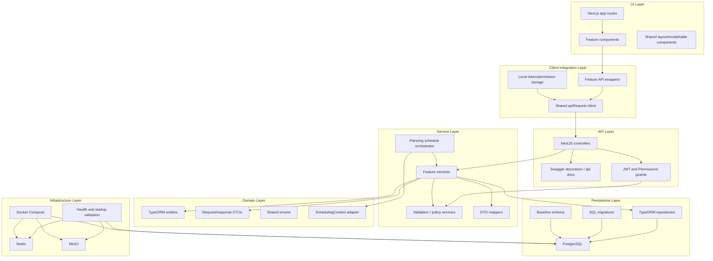
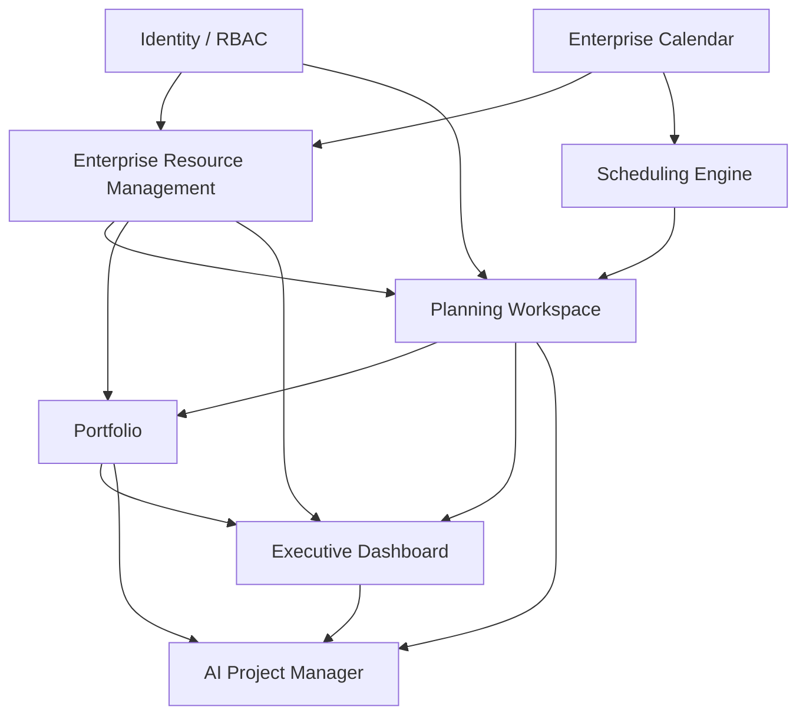

# ERM Stage 2 Repository Investigation

## 1. Executive Summary

This report documents the current repository state for Epic 1.2 Enterprise Resource Management. It is an investigation artifact for Stage 3 Architecture Gap Analysis and does not define a new implementation design.

Observed facts:

- PM Platform is a NestJS, Next.js, TypeScript, PostgreSQL application deployed through Docker Compose.
- Enterprise Calendar is implemented as a domain module plus public REST/UI module.
- Scheduling Engine is implemented inside Planning and is explicitly isolated from persistence, Calendar entities, and API controllers.
- Resource-related concepts currently exist only as Planning foundations: project-scoped capacity, allocation, and workload snapshot tables/entities.
- There is no standalone Resource bounded context, Resource aggregate, Resource Profile, Skill, Resource Calendar Assignment, Resource Rate, or ERM UI.
- Documentation already establishes that Resources must not become Scheduling authority and that Users are not Resources.

Readiness summary: investigation is complete enough to proceed to Stage 3. Open questions remain around ERM permissions, organization/tenant scoping, migration strategy for existing Planning resource tables, and whether team/resource grouping becomes first-class in v1.2.

## 2. Current Architecture Overview

The canonical architecture documents are:

- `docs/PM_PLATFORM_MASTER_GUIDE.md`
- `docs/architecture/01-SYSTEM-ARCHITECTURE.md`
- `docs/architecture/02-DOMAIN-MODEL.md`
- `docs/architecture/03-BACKEND-ARCHITECTURE.md`
- `docs/architecture/04-FRONTEND-ARCHITECTURE.md`
- `docs/architecture/05-SCHEDULING-ARCHITECTURE.md`
- `docs/architecture/06-DATABASE-ARCHITECTURE.md`
- `docs/architecture/07-SECURITY-ARCHITECTURE.md`
- `docs/architecture/08-DEVELOPMENT-WORKFLOW.md`
- `docs/architecture/09-CODING-STANDARDS.md`
- `docs/architecture/10-ROADMAP.md`
- `docs/architecture/RESOURCE_ARCHITECTURE.md`

Current runtime architecture from documentation and code:

- Frontend: Next.js app routes, React components, feature folders, Tailwind CSS.
- Backend: NestJS REST API with feature modules under `backend/src/modules`.
- Persistence: PostgreSQL through TypeORM entities and SQL migrations.
- Infrastructure: Redis and MinIO are wired in Docker Compose and health checks.
- API documentation: Swagger is configured at `/api/docs` in `backend/src/main.ts`.
- Authentication: JWT through `JwtAuthGuard`.
- Authorization: Permission metadata through `RequirePermissions`, `RequireAnyPermissions`, and `PermissionsGuard`.

Architectural principles relevant to ERM:

- Scheduling isolation is mandatory.
- Planning consumes Scheduling through `SchedulingContext`.
- Calendar owns working hours, holidays, and exception days.
- Resources may provide future capacity, availability, skills, and cost context, but do not own CPM or schedule mutation.
- Controllers should stay thin; services own business behavior.
- Public API boundaries should use DTOs.
- Database changes are additive and migration-driven.
- Frontend route pages should stay thin; feature logic belongs under `frontend/features`.

## 3. Existing Bounded Contexts

Observed backend bounded contexts:

| Context | Code Location | Current Responsibility |
| --- | --- | --- |
| Auth | `backend/src/modules/auth` | Login, registration, JWT session, `/auth/me`. |
| Authorization/RBAC | `backend/src/common/authz`, `backend/src/modules/users` | Roles, permissions, permission guards, user administration. |
| Projects | `backend/src/modules/projects` | Project CRUD, governance fields, visibility, membership, baselines, project-scoped task/RAID access. |
| Tasks | `backend/src/modules/tasks` | Task CRUD, assignment to users, task dependencies, WBS/task-kind rules. |
| Planning | `backend/src/modules/planning` | Planning workspace, schedule snapshots, task schedules, portfolio dependencies, project-scoped resource capacity/allocation foundations. |
| Scheduling Engine | `backend/src/modules/planning/*schedule/graph/forward/backward/float/critical*`, `backend/src/common/scheduling` | Deterministic graph scheduling, forward pass, backward pass, float, critical path, scheduling context adapter. |
| Enterprise Calendar Domain | `backend/src/modules/calendars` | Enterprise calendar entities, validation service, internal domain service. |
| Enterprise Calendar API | `backend/src/modules/calendar` | Public REST API, DTOs, mapper, service orchestration for calendars, working hours, holidays, exception days. |
| RAID | `backend/src/modules/raid`, `backend/src/modules/risks` | Risks, assumptions, issues, dependencies, comments, history. |
| Portfolio | `backend/src/modules/portfolio` | Portfolio summary metrics derived from projects, risks, issues, tasks, and project health. |
| Dashboard | `backend/src/modules/dashboard` | User dashboard and executive/project health signals. |
| Notifications | `backend/src/modules/notifications` | Notification CRUD/service behavior. |
| Integrations | `backend/src/modules/integrations/slack`, `backend/src/modules/documents` | Slack remains a non-document integration boundary; documents use provider-independent external links. |
| Health | `backend/src/modules/health` | Health endpoints, startup validation, migration runner, operational health. |

Not found:

- Standalone ERM/Resource module.
- Resource Profile bounded context.
- Skill or competency bounded context.
- Resource cost/rate bounded context.

## 4. Module Dependency Summary

Application module registration is in `backend/src/app.module.ts`.

Observed imports:

- `AppModule` imports TypeORM, `AuthzModule`, `AuthModule`, `CalendarModule`, `UsersModule`, `ProjectsModule`, `TasksModule`, `PlanningModule`, `RisksModule`, `RaidModule`, `DashboardModule`, `PortfolioModule`, `DocumentsModule`, `HealthModule`, `NotificationsModule`, and `SlackModule`.
- `PlanningModule` imports `AuthzModule`, `PlanningSnapshotModule`, `ProjectsModule`, and TypeORM repositories for Planning, Project, Task, and User entities.
- `PlanningModule` provides Scheduling Engine services and `SchedulingContextFactory`.
- Public `CalendarModule` imports `AuthzModule`, internal `modules/calendars` module, and calendar repositories.
- Internal `modules/calendars/CalendarModule` exports `CalendarValidationService` and `EnterpriseCalendarService`.
- `PortfolioService` depends on Project, Risk, Issue, Task repositories plus `ProjectHealthService` and `ProjectVisibilityService`.
- `DashboardService` depends on Project, ProjectMember, Task, Risk, Issue repositories plus `ProjectHealthService` and `ProjectVisibilityService`.

Observed dependency pattern:

- Feature modules own controllers/services/entities.
- Shared infrastructure lives under `backend/src/common`.
- TypeORM repositories are injected into services with `@InjectRepository`.
- Cross-context reads are common for reporting modules such as Portfolio and Dashboard.
- Scheduling Engine services are registered in Planning and exported by PlanningModule.

## Current Architecture Dependency Map

This section describes current repository dependencies only. It does not describe a target implementation for ERM.

Current dependency flow:

- The Next.js frontend consumes NestJS REST APIs through the shared `frontend/lib/api/client.ts` request helper and feature-specific API wrappers.
- Backend controllers depend on guards/decorators from Auth/Authz and delegate to feature services.
- Feature services depend on TypeORM repositories for their owned and consumed entities.
- Shared backend code under `backend/src/common` provides authorization, base entities, scheduling adapters, enums, interfaces, and serialization.
- Auth/Authz is consumed by protected controllers through `JwtAuthGuard`, `PermissionsGuard`, `RequirePermissions`, and `RequireAnyPermissions`.
- Planning depends on Projects, Tasks, Users, Planning repositories, and Scheduling Engine services.
- Scheduling Engine depends on `SchedulingContext` and graph/pass services inside Planning/Common. It does not depend on Calendar or persistence.
- Calendar API depends on the internal Calendar domain module and calendar repositories. No Planning or Scheduling dependency was found in Calendar services/controllers.
- Portfolio depends on Project, Risk, Issue, Task repositories, `ProjectHealthService`, and `ProjectVisibilityService`.
- Dashboard depends on Project, ProjectMember, Task, Risk, Issue repositories, `ProjectHealthService`, and `ProjectVisibilityService`.
- Health depends on database/migration/runtime infrastructure checks.
- Integrations and Notifications are registered as independent feature modules in `AppModule`.

Current repository dependency graph:

```mermaid
graph TD
  FrontendApp["frontend/app routes"] --> FrontendFeatures["frontend/features"]
  FrontendFeatures --> ApiClient["frontend/lib/api/client.ts"]
  ApiClient --> BackendControllers["NestJS controllers"]

  BackendControllers --> JwtAuthGuard["JwtAuthGuard"]
  BackendControllers --> PermissionsGuard["PermissionsGuard"]
  BackendControllers --> FeatureServices["Feature services"]

  PermissionsGuard --> AuthorizationPolicyService["AuthorizationPolicyService"]
  AuthorizationPolicyService --> UsersRBAC["Users / Roles / Permissions"]

  FeatureServices --> TypeOrmRepositories["TypeORM repositories"]
  TypeOrmRepositories --> PostgreSQL["PostgreSQL"]

  AppModule["AppModule"] --> AuthModule["AuthModule"]
  AppModule --> UsersModule["UsersModule"]
  AppModule --> ProjectsModule["ProjectsModule"]
  AppModule --> TasksModule["TasksModule"]
  AppModule --> PlanningModule["PlanningModule"]
  AppModule --> CalendarApiModule["modules/calendar"]
  AppModule --> DashboardModule["DashboardModule"]
  AppModule --> PortfolioModule["PortfolioModule"]
  AppModule --> RaidModule["RaidModule"]
  AppModule --> RisksModule["RisksModule"]
  AppModule --> NotificationsModule["NotificationsModule"]
  AppModule --> HealthModule["HealthModule"]
  AppModule --> DocumentsModule["DocumentsModule"]
  AppModule --> Integrations["Slack Module"]

  CalendarApiModule --> AuthzModule["AuthzModule"]
  CalendarApiModule --> CalendarDomainModule["modules/calendars"]
  CalendarApiModule --> CalendarRepositories["EnterpriseCalendar repositories"]
  CalendarDomainModule --> CalendarValidationService["CalendarValidationService"]
  CalendarRepositories --> PostgreSQL

  PlanningModule --> AuthzModule
  PlanningModule --> ProjectsModule
  PlanningModule --> PlanningSnapshotModule["PlanningSnapshotModule"]
  PlanningModule --> PlanningRepositories["Planning / Project / Task / User repositories"]
  PlanningModule --> SchedulingContextFactory["SchedulingContextFactory"]
  PlanningModule --> SchedulingEngine["PlanningScheduleEngineService"]
  SchedulingEngine --> GraphBuilder["PlanningGraphBuilderService"]
  GraphBuilder --> ForwardPass["PlanningForwardPassService"]
  ForwardPass --> BackwardPass["PlanningBackwardPassService"]
  BackwardPass --> FloatService["PlanningFloatService"]
  FloatService --> CriticalPath["PlanningCriticalPathService"]
  PlanningRepositories --> PostgreSQL

  PortfolioModule --> ProjectVisibilityService["ProjectVisibilityService"]
  PortfolioModule --> ProjectHealthService["ProjectHealthService"]
  PortfolioModule --> PortfolioRepositories["Project / Risk / Issue / Task repositories"]
  PortfolioRepositories --> PostgreSQL

  DashboardModule --> ProjectVisibilityService
  DashboardModule --> ProjectHealthService
  DashboardModule --> DashboardRepositories["Project / ProjectMember / Task / Risk / Issue repositories"]
  DashboardRepositories --> PostgreSQL

  HealthModule --> PostgreSQL
  HealthModule --> Redis["Redis"]
  HealthModule --> MinIO["MinIO"]
```

Dependency facts requiring attention during Stage 3:

- Planning is currently both a scheduling consumer and the owner of project-scoped resource capacity/allocation foundations.
- Portfolio and Dashboard read across several bounded contexts for reporting.
- Calendar is currently isolated from Scheduling and Planning mutation.
- Resource-related code is not isolated into its own module today.

## Current Layered Architecture

Current request flow follows a layered pattern from UI to API to services to persistence. Some reporting services read across bounded contexts, but controllers still delegate to services and services use repositories for persistence access.

Layering observations:

- Frontend route pages compose feature components instead of directly embedding API behavior in most feature areas.
- Backend controllers apply routing, guards, request parameters, and Swagger decorators.
- Backend services contain business rules, validation orchestration, authorization checks requiring domain state, and repository calls.
- Persistence access is through TypeORM repositories and SQL migrations.
- Scheduling Engine is service-level domain logic inside Planning, with its input adapted through `SchedulingContext`.

## Current Bounded Context Relationships

| Context | Owns | Depends On | Consumed By |
| --- | --- | --- | --- |
| Auth | Login, registration, JWT session, `/auth/me` | User/RBAC entities, JWT/passport libraries | Frontend auth flow, protected backend controllers |
| Authorization/RBAC | Permission keys, guards, role/permission policy | Users, roles, permissions repositories | Controllers, `PermissionsGuard`, frontend navigation |
| Users | User records, roles, assignable users | RBAC entities | Projects, Tasks, Planning, Dashboard, Auth, future ERM reference points |
| Projects | Projects, governance roles, members, baselines, project visibility | Users, project entities, ProjectVisibilityService | Tasks, Planning, RAID, Portfolio, Dashboard, frontend project workspace |
| Tasks | Tasks, task assignees, task dependencies, WBS fields | Projects, Users, SchedulingFoundationService | Planning, Portfolio, Dashboard, frontend task/project views |
| Planning | Planning workspace, schedule snapshots, task schedules, portfolio dependencies, project-scoped resource capacity/allocation foundations | Projects, Tasks, Users, SchedulingContextFactory, Scheduling Engine services | Frontend planning workspace, portfolio timeline, potential future ERM integration |
| Scheduling Engine | Graph validation, forward pass, backward pass, float, critical path | `SchedulingContext`, Planning graph/pass services | PlanningService and Planning snapshots/read models |
| Enterprise Calendar Domain | Calendar entities, exception entities, calendar validation/domain service | TypeORM calendar repositories | Calendar API module |
| Enterprise Calendar API | Calendar REST service, controller, DTOs, mapper | Calendar domain module, calendar repositories, Authz | Frontend Calendar UI |
| RAID | Risk, issue, assumption, dependency records, comments/history | Projects, Users | Projects, Portfolio, Dashboard, frontend RAID views |
| Portfolio | Portfolio summary metrics | Projects, Risks, Issues, Tasks, ProjectHealthService, ProjectVisibilityService | Frontend portfolio page, executive drilldowns |
| Dashboard | User/executive dashboard signals | Projects, ProjectMembers, Tasks, Risks, Issues, ProjectHealthService, ProjectVisibilityService | Frontend dashboard/executive pages |
| Notifications | Notification records and APIs | Users | Frontend notifications |
| Integrations | Slack integration boundary and external document links | Slack entity, ProjectDocument metadata | Slack endpoints and document metadata APIs |
| Health | Operational health, migration runner, startup validation | PostgreSQL, Redis, MinIO, SQL migrations | Docker health flow, frontend health route |

Relationship observations:

- Reporting contexts such as Portfolio and Dashboard are read-heavy consumers of Projects, Tasks, RAID, and health/visibility services.
- Planning is the only current consumer of Scheduling Engine services.
- Calendar API consumes Calendar Domain but Calendar does not consume Scheduling.
- No context currently consumes a standalone ERM context because no such module exists.

## Future Architectural Direction (Reference Only)

This section records roadmap-level direction already present in product and architecture documentation. It is not an implementation proposal and does not define APIs, entities, tables, or migrations.

Reference direction from the existing architecture/product documents:

- Identity remains responsible for users, login, RBAC, and permissions.
- Enterprise Calendar remains responsible for working hours, holidays, and exception days.
- Enterprise Resource Management is intended to become an independent bounded context for resource profiles, resource types, skills, capacity, availability, assignments, and cost metadata.
- Scheduling Engine remains the authority for scheduling calculations, critical path, float, and working day calculations.
- Planning Workspace consumes Scheduling output and owns planning workspace behavior.
- Portfolio and Executive Dashboard consume aggregated planning/project/resource signals for reporting.
- AI Project Manager is a future consumer of deterministic outputs and is not scheduling authority.

Conceptual dependency direction:

Conceptual notes:

- The diagram shows high-level information direction from established roadmap concepts, not current code dependencies.
- The current repository does not yet contain the ERM module shown in the diagram.
- Calendar-to-Scheduling direction is conceptual only for future calendar-aware scheduling; current code does not pass Calendar data into `SchedulingContext`.
- AI is shown only as a future consumer of platform outputs, consistent with documentation that AI must not become scheduling authority.

## Dependency Analysis

Existing one-way dependencies:

- Frontend feature APIs depend on the shared API client; the API client does not depend on feature modules.
- Controllers depend on guards/decorators and services; services do not depend on controllers.
- Calendar API depends on Calendar Domain; Calendar Domain does not depend on Calendar API.
- Planning depends on Scheduling Engine services; Scheduling Engine services do not depend on controllers or persistence repositories.
- Portfolio and Dashboard depend on Project/Task/RAID repositories and shared visibility/health services; those source modules do not depend on Portfolio or Dashboard.
- TypeORM config imports all entity classes for registration; entities do not depend on TypeORM config.

Shared abstractions:

- `BaseEntity`, `AuditableEntity`, and `TimestampedEntity`.
- Permission decorators and permission keys.
- `SchedulingContext` and `SchedulingContextFactory`.
- `SchedulingFoundationService`.
- `PaginatedResponse` interface.
- Shared frontend `apiRequest`.
- Frontend permission helper aliases.
- Shared UI primitives such as `PageHeader`, `AppModal`, and `ModalForm`.

Potential coupling observed:

- Planning owns current resource capacity/allocation tables and APIs, creating naming and ownership overlap with planned ERM.
- Planning resource endpoints currently return entities directly.
- Portfolio and Dashboard read across several domains for reporting.
- Calendar API uses project permissions for calendar administration.
- Calendar organization scoping is represented at the service/API level but not in calendar persistence.
- User IDs are currently embedded in task assignees, project membership, and Planning resource foundations.

Existing extension points:

- `SchedulingContextFactory` is the existing adapter point for Scheduling inputs.
- Calendar public API uses DTOs and a mapper, providing a reusable API-boundary pattern.
- `ProjectVisibilityService` centralizes project visibility decisions.
- `AuthorizationPolicyService` centralizes permission resolution.
- Frontend feature folders provide a repeatable UI/API/hook pattern.
- Migration runner and SQL migration folder provide the existing additive database evolution path.

Modules that must remain isolated:

- Scheduling Engine must remain isolated from persistence, Calendar entities, API controllers, and future ERM persistence.
- Calendar services must remain isolated from schedule mutation.
- Identity/Auth must remain separate from Resource domain semantics; documentation states Users are not Resources.
- Docker/database/migration infrastructure must remain stable during investigation tasks.

Areas where cyclic dependencies must be avoided:

- ERM and Planning should not form mutual service imports without an approved boundary.
- ERM and Scheduling should not couple directly in both directions.
- Calendar and Scheduling should not become mutually dependent.
- Portfolio/Dashboard reporting should not become authoritative owners of Resource, Planning, or Calendar data.
- Frontend feature folders should not bypass the shared API client with duplicate request helpers.

## Architectural Validation

| Principle | Status | Evidence | Notes |
| --- | --- | --- | --- |
| Clean Architecture | Partially Compliant | Controllers delegate to services; services use repositories; shared infrastructure is separated under `backend/src/common`. | Some APIs return entities directly, and reporting services read across contexts. |
| Layered Architecture | Compliant | Frontend routes/features call API client; controllers call services; services use repositories; persistence uses TypeORM/PostgreSQL. | Reporting paths intentionally cross several repositories. |
| Bounded Context Separation | Partially Compliant | Auth, Projects, Tasks, Planning, Calendar, Portfolio, Dashboard, RAID, Notifications, Integrations, and Health are separate modules. | Resource concepts are currently inside Planning; Portfolio/Dashboard are cross-context consumers. |
| Dependency Inversion | Partially Compliant | Services receive TypeORM repositories and collaborators through NestJS dependency injection. | Repository interfaces are not separately abstracted; TypeORM repositories are injected directly. |
| Scheduling Isolation | Compliant | SchedulingContext is internal; Scheduling Engine services have no controller or repository dependency found; docs prohibit Calendar/persistence imports. | Future calendar/resource scheduling integration remains unresolved and must preserve this boundary. |
| Calendar Ownership | Compliant | Calendar entities/services/controllers own enterprise calendars, working hours, holidays, and exception days. | Calendar persistence lacks organization column despite API-level organization metadata. |
| Separation of Identity and Domain | Partially Compliant | Users/RBAC are separate modules; ERM docs state Users are not Resources. | Current tasks, project membership, and Planning resource foundations reference Users directly; no Resource domain exists yet. |
| API Consistency | Partially Compliant | Swagger decorators, guards, DTOs, and validation are broadly used; Calendar API has request/response DTOs and mapper. | Some Planning APIs expose entities directly; pagination is documented but not uniformly used. |
| Persistence Consistency | Compliant | UUID IDs, timestamp columns, soft delete, audit columns, TypeORM registration, and additive SQL migrations are consistent patterns. | Optimistic locking was not found; ERM-specific tables do not exist. |

## 5. Database Architecture

Schema sources:

- Baseline schema: `backend/src/database/schema/001_initial_schema.sql`
- Migrations: `backend/src/database/migrations`
- TypeORM registration: `backend/src/database/typeorm.config.ts`

Current table groups documented in `docs/architecture/06-DATABASE-ARCHITECTURE.md`:

- Auth/RBAC: `users`, `roles`, `permissions`, `role_permissions`
- Projects: `projects`, `project_members`
- Tasks/WBS: `tasks`, `task_dependencies`
- Baselines: `project_baselines`, `project_baseline_tasks`
- RAID: `risks`, `issues`, `assumptions`, `dependencies`, `raid_comments`, `raid_history_entries`
- Planning: `planning_schedule_snapshots`, `planning_task_schedules`, `resource_capacities`, `resource_allocations`, `resource_workload_snapshots`, `portfolio_dependencies`
- Calendars: `enterprise_calendars`, `enterprise_calendar_exceptions`
- Notifications: `notifications`

Resource-adjacent schema currently exists in `backend/src/database/migrations/013_v0_2_0_phase_1_enterprise_planning_engine.sql`:

- `resource_capacities`
- `resource_allocations`
- `resource_workload_snapshots`

Calendar schema exists in `backend/src/database/migrations/016_v1_1_1_enterprise_calendar_domain_model.sql`:

- `enterprise_calendars`
- `enterprise_calendar_exceptions`

Not found:

- `resources`
- `resource_profiles`
- `skills`
- `resource_skills`
- `resource_calendar_assignments`
- `resource_rates`
- `resource_availability`
- ERM-specific database views or materialized views

## 6. Persistence Standards

Observed persistence conventions:

- Entity primary keys use UUIDs through `@PrimaryGeneratedColumn('uuid')` in `backend/src/common/entities/base.entity.ts`.
- `BaseEntity` provides `id`, `created_at`, `updated_at`, and nullable `deleted_at`.
- `AuditableEntity` extends `BaseEntity` with `created_by_id`, `updated_by_id`, and `deleted_by_id`.
- `TimestampedEntity` provides UUID plus `created_at` and `updated_at` without soft delete.
- Soft delete is represented through TypeORM `DeleteDateColumn` and service calls to `softRemove`.
- SQL migrations frequently use partial indexes filtered by `deleted_at IS NULL`.
- TypeORM `@Index` is used in some entities, for example active unique project membership in `ProjectMember`.
- Many migrations use `CREATE TABLE IF NOT EXISTS` and `CREATE INDEX IF NOT EXISTS`.
- Foreign keys are defined in SQL migrations and TypeORM relationships.
- Some relationships use explicit `onDelete`, for example calendar exceptions cascade on calendar deletion and planning task schedules cascade from schedule snapshots.

Optimistic locking:

- Not found in entity code. `@VersionColumn` was not found.

Entity inheritance:

- Domain entities commonly extend `AuditableEntity`.
- Some inheritance exists for specialized entities, for example RAID item subclasses.

Indexing conventions relevant to ERM:

- Active uniqueness commonly uses partial unique indexes with `deleted_at IS NULL`.
- Planning resource capacity has unique indexes by project/user/date and project/team/date.
- Resource allocation has indexes by project date range and task.
- Calendar has active name uniqueness and exception indexes by calendar/date/type.

## 7. Enterprise Calendar Investigation

Relevant files:

- `backend/src/modules/calendars/entities/enterprise-calendar.entity.ts`
- `backend/src/modules/calendars/entities/enterprise-calendar-exception.entity.ts`
- `backend/src/modules/calendars/calendar-validation.service.ts`
- `backend/src/modules/calendars/enterprise-calendar.service.ts`
- `backend/src/modules/calendars/calendar.module.ts`
- `backend/src/modules/calendar/calendar.controller.ts`
- `backend/src/modules/calendar/calendar.service.ts`
- `backend/src/modules/calendar/calendar.mapper.ts`
- `backend/src/modules/calendar/dto/calendar.dto.ts`
- `backend/src/modules/calendar/dto/working-hours.dto.ts`
- `backend/src/modules/calendar/dto/holiday.dto.ts`
- `backend/src/modules/calendar/dto/exception-day.dto.ts`
- `frontend/features/calendar`
- `frontend/app/(app)/calendar/page.tsx`

Calendar identifiers:

- `EnterpriseCalendar.id` is a UUID inherited from `AuditableEntity`.
- `EnterpriseCalendarException.id` is a UUID inherited from `AuditableEntity`.
- Public calendar DTOs expose `id` and an `organizationId`.
- `CalendarService` currently uses `DEFAULT_ORGANIZATION_ID = 'default'`.
- Calendar working-hour rows are mapped from calendar defaults; working hour ID is the day-of-week string.

Ownership boundaries:

- Calendar owns calendar metadata: name, description, timezone, default working days, working day start/end, hours per day, status.
- Calendar exceptions are stored in `enterprise_calendar_exceptions`.
- Holiday and exception day API behavior is backed by `EnterpriseCalendarException`.
- Working hours are represented through default working days plus shared working-day start/end/hours fields on `EnterpriseCalendar`.

Confirmed Calendar ownership:

- Working Hours: yes, through `CalendarService` and `CalendarMapper.toWorkingHoursResponses`.
- Holidays: yes, through `CalendarExceptionType.Holiday`.
- Exception Days: yes, through `CalendarExceptionType.NonWorking` and `CalendarExceptionType.WorkingOverride`.

Integration points:

- Public REST routes are under `/calendar`.
- Controllers use `JwtAuthGuard`, `PermissionsGuard`, Swagger decorators, and project permissions.
- Frontend Calendar page uses `CalendarList`, `CalendarDialog`, `CalendarForm`, `WorkingHoursEditor`, `HolidayTable`, and `ExceptionTable`.
- Calendar UI uses `frontend/features/calendar/api/calendar-api.ts` through the shared `apiRequest` client.

Reusable patterns:

- Split between internal domain module `modules/calendars` and public API module `modules/calendar`.
- DTO-only response boundary in the public Calendar API.
- Mapper class for entity-to-response conversion.
- Validation service for reusable domain validation.
- Feature-local frontend API, hook, components, constants, and types.

Observed limitation:

- Organization scoping exists as service/API metadata using `x-organization-id`, but the calendar entities and tables do not contain an organization column.

## 8. Scheduling Engine Investigation

Relevant files:

- `backend/src/common/scheduling/scheduling-context.ts`
- `backend/src/common/scheduling/scheduling-context.factory.ts`
- `backend/src/common/scheduling/scheduling-foundation.service.ts`
- `backend/src/modules/planning/planning-schedule-engine.service.ts`
- `backend/src/modules/planning/planning-graph-builder.service.ts`
- `backend/src/modules/planning/planning-forward-pass.service.ts`
- `backend/src/modules/planning/planning-backward-pass.service.ts`
- `backend/src/modules/planning/planning-float.service.ts`
- `backend/src/modules/planning/planning-critical-path.service.ts`

Responsibilities:

- `SchedulingContext` is an internal adapter containing tasks and dependencies.
- `SchedulingContextFactory` freezes task/dependency arrays into immutable context objects.
- `PlanningGraphBuilderService` builds and validates graph nodes and edges.
- `PlanningForwardPassService` calculates early start/finish values.
- `PlanningBackwardPassService` calculates late start/finish values.
- `PlanningFloatService` calculates total and free float.
- `PlanningCriticalPathService` identifies critical tasks.
- `PlanningScheduleEngineService` orchestrates graph, forward pass, backward pass, float, and critical path.

Public interfaces:

- No public SchedulingContext API found.
- No SchedulingContext database table found.
- Scheduling output is consumed by Planning services and read models.

Dependencies:

- Scheduling Engine consumes `SchedulingContext`.
- Scheduling Engine imports planning graph/pass services and common scheduling types.
- No Calendar entity import found in the Scheduling Engine files inspected.
- No TypeORM repository injection found in `PlanningScheduleEngineService`.

Confirmed Scheduling ownership:

- Scheduling logic: yes.
- Critical path: yes.
- Float: yes.
- Graph validation and pass calculations: yes.

Holiday/working day calculation:

- Documentation states Scheduling owns working day and holiday calculations.
- Current SchedulingContext does not include calendar, holiday, or working-day fields.
- Calendar-aware scheduling is documented as deferred/future work.

Integration boundaries:

- Planning builds scheduling context and calls Scheduling.
- Calendar services must not mutate schedules.
- Resource services must not mutate schedule dates.
- Future ERM integrations must respect the Planning-to-Scheduling boundary.

## 9. Planning Workspace Investigation

Relevant files:

- `backend/src/modules/planning/planning.module.ts`
- `backend/src/modules/planning/planning.controller.ts`
- `backend/src/modules/planning/planning.service.ts`
- `backend/src/modules/planning/entities/resource-capacity.entity.ts`
- `backend/src/modules/planning/entities/resource-allocation.entity.ts`
- `backend/src/modules/planning/entities/resource-workload-snapshot.entity.ts`
- `backend/src/modules/planning/dto/create-resource-capacity.dto.ts`
- `backend/src/modules/planning/dto/update-resource-capacity.dto.ts`
- `backend/src/modules/planning/dto/create-resource-allocation.dto.ts`
- `backend/src/modules/planning/dto/update-resource-allocation.dto.ts`
- `frontend/components/planning/planning-workspace.tsx`
- `frontend/features/planning/index.ts`
- `frontend/features/projects/planning.ts`

Current ownership:

- Project membership is owned by Projects through `ProjectMember`.
- Task assignees are owned by Tasks through `Task.assigneeId`.
- Project-scoped capacity and allocation are currently owned by Planning.
- Resource workload snapshots are currently Planning read-model data.
- Planning APIs expose project-scoped resource capacity, allocation, and heat map endpoints.

Current resource concepts:

- `ResourceAllocationUnit` supports `user` and `team`.
- User resources require `userId` only.
- Team resources require `teamName` only.
- Capacity rows include `projectId`, `resourceUnit`, `userId`, `teamName`, `capacityDate`, `capacityMinutes`, and `timezone`.
- Allocation rows include `projectId`, optional `taskId`, `resourceUnit`, `userId`, `teamName`, allocation percent, date range, and optional planned minutes per day.
- Workload snapshots include capacity minutes, allocated minutes, overallocated flag, and generated timestamp.

Current APIs:

- `POST /planning/projects/:projectId/resource-capacities`
- `GET /planning/projects/:projectId/resource-capacities`
- `PATCH /planning/projects/:projectId/resource-capacities/:capacityId`
- `DELETE /planning/projects/:projectId/resource-capacities/:capacityId`
- `POST /planning/projects/:projectId/resource-allocations`
- `GET /planning/projects/:projectId/resource-allocations`
- `PATCH /planning/projects/:projectId/resource-allocations/:allocationId`
- `DELETE /planning/projects/:projectId/resource-allocations/:allocationId`
- `GET /planning/projects/:projectId/resource-heat-map`

Concepts that may eventually reference ERM:

- `Task.assigneeId`
- `ProjectMember.userId`
- `ResourceCapacity.userId`
- `ResourceAllocation.userId`
- `ResourceWorkloadSnapshot.userId`
- Planning workspace resource allocation arrays in `ApiPlanningWorkspace`

No redesign is proposed in this report.

## 10. Portfolio Investigation

Relevant files:

- `backend/src/modules/portfolio/portfolio.module.ts`
- `backend/src/modules/portfolio/portfolio.controller.ts`
- `backend/src/modules/portfolio/portfolio.service.ts`
- `backend/src/modules/portfolio/dto/portfolio-summary.dto.ts`
- `docs/architecture/portfolio-engine.md`
- `frontend/app/(app)/portfolio/page.tsx`
- `frontend/features/portfolio/index.ts`

Current behavior:

- Portfolio summary aggregates visible projects.
- It uses Project, Risk, Issue, and Task repositories.
- It uses `ProjectVisibilityService` for visibility.
- It uses `ProjectHealthService` for health status.
- Metrics include total/green/amber/red project counts, projects requiring attention, open risks by severity, open issues by priority, overdue task counts, and upcoming milestones.

Capacity assumptions:

- Current Portfolio service does not consume Planning resource capacity/allocation tables.
- Current Portfolio service does not compute utilization, remaining capacity, or resource pressure.
- Documentation identifies future portfolio resource pressure summaries in later roadmap phases.

Future ERM integration points observed:

- Portfolio summary could consume ERM/resource pressure read models in the future.
- Portfolio roadmap and resource architecture docs mention portfolio/resource pressure as future direction.

## 11. Executive Dashboard Investigation

Relevant files:

- `backend/src/modules/dashboard/dashboard.module.ts`
- `backend/src/modules/dashboard/dashboard.controller.ts`
- `backend/src/modules/dashboard/dashboard.service.ts`
- `backend/src/modules/dashboard/dto/executive-dashboard.dto.ts`
- `backend/src/modules/dashboard/dto/me-dashboard.dto.ts`
- `frontend/app/(dashboard)/executive/page.tsx`
- `frontend/app/(dashboard)/user/page.tsx`
- `frontend/features/dashboard/index.ts`

Current behavior:

- User dashboard aggregates assigned projects, task summary, overdue/upcoming assigned tasks, open risks, open issues, and health.
- Assignment currently means project membership, project ownership, or task assignment to a User.
- Dashboard uses Project, ProjectMember, Task, Risk, and Issue repositories.
- Executive dashboard frontend uses project/task/portfolio API signals.

Resource-related metrics found:

- Assigned tasks by user.
- Assigned projects by membership/ownership/task assignment.
- Overdue and upcoming task signals.
- Health status calculated from tasks, risks, and issues.

Not found:

- Resource utilization widget.
- Capacity heat map widget in Executive Dashboard.
- ERM-specific dashboard API.
- Resource availability or over-allocation summary in dashboard service.

## 12. Frontend Architecture

Relevant files:

- `docs/architecture/04-FRONTEND-ARCHITECTURE.md`
- `frontend/app`
- `frontend/components`
- `frontend/features`
- `frontend/lib/api/client.ts`
- `frontend/features/calendar`
- `frontend/components/ui/app-modal.tsx`
- `frontend/components/ui/modal-form.tsx`
- `frontend/components/layout/page-header.tsx`
- `frontend/components/layout/app-shell.tsx`

Observed patterns:

- Next.js routes live under `frontend/app`.
- Route pages are generally thin and compose feature or domain components.
- Feature-level code lives under `frontend/features/<feature>`.
- Shared components live under `frontend/components`.
- API calls use `frontend/lib/api/client.ts`.
- Auth session and permissions are stored in local storage by the API client/auth helpers.
- Navigation is permission-aware through `frontend/components/layout/app-shell.tsx` and `frontend/features/auth/permissions.ts`.
- Tests live under `frontend/tests`.

CRUD page patterns:

- Calendar uses `CalendarList` with local loading/saving/error state via `useCalendars`.
- Calendar create/edit uses modal/dialog components and forms.
- Calendar delete uses confirmation dialog.
- Projects page uses URL query parameters for client-side filters and sorting.
- RAID and task pages use local state plus shared API client calls.

Tables/forms/dialogs:

- Table markup is component-local with Tailwind classes.
- Shared modal helpers exist in `components/ui/app-modal.tsx` and `components/ui/modal-form.tsx`.
- `PageHeader` is reused for page-level identity and actions.
- Form validation is mostly component-local client validation plus backend validation.

State management:

- React `useState`, `useEffect`, `useCallback`, and `useMemo`.
- No Redux, Zustand, MobX, Material UI, Ant Design, Chakra, or Bootstrap found in dependencies.

Calendar UI:

- `frontend/app/(app)/calendar/page.tsx`
- `frontend/features/calendar/api/calendar-api.ts`
- `frontend/features/calendar/hooks/useCalendars.ts`
- `frontend/features/calendar/components/CalendarList.tsx`
- `frontend/features/calendar/components/CalendarDialog.tsx`
- `frontend/features/calendar/components/CalendarForm.tsx`
- `frontend/features/calendar/components/WorkingHoursEditor.tsx`
- `frontend/features/calendar/components/HolidayTable.tsx`
- `frontend/features/calendar/components/ExceptionTable.tsx`
- `frontend/features/calendar/components/DeleteCalendarDialog.tsx`

## 13. Cross-Cutting Standards

Authentication:

- JWT strategy is under `backend/src/modules/auth/strategies/jwt.strategy.ts`.
- Guard is `backend/src/modules/auth/guards/jwt-auth.guard.ts`.
- Frontend stores access and refresh tokens in local storage via `frontend/lib/api/client.ts`.

Authorization:

- Permission constants are in `backend/src/common/authz/permissions.ts`.
- Decorators are in `backend/src/common/authz/require-permissions.decorator.ts`.
- Guard is in `backend/src/common/authz/permissions.guard.ts`.
- Authorization policy service is in `backend/src/common/authz/authorization-policy.service.ts`.
- Frontend aliases are in `frontend/features/auth/permissions.ts`.

Auditing:

- `AuditableEntity` provides created/updated/deleted actor columns.
- Several services set `createdById`, `updatedById`, and `deletedById` from authenticated actor context.

Logging:

- Nest `Logger` is used in health/startup/migration services.
- No centralized application logging abstraction was found.

Validation:

- Global `ValidationPipe` is configured in `backend/src/main.ts` with whitelist, forbid non-whitelisted, and transform enabled.
- Request DTOs use `class-validator`.
- Swagger DTO metadata uses `@ApiProperty`.
- Domain validation services exist for Calendar and Scheduling foundation rules.

Pagination:

- `backend/src/common/interfaces/paginated-response.interface.ts` exists.
- `docs/development/api-guidelines.md` discusses pagination.
- Many current list endpoints return arrays directly.

Sorting/filtering:

- Frontend Projects page uses URL query filters and sort options.
- Backend Portfolio/Dashboard services perform query and in-memory aggregation.
- Documentation says filters and sorting should be documented and indexed for high-volume queries.

OpenAPI/Swagger:

- Swagger is configured in `backend/src/main.ts`.
- Controllers use `@ApiTags`, `@ApiBearerAuth`, `@ApiOperation`, `@ApiOkResponse`, `@ApiCreatedResponse`, `@ApiNoContentResponse`, and error decorators.

Testing:

- Backend uses Jest with specs under `backend/src`.
- Frontend uses Vitest and Testing Library with tests under `frontend/tests`.
- Calendar has backend service/controller/integration tests and frontend calendar page tests.

Docker:

- `docker-compose.yml` defines PostgreSQL 17, Redis 7, MinIO, backend, and frontend.
- PostgreSQL loads baseline schema from `backend/src/database/schema`.
- Backend depends on healthy PostgreSQL, healthy Redis, and started MinIO.
- Frontend depends on healthy backend.

Environment configuration:

- Backend uses `process.env` for database, JWT, frontend origin, Redis, MinIO, and port settings.
- Frontend uses `NEXT_PUBLIC_API_URL` through `frontend/lib/config/env.ts`.

## 14. Existing Reusable Components

Backend reusable components:

- `BaseEntity`, `AuditableEntity`, `TimestampedEntity`.
- `AuthzModule`, `PermissionsGuard`, permission decorators.
- `SanitizeResponseInterceptor`.
- `SchedulingContext`, `SchedulingContextFactory`.
- `SchedulingFoundationService` validation/normalization helpers.
- `ProjectVisibilityService`.
- `ProjectHealthService`.
- Calendar validation and mapper patterns.

Frontend reusable components:

- `PageHeader`.
- `AppShell`.
- `AppModal`.
- `ModalForm`, `ModalFormGrid`, `ModalFormSection`.
- Dashboard cards: `SummaryCard`, `StatCard`, `DashboardSection`.
- Project table/workspace components.
- Task table.
- RAID management component.
- Calendar list/dialog/form/editor/table components.

Reusable frontend infrastructure:

- Shared `apiRequest` client.
- Auth permission helpers.
- Feature folder pattern with `api`, `components`, `hooks`, `types`, `constants`.

## 15. Architectural Constraints

Observed constraints from documentation and code:

- Scheduling Engine must remain isolated from persistence and Calendar entities.
- SchedulingContext is internal only.
- Calendar services must not mutate planning schedules.
- Resource services must not mutate early/late dates, critical path, float, or scheduling outputs.
- Existing Planning APIs expose resource capacity/allocation entities directly; backward compatibility matters.
- Database changes must be additive.
- Existing Docker and Ubuntu compatibility are part of release expectations.
- Users are identity/RBAC actors; Resource is documented as a separate future domain concept.
- Calendar entity/table currently has no organization foreign key despite public DTO organization metadata.
- Current Planning resource unit constraint supports only `user` and `team`.

## 16. Potential Integration Points

This section lists observed integration surfaces only. It does not propose a design.

Potential backend integration surfaces:

- `User` identity for optional human-resource reference.
- `ProjectMember` for project team membership relationships.
- `Task.assigneeId` for current task assignment semantics.
- Planning `ResourceCapacity`, `ResourceAllocation`, and `ResourceWorkloadSnapshot`.
- `EnterpriseCalendar` for future resource calendar assignment references.
- `ProjectVisibilityService` for resource visibility where project scope is involved.
- `AuthorizationPolicyService` and permission keys for ERM access control.
- Portfolio summary and Dashboard services for future resource/utilization reporting.

Potential frontend integration surfaces:

- `frontend/features/calendar` as a feature folder model.
- `frontend/lib/api/client.ts` for ERM API client additions.
- `frontend/components/ui` modal/form patterns.
- `frontend/components/layout/app-shell.tsx` for navigation.
- `frontend/features/auth/permissions.ts` for resource permission aliases.
- Existing project and planning pages where resource allocation is already visible or implied.

Potential documentation integration surfaces:

- `docs/architecture/RESOURCE_ARCHITECTURE.md`
- `docs/product/epics/EPIC-1.2-Enterprise-Resource-Management.md`
- `docs/product/PRODUCT_BACKLOG.md`
- `docs/product/RELEASE_PLAN.md`
- `docs/architecture/adr/ADR-006-resource-domain.md`
- `docs/architecture/adr/ADR-007-capacity-model.md`
- `docs/architecture/adr/ADR-008-calendar-assignment.md`
- `docs/architecture/adr/ADR-009-resource-types.md`

## 17. Risks

Observed risks for Stage 3 analysis:

- Existing Planning resource tables already use `resource_*` names and may conflict conceptually with a future ERM domain if boundaries are not clarified.
- Existing resource units are limited to `user` and `team`, while ERM documentation lists human, contractor, team, equipment, facility, vehicle, and generic resource.
- Existing Planning resource APIs return entities directly, unlike the Calendar public API DTO boundary.
- Calendar API exposes organization metadata but persistence is not organization-scoped.
- Project membership, task assignment, and planning allocation all currently reference Users; ERM documentation says Users are not Resources.
- Portfolio and Dashboard aggregate project/task data but do not have current resource utilization inputs.
- Scheduling documentation says Scheduling owns working day and holiday calculations, but current SchedulingContext does not contain calendar inputs.
- Permissions do not currently include resource-specific permission keys.
- No centralized pagination pattern is broadly applied to current list endpoints.

## 18. Questions Requiring Resolution Before Design

Open questions:

- What exact permission keys should govern ERM administration, viewing, rates, skills, and assignments?
- Should ERM be organization-scoped now, or follow the current default organization pattern until SaaS multi-tenancy?
- How should existing Planning resource capacity/allocation data be treated during ERM introduction: remain Planning-owned, be referenced, or be migrated later?
- Should Team become a first-class Resource type in v1.2 or remain a string/grouping concept initially?
- Which existing User fields are sufficient for optional Resource-to-User linking?
- Should Resource assignment reuse existing Planning allocation concepts or remain a separate domain object until Planning integration is designed?
- What ERM data is allowed on Executive Dashboard and Portfolio views given privacy and cost visibility concerns?
- Are cost/rate fields in scope for v1.2 persistence or only documented for future release planning?
- What are the expected performance targets for resource search and availability views?
- What is the canonical unit for capacity in ERM: minutes, hours, percent, or a combination?

## 19. Conclusion

The repository is ready for Stage 3 Architecture Gap Analysis. The current system has stable foundations for Users, Projects, Tasks, Planning, Scheduling, Calendar, Portfolio, Dashboard, RBAC, and Docker deployment. Enterprise Calendar is implemented and provides reusable backend and frontend patterns. Planning contains resource-related capacity/allocation foundations, but those are project-scoped and not a standalone ERM bounded context.

The main architectural work for Stage 3 is to analyze the gap between existing Planning resource foundations and the documented ERM target, while preserving the Scheduling Engine boundary and avoiding assumptions not present in the repository.

## Readiness for Stage 3 – Architecture Gap Analysis

Repository investigation is complete.

Missing information to resolve before proceeding:

- ERM-specific permission model.
- Organization/tenant scoping decision for ERM.
- Boundary decision for existing Planning resource tables versus future ERM resources.
- Team/resource grouping semantics.
- Cost/rate visibility and release scope.
- Resource search/filter performance expectations.
- Capacity unit standard and calculation ownership boundaries.
