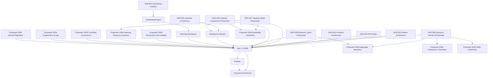

# ERM Stage 3.5 ADR Review

## 1. Executive Summary

This document reviews Architecture Decision Record coverage for Epic 1.2 Enterprise Resource Management. It is an architecture governance artifact only. It does not create new ADRs, design ERM, define schema, define APIs, or provide implementation instructions.

Repository facts:

- ADRs exist in `docs/adr/`, `docs/architecture/adr/`, and `docs/archive/adr/`.
- The newer architecture ADR set contains accepted platform ADRs and proposed ERM-specific ADRs.
- Stage 3 Gap Analysis concluded that ERM has significant unresolved decisions around resource identity, assignment ownership, capacity ownership, permissions, calendar association, cost visibility, and Planning integration.
- The repository currently has no standalone ERM module; resource-related code is Planning-owned.

Analysis:

- ADR maturity is moderate. Core platform and scheduling decisions are well documented, but ADR organization contains duplicates and historical naming overlap.
- ERM coverage is partial. ADR-006 through ADR-009 cover major ERM direction, but they are still proposed and do not cover all decisions required before implementation.
- Stage 4 ADD should not start until proposed ERM ADRs are reviewed and missing governance decisions are either accepted as new ADR work or explicitly deferred.

Readiness for Stage 4:

- Additional ADR work required before Stage 4.

## 2. Existing ADR Inventory

| ADR | Title | Status | Relevant to ERM | Notes |
| --- | --- | --- | --- | --- |
| `docs/adr/ADR-001 Scheduling Engine Architecture.md` | Scheduling Engine Architecture | Accepted | Yes | Historical/current scheduling architecture decision. Relevant because ERM must not destabilize Scheduling Engine. Duplicates newer scheduling ADR concepts. |
| `docs/adr/ADR-001-Planning-Engine.md` | Planning Engine | Accepted | Yes | Establishes Planning Engine direction. Relevant because current resource foundations are Planning-owned. |
| `docs/adr/ADR-001-scheduling-engine.md` | Scheduling Engine Architecture | Accepted | Yes | Duplicate/expanded scheduling engine ADR. Relevant to scheduling isolation and deterministic scheduling ownership. |
| `docs/adr/ADR-002 WBS Model.md` | WBS Model | Accepted | Indirect | Governs task hierarchy. Relevant only where ERM assignments may reference tasks. |
| `docs/adr/ADR-002-Project-Workspace.md` | Project Workspace | Accepted | Yes | Relevant because project workspace is a likely consumer of resource assignment/capacity information. |
| `docs/adr/ADR-002-planning-engine.md` | Planning Engine | Accepted | Yes | Duplicate Planning Engine numbering. Relevant to Planning/ERM boundaries. |
| `docs/adr/ADR-003 Summary Task Semantics.md` | Summary Task Semantics | Accepted | Indirect | Relevant only through task assignment and planning rollup semantics. |
| `docs/adr/ADR-003-Scheduling-Authority.md` | Scheduling Authority | Accepted | Yes | Relevant because ERM must not become scheduling authority. |
| `docs/adr/ADR-003-wbs-model.md` | WBS Model | Accepted | Indirect | Duplicate WBS ADR. Relevant only through task hierarchy. |
| `docs/adr/ADR-004 Milestone Categories.md` | Milestone Categories | Accepted | Indirect | Relevant only through task/milestone assignment context. |
| `docs/adr/ADR-004-project-workspace.md` | Project Workspace | Accepted | Yes | Duplicate project workspace ADR. Relevant to project resource views. |
| `docs/adr/ADR-005 ScheduleAnalysis Model.md` | ScheduleAnalysis Model | Accepted | Yes | Relevant because ERM must consume scheduling output without redefining schedule analysis. |
| `docs/adr/ADR-005-scheduling-authority.md` | Scheduling Authority | Accepted | Yes | Duplicate scheduling authority ADR. Relevant to Scheduling Engine boundaries. |
| `docs/adr/ADR-006-summary-task-semantics.md` | Summary Task Semantics | Accepted | Indirect | Duplicate summary task ADR. Relevant to planning/task behavior only. |
| `docs/adr/ADR-007-milestone-categories.md` | Milestone Categories | Accepted | Indirect | Duplicate milestone ADR. Relevant to task context only. |
| `docs/adr/ADR-008-schedule-analysis-model.md` | ScheduleAnalysis Model | Accepted | Yes | Relevant to read-model and scheduling analysis boundaries. |
| `docs/adr/ADR-009-dependency-validation.md` | Dependency Validation | Accepted | Indirect | Relevant where ERM assignments reference tasks affected by dependency rules; not directly ERM-specific. |
| `docs/architecture/adr/ADR-001-feature-architecture.md` | Feature Architecture | Accepted | Yes | Relevant to module boundaries, feature ownership, and clean feature flow. |
| `docs/architecture/adr/ADR-002-calendar-architecture.md` | Calendar Architecture | Accepted | Yes | Establishes Calendar ownership. Directly relevant to ERM calendar association. |
| `docs/architecture/adr/ADR-003-scheduling-isolation.md` | Scheduling Isolation | Accepted | Yes | Primary accepted scheduling boundary for ERM. States Scheduling must not access persistence or import Calendar/Resource entities. |
| `docs/architecture/adr/ADR-004-api-design.md` | API Design | Accepted | Yes | Relevant to future ERM REST conventions, DTO boundaries, validation, and compatibility. |
| `docs/architecture/adr/ADR-005-frontend-architecture.md` | Frontend Architecture | Accepted | Yes | Relevant to future ERM UI feature structure, navigation, forms, and shared components. |
| `docs/architecture/adr/ADR-006-resource-domain.md` | Resource Domain | Proposed for Epic 1.2 | Yes | Direct ERM ADR. Covers Resource separate from User and non-user resource support. Needs governance review before ADD. |
| `docs/architecture/adr/ADR-007-capacity-model.md` | Capacity Model | Proposed for Epic 1.2 | Yes | Direct ERM ADR. Covers explicit capacity/availability/allocation concepts. Needs governance review before ADD. |
| `docs/architecture/adr/ADR-008-calendar-assignment.md` | Calendar Assignment | Proposed for Epic 1.2 | Yes | Direct ERM ADR. Covers calendar assignment precedence and no schedule mutation. Needs governance review before ADD. |
| `docs/architecture/adr/ADR-009-resource-types.md` | Resource Types | Proposed for Epic 1.2 | Yes | Direct ERM ADR. Covers extensible explicit resource types. Needs governance review before ADD. |
| `docs/archive/adr/ADR-001-scheduling-engine-legacy.md` | Scheduling Engine Architecture | Accepted / archived | Yes | Historical scheduling ADR. Relevant as legacy context only; newer scheduling isolation ADR should be treated as current governance source. |

Inventory observations:

- Repository facts: all ADRs found are listed above.
- Analysis: scheduling and planning decisions are represented multiple times across historical and newer ADR directories.
- Open governance question: which ADR directory is canonical for future governance, `docs/adr/` or `docs/architecture/adr/`?

## 3. Architectural Decision Inventory

### Domain Boundaries

- Resource identity separation.
- Calendar ownership.
- Scheduling ownership.
- Planning ownership.
- Portfolio ownership.
- Executive Dashboard ownership.
- Reporting versus source-of-truth boundaries.
- Resource versus User boundary.
- Resource versus Planning resource foundations boundary.

### Resource Domain

- Resource aggregate boundary.
- Resource lifecycle.
- Resource type model.
- Optional User reference.
- Skills ownership.
- Capacity ownership.
- Availability ownership.
- Assignment ownership.
- Cost and rate ownership.
- Team/resource grouping.
- Non-human resource behavior.
- Resource visibility/privacy.

### Integration

- Calendar integration.
- Scheduling integration.
- Planning integration.
- Portfolio integration.
- Dashboard integration.
- Auth/RBAC integration.
- Future AI Project Manager integration.
- Existing Planning resource table transition.

### Persistence

- Entity relationship governance.
- Additive migration strategy.
- Audit model.
- Soft delete strategy.
- Versioning or optimistic locking.
- Read model ownership.
- Indexing and query performance.
- Organization/tenant scoping.

### API

- REST conventions.
- DTO request/response boundaries.
- Validation.
- Pagination.
- Filtering.
- Sorting.
- Authorization.
- Error semantics.
- Backward compatibility with existing Planning APIs.

### Frontend

- CRUD consistency.
- Navigation.
- Forms.
- Tables.
- Permissions.
- Feature folder boundary.
- Shared API client usage.
- Dashboard/reporting integration.

### Extensibility

- Capacity Planning.
- Scheduling Engine integration after v1.2.
- AI Project Manager.
- Equipment resources.
- Facility/meeting room resources.
- Vehicles.
- Vendors.
- Contractors.
- Generic resources.
- Future SaaS multi-tenancy.

## 4. ADR Coverage Matrix

| Decision | Existing ADR | New ADR Required | Deferred | No ADR Required | Evidence | Notes |
| --- | --- | --- | --- | --- | --- | --- |
| Feature/module architecture | ADR-001 Feature Architecture | No | No |  | `docs/architecture/adr/ADR-001-feature-architecture.md` | Sufficient for module shape. |
| Calendar ownership | ADR-002 Calendar Architecture | No | No |  | Calendar ADR and Stage 2 Calendar investigation | Existing ADR covers Calendar as owner of working hours/holidays/exceptions. |
| Scheduling isolation | ADR-003 Scheduling Isolation | No | No |  | `docs/architecture/adr/ADR-003-scheduling-isolation.md` | Accepted and directly applicable. |
| API conventions | ADR-004 API Design | No | No |  | `docs/architecture/adr/ADR-004-api-design.md` | Sufficient at platform level. ERM-specific API detail belongs in ADD. |
| Frontend architecture | ADR-005 Frontend Architecture | No | No |  | `docs/architecture/adr/ADR-005-frontend-architecture.md` | Sufficient for UI structure. |
| Resource separate from User | ADR-006 Resource Domain | No, but review required | No |  | Proposed ADR-006, Stage 3 gap analysis | Existing proposed ADR covers decision but is not yet accepted. |
| Resource aggregate boundary | ADR-006 Resource Domain | Yes | No |  | Stage 3 required decisions | ADR-006 establishes direction but not full aggregate ownership detail. |
| Resource lifecycle | Partial: ADR-006 | Yes | No |  | Epic 1.2 stories and Resource Architecture lifecycle | Needs explicit governance before ADD. |
| Resource types | ADR-009 Resource Types | No, but review required | No |  | Proposed ADR-009 | Existing proposed ADR covers explicit resource types. |
| Non-human resources | ADR-006, ADR-009 | No, but review required | No |  | Proposed ADRs and Epic requirements | Covered in principle, pending acceptance. |
| Skills ownership | None | Yes | No |  | Stage 3 gap analysis: skills missing | Significant domain ownership decision. |
| Capacity ownership | ADR-007 Capacity Model | No, but review required | No |  | Proposed ADR-007 | Covers capacity direction; needs acceptance. |
| Availability ownership | ADR-007 Capacity Model | Yes | No |  | Stage 3 required decisions | ADR-007 mentions availability, but ownership boundary remains unresolved. |
| Assignment ownership | None | Yes | No |  | Planning `ResourceAllocation`, task assignees, project members | Required because current ownership spans Planning/Tasks/Projects. |
| Cost/rate ownership | None | Yes | No |  | Stage 3 gap: cost/rates missing | Sensitive data and visibility decision. |
| Resource permission model | None | Yes | No |  | Security docs and Stage 3 permission gap | Current RBAC exists, but no ERM permissions. |
| Resource visibility/privacy | None | Yes | No |  | Stage 3 risks and Epic requirements | Needed before cost/availability exposure. |
| Calendar assignment | ADR-008 Calendar Assignment | No, but review required | No |  | Proposed ADR-008 | Covers precedence and no schedule mutation. |
| Effective calendar resolution | ADR-008 Calendar Assignment | Yes | No |  | Proposed ADR says effective calendar is most specific | Needs governance depth before ADD if v1.2 includes it. |
| Scheduling integration | ADR-003 Scheduling Isolation |  | Yes |  | ADR-003, roadmap v1.3 | v1.2 is data/domain foundation; scheduling integration is future. |
| Planning integration | Planning ADRs, ADR-003 | Yes | No |  | Current Planning resource tables and APIs | Boundary with existing Planning resource foundations is unresolved. |
| Portfolio integration | None specific |  | Yes |  | Roadmap v1.5 and Stage 3 | Portfolio resource pressure is future reporting work. |
| Executive Dashboard integration | None specific |  | Yes |  | Stage 3 Dashboard gap | ERM dashboard/reporting details can be deferred unless v1.2 UI requires it. |
| Existing Planning resource table transition | None | Yes | No |  | Migration 013 and Planning resource entities | Required because existing tables use `resource_*` names. |
| Additive migrations | Database architecture docs | No | No |  | `docs/architecture/06-DATABASE-ARCHITECTURE.md` | No new ADR required unless migration strategy deviates. |
| Audit model | Database architecture docs | No | No | Yes | `AuditableEntity`, Database Architecture | Existing standard is sufficient. |
| Soft delete | Database architecture docs | No | No | Yes | `BaseEntity`, partial indexes | Existing standard is sufficient. |
| Versioning/optimistic locking | None |  | Yes |  | Stage 2 found no `@VersionColumn` | Can defer unless ERM requires concurrent editing controls. |
| Organization/tenant scoping | Security/Database docs only | Yes | No |  | Calendar default organization pattern; no tenant model | Important governance issue for ERM scope. |
| Pagination/filtering/sorting | API docs/guidelines | Yes | No |  | Stage 3 API decisions | ERM search/filter performance is a core requirement. |
| Frontend navigation permissions | ADR-005 Frontend Architecture | No | No |  | Frontend architecture docs | ERM permission keys still require separate governance. |
| AI Project Manager integration | System Architecture docs |  | Yes |  | AI documented as future consumer | Future epic; no ERM v1.2 ADR required. |
| Equipment/facility/vehicle details | ADR-009 Resource Types |  | Yes |  | ADR-009 future impact section | Type support covered; type-specific fields can be deferred. |
| Vendors/procurement | None |  | Yes |  | Epic 1.2 non-goals exclude procurement | Deferred by scope. |

## 5. Proposed New ADRs

These are governance items that should become future ADRs or be folded into an explicitly accepted ADR before implementation. This section does not write the ADRs.

| Proposed ADR Title | Reason | Priority | Dependencies |
| --- | --- | --- | --- |
| ADR: ERM Aggregate and Ownership Boundary | Resource aggregate boundary, lifecycle, and ownership are not fully governed by existing ADRs. | High | ADR-006 review. |
| ADR: ERM Assignment Ownership | Current assignment concepts exist in Tasks, Projects, and Planning; ERM requires clear ownership. | High | ADR-006, Planning ADRs, Stage 3 gap analysis. |
| ADR: ERM Permissions and Visibility | Existing RBAC lacks resource-specific permissions and cost/availability visibility rules. | High | Security architecture, ADR-004 API Design. |
| ADR: ERM Planning Resource Transition | Existing Planning resource capacity/allocation tables overlap with future ERM concepts. | High | Planning ADRs, ADR-007, Stage 2 investigation. |
| ADR: ERM Skills and Competency Ownership | Skills are required but not covered by an existing ADR. | Medium | ADR-006 Resource Domain. |
| ADR: ERM Availability Ownership | ADR-007 covers capacity direction but not full availability ownership and reporting boundary. | Medium | ADR-007 Capacity Model, ADR-008 Calendar Assignment. |
| ADR: ERM Cost and Rate Governance | Cost/rate metadata is sensitive and not covered by existing ADRs. | Medium | ERM permissions ADR. |
| ADR: ERM Organization Scope | Calendar currently uses a default organization scope and the platform lacks full tenant isolation. | Medium | Security/Database architecture, future SaaS roadmap. |
| ADR: ERM Search, Filtering, and Pagination Governance | Resource search/filter performance is a success metric and current pagination is not uniformly applied. | Medium | ADR-004 API Design. |

Existing proposed ADRs requiring review, not creation:

- `docs/architecture/adr/ADR-006-resource-domain.md`
- `docs/architecture/adr/ADR-007-capacity-model.md`
- `docs/architecture/adr/ADR-008-calendar-assignment.md`
- `docs/architecture/adr/ADR-009-resource-types.md`

## 6. Deferred ADRs

| Deferred ADR | Reason for Deferral |
| --- | --- |
| ADR: Resource-Aware Scheduling Context Extension | Roadmap places scheduling integration after ERM foundation; ADR-003 requires ADD and regression tests before context extension. |
| ADR: Automatic Resource Leveling | Epic 1.2 excludes automatic leveling and schedule mutation. |
| ADR: Portfolio Resource Pressure Read Models | Portfolio pressure is roadmap/future reporting; current Portfolio does not consume ERM data. |
| ADR: Executive Resource Utilization Widgets | Current Dashboard has no ERM metrics; detailed widget governance can follow resource data ownership decisions. |
| ADR: AI Resource Recommendations | AI Project Manager is future direction and must consume deterministic outputs only. |
| ADR: Equipment-Specific Metadata | ADR-009 covers resource types; equipment-specific details can wait until type-specific workflows are required. |
| ADR: Facility and Meeting Room Rules | Facility/meeting room details are not required for initial ERM governance. |
| ADR: Vehicle Assignment Rules | Vehicle-specific constraints are future type-specific rules. |
| ADR: Vendor and Procurement Model | Procurement is out of scope in Epic 1.2 requirements. |
| ADR: SaaS Multi-Tenant Resource Isolation | SaaS multi-tenancy is future roadmap; ERM organization scope still needs near-term governance. |

## 7. ADR Dependency Map

Diagram notes:

- This is a governance dependency map, not an implementation dependency map.
- Proposed nodes are not ADR files and should not be treated as accepted decisions.
- Historical ADRs in `docs/adr/` provide context, while newer `docs/architecture/adr/` files appear to be the current architecture governance path.

## 8. Architecture Governance Assessment

Repository facts:

- Accepted ADRs govern Scheduling, Calendar, API, frontend, and feature architecture.
- Proposed ERM ADRs exist for Resource Domain, Capacity Model, Calendar Assignment, and Resource Types.
- Stage 3 Gap Analysis identifies several required decisions not fully covered by existing ADRs.
- ADR files exist in multiple locations, and several older ADRs duplicate topics with different numbering.

Analysis:

- Repository architecture is sufficiently governed for current platform behavior.
- Existing accepted ADRs remain generally consistent with Stage 2 and Stage 3 findings.
- Proposed ERM ADRs overlap correctly with existing scheduling and calendar boundaries; they do not appear to conflict with accepted ADR-003 Scheduling Isolation.
- ADR-006 through ADR-009 are necessary but not sufficient for Stage 4 because several ERM decisions remain uncovered.
- Duplicate ADR numbering and legacy/current ADR locations create governance ambiguity.

Open governance questions:

- Which ADR directory is canonical for future accepted decisions?
- Should proposed ADR-006 through ADR-009 be accepted as-is, revised, or split?
- Should ERM permissions, assignment ownership, and Planning resource transition be addressed as separate ADRs before Stage 4?
- Should organization/tenant scoping be governed now or explicitly constrained for v1.2?
- Should historical duplicate ADRs be indexed as legacy to avoid conflicting interpretations?

Conflicting guidance:

- No direct conflict was found between accepted Scheduling Isolation and proposed ERM ADRs.
- No direct conflict was found between Calendar Architecture and proposed Calendar Assignment.
- Governance ambiguity exists because multiple ADRs cover similar scheduling/planning topics in different directories and numbering schemes.

## 9. Stage 4 Readiness

Conclusion:

Additional ADR work required before Stage 4.

Rationale:

- The repository has strong accepted ADR coverage for current Scheduling, Calendar, API, frontend, and feature architecture.
- ERM-specific ADR coverage is partial and currently proposed rather than accepted.
- Major decisions required by Stage 3 remain uncovered or only partially covered: assignment ownership, resource permissions and visibility, Planning resource transition, skills ownership, availability ownership, cost/rate governance, and organization scope.
- Stage 4 ADD depends on these decisions because they determine ownership boundaries, dependency direction, public API shape, persistence responsibilities, and integration constraints.

Minimum governance prerequisites before Stage 4:

- Review and disposition ADR-006 Resource Domain.
- Review and disposition ADR-007 Capacity Model.
- Review and disposition ADR-008 Calendar Assignment.
- Review and disposition ADR-009 Resource Types.
- Decide whether the proposed new ADRs in Section 5 must be authored before the ADD or explicitly folded into the ADD scope with governance approval.
