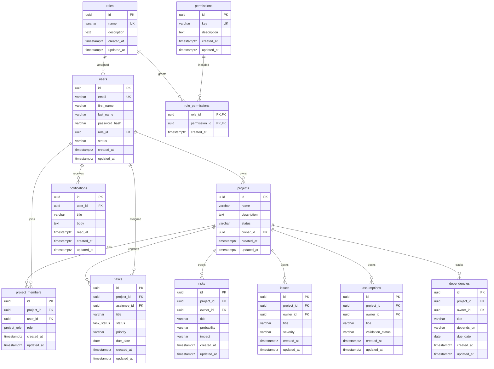

# Database ERD

```mermaid
erDiagram
  users {
    uuid id PK
    varchar email UK
    varchar first_name
    varchar last_name
    varchar password_hash
    uuid role_id FK
    varchar status
    timestamptz created_at
    timestamptz updated_at
  }

  roles {
    uuid id PK
    varchar name UK
    text description
    timestamptz created_at
    timestamptz updated_at
  }

  permissions {
    uuid id PK
    varchar key UK
    text description
    timestamptz created_at
    timestamptz updated_at
  }

  role_permissions {
    uuid role_id PK,FK
    uuid permission_id PK,FK
    timestamptz created_at
  }

  projects {
    uuid id PK
    varchar name
    text description
    varchar status
    uuid owner_id FK
    timestamptz created_at
    timestamptz updated_at
  }

  project_members {
    uuid id PK
    uuid project_id FK
    uuid user_id FK
    project_role role
    timestamptz created_at
    timestamptz updated_at
  }

  tasks {
    uuid id PK
    uuid project_id FK
    uuid assignee_id FK
    varchar title
    task_status status
    varchar priority
    date due_date
    timestamptz created_at
    timestamptz updated_at
  }

  risks {
    uuid id PK
    uuid project_id FK
    uuid owner_id FK
    varchar title
    varchar probability
    varchar impact
    timestamptz created_at
    timestamptz updated_at
  }

  issues {
    uuid id PK
    uuid project_id FK
    uuid owner_id FK
    varchar title
    varchar severity
    timestamptz created_at
    timestamptz updated_at
  }

  assumptions {
    uuid id PK
    uuid project_id FK
    uuid owner_id FK
    varchar title
    varchar validation_status
    timestamptz created_at
    timestamptz updated_at
  }

  dependencies {
    uuid id PK
    uuid project_id FK
    uuid owner_id FK
    varchar title
    varchar depends_on
    date due_date
    timestamptz created_at
    timestamptz updated_at
  }

  notifications {
    uuid id PK
    uuid user_id FK
    varchar title
    text body
    timestamptz read_at
    timestamptz created_at
    timestamptz updated_at
  }

  roles ||--o{ users : assigned
  roles ||--o{ role_permissions : grants
  permissions ||--o{ role_permissions : included
  users ||--o{ projects : owns
  projects ||--o{ project_members : has
  users ||--o{ project_members : joins
  projects ||--o{ tasks : contains
  users ||--o{ tasks : assigned
  projects ||--o{ risks : tracks
  projects ||--o{ issues : tracks
  projects ||--o{ assumptions : tracks
  projects ||--o{ dependencies : tracks
  users ||--o{ notifications : receives
```
