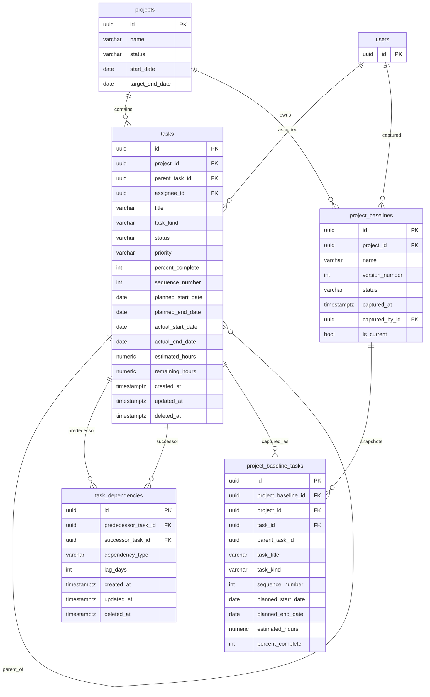

# v1.0.6 Planning Foundation Architecture

Review date: 2026-06-19

## Objective

Define the final architecture for `v1.0.6` task planning foundation.

This specification establishes the approved design for:

- task hierarchy
- milestones and summary tasks
- dependency modeling
- planned and actual schedule fields
- effort tracking
- baseline snapshots
- timeline and Gantt foundations

This release is a planning foundation release, not a full enterprise scheduling release. It must create the right data and API model for future timeline, Gantt, critical path, resource planning, and portfolio planning without locking the platform into hard-to-reverse shortcuts.

## Scope

`v1.0.6` supports:

- Parent Tasks
- Child Tasks
- Summary Tasks
- Milestones
- Dependencies
- Planned Dates
- Actual Dates
- Estimated Hours
- Remaining Hours
- Baselines

Supported dependency types:

- Finish-to-Start (`FS`)
- Start-to-Start (`SS`)
- Finish-to-Finish (`FF`)
- Start-to-Finish (`SF`)

Deferred from `v1.0.6`:

- cross-project dependency execution
- multi-resource task assignments
- drag-and-drop auto-scheduling
- resource leveling
- working calendars
- full program and portfolio hierarchy entities

## Approved Architecture Decisions

The following decisions are fixed for `v1.0.6`:

1. Task hierarchy uses `parent_task_id`.
2. `task_kind` is `standard | summary | milestone`.
3. Dependencies are allowed only on leaf tasks and milestones.
4. Baselines use separate `project_baselines` and `project_baseline_tasks` tables.
5. `planned_start_date` and `planned_end_date` are the canonical schedule fields.
6. WBS is derived and is not the authoritative hierarchy model.
7. Cross-project dependencies are deferred, but the dependency model must not block future support.
8. The single-assignee task model is retained for `v1.0.6`.

## Current-State Context

The current task model already includes:

- `planned_start_date`
- `planned_end_date`
- `actual_start_date`
- `actual_end_date`

in [backend/src/modules/tasks/entities/task.entity.ts](/Users/ramdatla/Projects/pm-platform/backend/src/modules/tasks/entities/task.entity.ts:39).

The current platform does not yet support:

- task hierarchy
- milestone semantics
- dependency edges
- baseline snapshots
- planning read models
- project timeline and Gantt pages

The current frontend timeline page is a redirect placeholder in [frontend/app/projects/[id]/timeline/page.tsx](/Users/ramdatla/Projects/pm-platform/frontend/app/projects/[id]/timeline/page.tsx:1), and portfolio milestone reporting currently infers milestones from generic due-dated tasks in [backend/src/modules/portfolio/portfolio.service.ts](/Users/ramdatla/Projects/pm-platform/backend/src/modules/portfolio/portfolio.service.ts:243).

## Domain Model

### Core Concepts

#### Task

`Task` remains the central work item entity.

In `v1.0.6`, a task may be:

- a standard task
- a summary task
- a milestone

Every planning artifact in this release remains inside the project task domain. No separate planning-only work item is introduced.

#### Task Hierarchy

Task hierarchy is represented by `parent_task_id`.

Hierarchy rules:

- parent-child hierarchy is strictly project-local
- parent and child must belong to the same project
- a task cannot be its own parent
- cyclic ancestry is forbidden
- hierarchy is for WBS decomposition only
- hierarchy cannot be used to represent program or portfolio structure

#### Summary Task

A summary task is a planning container for child tasks.

Summary task rules:

- summary tasks may have children
- summary tasks may not have dependency edges in `v1.0.6`
- summary schedule and roll-up indicators are derived from children
- summary tasks are not treated as execution network nodes for critical path

#### Milestone

A milestone is a zero-duration planning checkpoint stored as a task with `task_kind = milestone`.

Milestone rules:

- milestones may participate in dependency edges
- milestones may not have children
- milestone planned start and planned end must match when both exist
- milestones are explicit, not inferred from dates alone

#### Dependency

Dependencies are stored as directed task-to-task edges.

Dependency rules:

- allowed only between leaf tasks and milestones
- both endpoints must be in the same project for `v1.0.6`
- self-dependencies are forbidden
- duplicate active edges between the same predecessor and successor are forbidden
- dependency type is explicit and normalized
- lag is modeled as an integer day offset

#### Baseline

A baseline is a versioned project-level snapshot of planning data.

Baseline rules:

- baselines are immutable after capture
- each baseline has a project-level header row
- each baseline has per-task snapshot rows
- baseline-task rows must contain enough denormalized descriptive data to remain meaningful after later task renames or reparenting

#### Effort

Effort fields are task-level effort signals, not full resource allocations.

Effort rules:

- `estimated_hours` represents total task effort
- `remaining_hours` represents remaining total task effort
- these values do not imply future multi-resource assignments are modeled
- effort is task-scoped, not assignee-capacity-scoped

### Entity Responsibilities

- `tasks`
  - current project work items and planning state
- `task_dependencies`
  - scheduling edge network
- `project_baselines`
  - baseline header/version metadata
- `project_baseline_tasks`
  - immutable per-task schedule and effort snapshots

## ERD



## Database Schema

### Tasks Table Changes

Extend `tasks` with the following columns:

- `parent_task_id UUID NULL REFERENCES tasks(id)`
- `task_kind VARCHAR(20) NOT NULL DEFAULT 'standard'`
- `sequence_number INTEGER NULL`
- `estimated_hours NUMERIC(10,2) NULL`
- `remaining_hours NUMERIC(10,2) NULL`

Retained existing task columns:

- `planned_start_date`
- `planned_end_date`
- `actual_start_date`
- `actual_end_date`
- `percent_complete`
- `assignee_id`

Legacy compatibility fields retained for now:

- `start_date`
- `due_date`

Semantic rule:

- `planned_start_date` and `planned_end_date` are the canonical planning schedule fields
- `start_date` and `due_date` are compatibility fields only and must not be used as the planning source of truth in new APIs or UI

### Task Constraints

Recommended constraints:

- `task_kind IN ('standard', 'summary', 'milestone')`
- `estimated_hours >= 0`
- `remaining_hours >= 0`
- milestone date rule when both planned dates are present
- prevent self-parenting

Recommended domain-layer invariants:

- parent task must belong to the same project
- milestone cannot have children
- summary task cannot be a dependency endpoint
- dependency endpoints must be leaf tasks or milestones
- hierarchy cycles are forbidden

### task_dependencies

Create `task_dependencies` with:

- `id UUID PK`
- `predecessor_task_id UUID NOT NULL REFERENCES tasks(id)`
- `successor_task_id UUID NOT NULL REFERENCES tasks(id)`
- `dependency_type VARCHAR(2) NOT NULL`
- `lag_days INTEGER NOT NULL DEFAULT 0`
- audit columns

Dependency type values:

- `FS`
- `SS`
- `FF`
- `SF`

Recommended indexes:

- active unique edge on `(predecessor_task_id, successor_task_id)`
- index on `predecessor_task_id`
- index on `successor_task_id`

Design note:

The dependency model is task-to-task first. Same-project validation is enforced by current business rules, not by a schema design that blocks future cross-project dependency support.

### project_baselines

Create `project_baselines` with:

- `id UUID PK`
- `project_id UUID NOT NULL REFERENCES projects(id)`
- `name VARCHAR(255) NOT NULL`
- `version_number INTEGER NOT NULL`
- `status VARCHAR(50) NOT NULL`
- `captured_at TIMESTAMPTZ NOT NULL`
- `captured_by_id UUID NOT NULL REFERENCES users(id)`
- `is_current BOOLEAN NOT NULL DEFAULT false`
- audit columns

Expected statuses:

- `draft`
- `approved`
- `superseded`

`v1.0.6` may choose to expose only approved/current usage in the API while preserving status support in the schema.

### project_baseline_tasks

Create `project_baseline_tasks` with:

- `id UUID PK`
- `project_baseline_id UUID NOT NULL REFERENCES project_baselines(id)`
- `project_id UUID NOT NULL REFERENCES projects(id)`
- `task_id UUID NOT NULL REFERENCES tasks(id)`
- `parent_task_id UUID NULL`
- `task_title VARCHAR(255) NOT NULL`
- `task_kind VARCHAR(20) NOT NULL`
- `sequence_number INTEGER NULL`
- `planned_start_date DATE NULL`
- `planned_end_date DATE NULL`
- `estimated_hours NUMERIC(10,2) NULL`
- `percent_complete INTEGER NULL`

Important normalization decision:

- baseline rows intentionally denormalize descriptive task snapshot data
- this preserves historical meaning even after live task titles, parents, or kinds change later

Recommended indexes:

- `(project_baseline_id, task_id)`
- `(project_id, task_id)`

## API Contracts

### Principles

- Existing task CRUD remains intact and is extended
- Planning read models use dedicated endpoints
- New planning APIs always use canonical planned date fields
- Summary task roll-ups are read-model outputs, not separate write-side entities

### Extended Task Write Contracts

#### Create Task

`POST /projects/:projectId/tasks`

Additional fields:

- `parentTaskId?: string | null`
- `taskKind?: 'standard' | 'summary' | 'milestone'`
- `plannedStartDate?: string | null`
- `plannedEndDate?: string | null`
- `actualStartDate?: string | null`
- `actualEndDate?: string | null`
- `estimatedHours?: number | null`
- `remainingHours?: number | null`
- `sequenceNumber?: number | null`

#### Update Task

`PATCH /projects/:projectId/tasks/:taskId`

Supports the same planning fields with project authorization rules.

Role behavior target:

- project managers and equivalent planning roles may update planned structure and schedule
- assignees may continue to update execution-oriented fields only where policy allows

### Dependency Contracts

#### Create Dependency

`POST /projects/:projectId/task-dependencies`

Request:

```json
{
  "predecessorTaskId": "uuid",
  "successorTaskId": "uuid",
  "dependencyType": "FS",
  "lagDays": 0
}
```

#### Update Dependency

`PATCH /projects/:projectId/task-dependencies/:dependencyId`

Request:

```json
{
  "dependencyType": "SS",
  "lagDays": 2
}
```

#### Delete Dependency

`DELETE /projects/:projectId/task-dependencies/:dependencyId`

### Baseline Contracts

#### Create Baseline

`POST /projects/:projectId/baselines`

Request:

```json
{
  "name": "Approved Delivery Baseline",
  "status": "approved",
  "setAsCurrent": true
}
```

Behavior:

- captures immutable snapshot rows for current project tasks
- records current hierarchy, task kinds, schedule, and effort data

#### List Baselines

`GET /projects/:projectId/baselines`

#### Get Baseline Detail

`GET /projects/:projectId/baselines/:baselineId`

### Planning Read Models

#### Plan View

`GET /projects/:projectId/plan`

Purpose:

- hierarchical planning grid
- current tasks with roll-up metadata
- current dependency summary

Response shape:

```json
{
  "project": {
    "id": "uuid",
    "name": "ERP Modernization"
  },
  "tasks": [
    {
      "id": "uuid",
      "parentTaskId": null,
      "taskKind": "summary",
      "title": "Design Phase",
      "sequenceNumber": 10,
      "depth": 0,
      "isLeaf": false,
      "plannedStartDate": "2026-07-01",
      "plannedEndDate": "2026-07-21",
      "actualStartDate": "2026-07-03",
      "actualEndDate": null,
      "estimatedHours": 120,
      "remainingHours": 72,
      "percentComplete": 40
    }
  ],
  "dependencies": [
    {
      "id": "uuid",
      "predecessorTaskId": "uuid",
      "successorTaskId": "uuid",
      "dependencyType": "FS",
      "lagDays": 0
    }
  ],
  "currentBaseline": {
    "id": "uuid",
    "name": "Approved Delivery Baseline",
    "capturedAt": "2026-07-01T09:00:00Z"
  }
}
```

#### Timeline View

`GET /projects/:projectId/timeline`

Purpose:

- flattened chronological read model for timeline rendering
- milestone markers
- schedule filtering

#### Gantt View

`GET /projects/:projectId/gantt`

Purpose:

- hierarchical bars
- dependency edge rendering
- baseline overlays
- critical path flags when available

#### Critical Path View

`GET /projects/:projectId/critical-path`

Purpose:

- expose schedule-critical network results
- calculated from leaf tasks and milestones only

Design rule:

- critical path is a read-model calculation
- critical-path flags and slack values are not persisted as authoritative write-side fields in `v1.0.6`

## UI Design

### Design Goals

- preserve the existing project workspace as the planning entrypoint
- introduce planning progressively
- separate planning UX from simple task list UX
- keep `v1.0.6` read-heavy where schedule complexity would otherwise spike

### Project Workspace Additions

The current project workspace page in [frontend/app/(app)/projects/[id]/page.tsx](/Users/ramdatla/Projects/pm-platform/frontend/app/(app)/projects/[id]/page.tsx:48) becomes the anchor for planning.

Add workspace-level planning surfaces:

- `Plan`
- `Timeline`
- `Gantt`

### Plan View

Primary planning workspace.

Layout:

- left-aligned hierarchical grid
- expand/collapse rows
- inline create child task
- inline create milestone
- explicit summary task creation

Columns:

- WBS
- Title
- Kind
- Assignee
- Planned Start
- Planned End
- Actual Start
- Actual End
- Estimated Hours
- Remaining Hours
- % Complete
- Status

Rules:

- WBS is rendered from hierarchy and ordering
- WBS is not the authoritative model
- summary rows are visually distinct
- milestones are visually distinct and zero-duration

### Timeline View

Purpose:

- answer “what happens when?”

Features:

- task bars by planned schedule
- milestone markers
- assignee filter
- status filter
- date-range filter

The timeline surface should be read-only in the first implementation wave.

### Gantt View

Purpose:

- answer “how does the schedule fit together?”

Layout:

- left tree grid
- right schedule canvas

Features:

- task duration bars
- milestone markers
- summary roll-up bars
- dependency lines
- baseline overlays
- zoom levels:
  - day
  - week
  - month
  - quarter

The Gantt surface should start as read-only in `v1.0.6`.

### Baseline UX

Baseline capabilities:

- show current approved baseline banner
- capture baseline action
- compare current plan against current baseline

Display behavior:

- baseline is shown as visual comparison, not editable inline
- baseline bars should appear as lighter comparison overlays in Gantt

### Resource Planning UX Foundation

`v1.0.6` does not deliver full resource planning, but the UI should reserve a simple planning view for effort visibility.

Foundation features:

- group tasks by assignee
- show estimated and remaining hours totals
- show simple time-bucket summaries by week

This view is an effort visibility layer, not a full staffing engine.

## Migration Strategy

### Migration Principles

- use additive schema changes
- do not break existing task CRUD consumers
- move new planning reads to canonical fields
- preserve compatibility while reducing semantic ambiguity

### Phase A: Additive Schema

Add:

- task planning columns
- `task_dependencies`
- `project_baselines`
- `project_baseline_tasks`

No destructive removal of legacy task fields in this release.

### Phase B: Backfill

Backfill rules:

- if `planned_start_date` is null and `start_date` exists, copy `start_date` into `planned_start_date`
- if `planned_end_date` is null and `due_date` exists, copy `due_date` into `planned_end_date`
- default `task_kind = standard`

Do not:

- attempt to infer milestones from existing tasks
- infer hierarchy automatically
- generate authoritative WBS codes in migration
- infer dependencies from RAID dependency records

### Phase C: Read-Model Cutover

Update new planning APIs and UI to use:

- `planned_start_date`
- `planned_end_date`

Dashboard and portfolio compatibility:

- existing dashboard and portfolio logic may continue using current task fields initially
- a later phase in the same release line should shift milestone and schedule reporting to planning-aware semantics

### Phase D: Semantic Cleanup

Post-foundation cleanup target:

- mark `start_date` and `due_date` as compatibility-only in DTOs and docs
- later remove them from planning-specific reads

## Impact on Future Capabilities

### Timeline View

Impact:

- timeline becomes schedule-aware rather than task-list-aware
- milestone markers become explicit
- summary tasks improve execution readability

### Gantt View

Impact:

- hierarchy and dependency model make Gantt viable
- baseline overlay becomes supportable
- zoom and dependency rendering become stable read-model concerns

### Critical Path

Impact:

- critical path becomes feasible once:
  - planned dates are canonical
  - dependency network is explicit
  - summary tasks are excluded from dependency endpoints

Critical path scope in `v1.0.6`:

- computed from leaf tasks and milestones only
- assumes simple uniform working-day behavior until calendars exist

### Resource Planning

Impact:

- estimated and remaining hours create the minimum viable effort signal
- single-assignee tasks permit basic workload visibility

Limitations:

- no multi-resource assignments
- no role-based allocation
- no resource calendars
- no leveling

### Portfolio Reporting

Impact:

- portfolio reporting can stop inferring milestones from generic tasks
- future portfolio summary can report:
  - real milestones
  - slipped milestones
  - critical-path task count
  - remaining effort by project

Important boundary:

- task hierarchy must not become a substitute for future project/program/portfolio hierarchy

## Implementation Phases

### Phase 1: Data Foundation

Deliver:

- extended task schema
- dependency schema
- baseline schema
- DTO and validation alignment
- hierarchy invariants

### Phase 2: Planning Write Flows

Deliver:

- create and update planning tasks
- create and manage dependencies
- capture baselines
- restore and validate hierarchy behavior

### Phase 3: Planning Read Models

Deliver:

- `/plan`
- `/timeline`
- `/gantt`
- `/critical-path`
- baseline listing and detail

### Phase 4: Plan Workspace UI

Deliver:

- Plan tab
- hierarchical planning grid
- milestone and summary task support
- dependency management UI

### Phase 5: Timeline and Gantt UI

Deliver:

- timeline read model rendering
- Gantt read model rendering
- baseline overlays
- critical path highlight

### Phase 6: Reporting Alignment

Deliver:

- milestone-aware portfolio reporting
- planning-aware dashboard enhancements
- basic effort roll-ups by assignee and project

## Risks

- semantic confusion if legacy and canonical task date fields are both treated as active planning fields
- summary-task drift if roll-up behavior is not enforced clearly
- dependency corruption if eligibility is treated as a UI rule rather than a domain invariant
- weak historical reporting if baseline-task rows do not snapshot enough descriptive context
- future portfolio architecture confusion if task hierarchy is misused for cross-project structure
- overpromising resource planning before multi-resource assignment support exists

## Recommendations

- treat `planned_start_date` and `planned_end_date` as canonical from the first planning API release
- enforce same-project task hierarchy strictly
- enforce dependency eligibility strictly
- keep summary tasks out of the execution dependency network
- treat baseline rows as immutable historical snapshots
- keep WBS derived from hierarchy and ordering, not stored as authoritative structure
- keep effort semantics task-level, not staffing-level

## Out of Scope

The following are intentionally deferred beyond `v1.0.6`:

- program and portfolio hierarchy entities
- cross-project dependency execution
- task resource assignment table
- working calendars
- resource leveling
- auto-scheduling
- drag-and-drop schedule editing
- project membership history table

